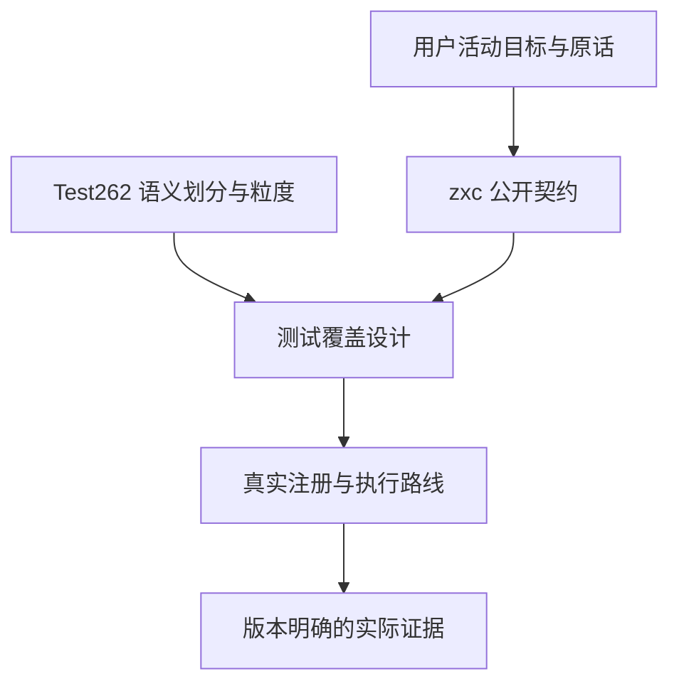
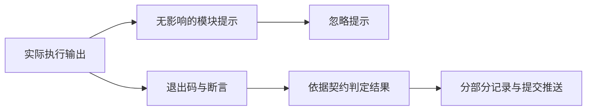

# 参考测试范围与提示处理执行计划

## Intent：最终目标

采用 IDEA 框架，保存用户本轮明确修正，确保中断恢复后继续以 zxc 的真实契约补齐测试。Test262 提供语义划分、边界覆盖及粒度参考，同时覆盖 zxc 自身全部特性；按已授权目标逐部分提交推送。

## Data：可用证据

- 当前活动目标明确“参考，不是要一模一样”，并要求 zxc 自身特性具有相同测试粒度。
- 当前用户消息明确提交信息使用规范英文，`type: module` 这类提示可以忽略。
- 标量回退补强已完成两模式 756 次语义观察，其中 84 次检查输入保持；原 R1 和最终 R2 都实际退出 0。
- 目标字段与消息原文统一补入 `docs/user_request.md`，不伪造发生时间或混入历史消息计数。

## Edges：边界与限制

- 无影响的模块类型提示不作为失败、生产缺陷或重复执行依据。判断依赖实际退出、断言及目标行为；实际加载失败仍按真实失败分析。
- Test262 的 JavaScript 特有机制不能直接成为 zxc 的实现义务；已经声明支持的 zxc 契约缺陷也不能借语言差异略过。
- 案例、断言与不同路线的执行次数分别统计，不以重复执行增加独立用例数，不以 catalog 数量证明生产可用。
- 固定编译器证据保留其版本边界；不能替代当前源码、当前完整 root 的实际验证。
- 本批仅校正文档与续接标准，不修改编译器、Node 配置、测试断言或后台队列，不重跑已通过门禁。

## Answer：交付格式与成功标准

交付统一原话补充、本目录执行记录，以及既有标量回退记录的提示解释修正。下一批先按公开契约和真实注册入口核对特性与测试映射，再选择语义完整的小部分补齐边界和实际执行。仅已确认的实现缺陷发给用户指定实现会话；绿色结果不发送。

## 自我批判检查点

不能让工具提示转移测试重心，也不能用参考语言的原始文件数量替代 zxc 特性覆盖。记录修正必须保留已经发生的运行事实，区分历史行为与未来通过条件。
