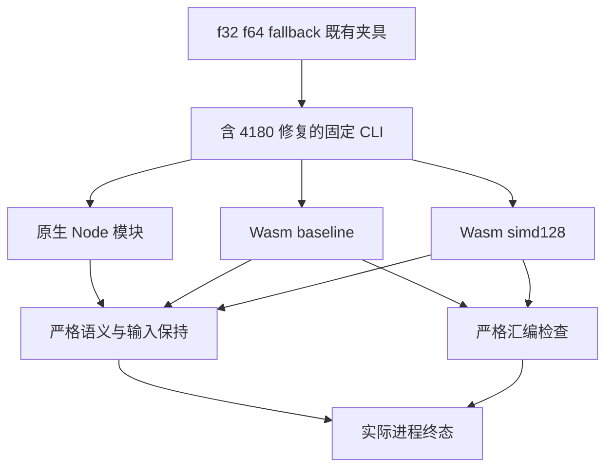
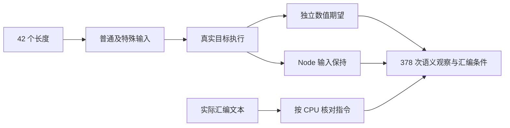

# 向量循环修复回归

## Intent：最终目标

以既有严格 SIMD 门禁复验普通循环向量化修复，分别核对数值语义、尾部路径、输入保持和实际 Wasm 指令，避免只凭结果相等就宣称 SIMD 生效。记录遵循 IDEA 框架。

## Data：可用证据

此前固定 `bbd92b5c5` 的实际 f32 生成结果没有预期 SIMD 汇编，已按确认的实现缺陷单独归档并报告。生产修复为 `4180f77273bad717ec847827398772f2b8e01b68`。本轮以包含该修复的 `e4d21707d15432b507dd2f83ca5750f93fc04b24` 为生产基线，执行既有 `test-simd-semantics`。

该门禁与项目诊断、native references、product transfer 共六个目标联合构建以共享冷自举成本，固定工作树包含另五个诊断维护文件与一个 product 维护文件覆盖；SIMD 测试和生产源码没有本轮覆盖。这些联合目标之间只共享构建资源，结果按专项分别核对。

Debug 已实际退出 0，联合构建为 90/90 步骤、226/226 Zig 测试。SIMD 脚本保留输出确认：42 个长度，每种 f32/f64 的 Node 普通与特殊输入共 84 次检查；每种类型、每种 baseline/baseline+simd128 的 Wasm 各 42 次；fallback 42 次。合计每模式 378 次语义观察，不能将同一输入的不同路线重复登记为新增上游原文。

ReleaseSafe 已真实退出 0，每模式同样为 378 次语义观察，两模式合计 756 次，详见《执行记录.md》。早期续接摘要把长度数量误记为 21、观察数误算为 189；本记录以固定源码中 34 个连续长度加 8 个边界长度，以及实际 stdout 的 378 为准，不沿用估算。

## Edges：边界与限制

- 不修改 SIMD 语义检查、汇编检查、长度、数据或 production，实现修复与测试维护分开追溯。
- 保留 baseline 禁止相应向量指令、simd128 必须出现相应向量指令的严格条件，同时保留 f32/f64 Node 输入不变和特殊浮点值语义。
- 使用 canonical `test-simd-semantics` 的真实 Node 构建、加载与 Wasm 调用；只读完整源不能替代执行。
- 既有 runner 最后会删除临时 Node、Wasm、汇编文件，因此仅报告实际命令、完整 stdout、未改动源码与真实退出状态；不补造被清理产物的 SHA。
- 该旧生产基线通过不能证明最新 HEAD 的完整根通过，也不能代替所有权相关修复的另行验证。

## Answer：交付与成功标准

两模式分别保留包含全部 SIMD 通过行、联合真实终态和输入身份的无损记录，明确严格汇编检查仍在实际运行路径中。两模式全部成功后，作为独立复验部分仅提交记录文档，标题与正文使用英文 Conventional Commits。没有新增 catalog 用例，不向实现聊天发送绿色状态。

## 架构图

## 数据流图

## 自我批判

输出正确与向量化生效是两个不同的验收条件，必须同时保留。实际日志暴露了早期计数摘要不准确，不能用重复摘要充当证据；本轮从源码与 stdout 重新核对长度和路线。临时文件被既有 runner 清理是可追溯性的限制，需要如实记录，不能将同目录的另一轮产物当成本轮二进制。当前两模式已完成，本部分仅提交复验记录，不重复提交生产修复或增加用例计数。
