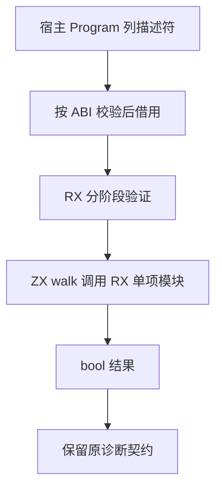

# 完整 IR 校验整块自举

## Intent：最终目标

迁移 ir/validate 的完整校验编排，使源码发布、已编译库接入与缓存恢复共用 RX/ZX 的正式验证入口。保留全部规则、顺序、短路和 OOM 传播。

## Data：可用证据

- canonical 已具备 body、contracts、native、expressions、scopes、tasks、stores 等校验模块。
- validate.zig 仍编排全局结构、全部函数预检、entry 与 functions、exports、error contracts。
- core/function_table/model.zx 是分析器子集，不能替代完整外层列结构验证。
- malformed 列必须在逐行读取之前被拒绝；所有函数的 body/contract 预检必须先于调用语义检查。

## Edges：边界与限制

- 先版本与完整函数列，再类型，再所有 body/contracts，再 native/函数语义；不随意重排。
- host 仅借用列，禁止先 at(index) 再让 validator 检查形状。
- 保持 type_only、external、前向调用和 Borrowed 声明的原有特殊规则。
- error contracts 保留 capture/task 实际错误集合的精确比较，不遗漏最后阶段。
- 校验失败返回原有固定 contract 诊断；OOM 继续传播。
- 原始 Zig 仅供 seed 使用；不新增测试、不运行全量测试、不调用浏览器。

## Answer：交付格式与成功标准

交付完整函数列模型、RX 顺序与分支、ZX 集合/单项规则、正式宿主适配与构建注册。集中构建及现有 RX 应用验证后，核对正式 validate 不再执行旧 Zig 总控；保留工程调度仍待迁移的边界。

## 自我批判

每个原子已生成不代表完整验证器已自举。尤其结构预检是后续读取安全性的前提；仅对合法生成 IR 跑通不能证明 malformed 输入路径正确。本次以源码顺序审查与现有应用验证提供限定证据，其余回归仍由测试会话负责。

## 接入修正

集中构建发现 Store 声明校验旧接口使用 `u8[][]`，而统一 Store 模型使用 `string[]`。原 Zig 宿主布局兼容掩盖了语义接口差异；本次将 declarations 与 path 接口统一为 `string[]`，保留字节级路径判断，不增加转换或复制。

生成成功后的 Zig 构建指出完整验证器传递使用表达式浮点规则；构建注册补充复用已有 `floats` 模块。

## 验证结果

- `zig build --summary all`：退出 0，36/36 步成功；构建日志见 `主分析器集中构建/完整IR校验构建.log`。
- 新编译器构建现有 `aggregate.rx`：退出 0；输入 `[1,2,3]` 输出 `{"items":[2,3,4],"total":9}`。
- 新编译器构建现有 `standard/decoding/errors.zx`：退出 0；十六进制 `616263` 输出 `"abc"`，无效输入 `gg` 保留 `InvalidCharacter`、退出 1。CLI 应用将 JSON 作为位置参数传入。
- 首次运行误用了 `--input`，应用按原 CLI 契约返回 `ExpectedJsonInput`；改用位置参数后得到上述结果，未修改实现适配错误命令。
- 新增 21 个 ZX 文件最长 53 行；本次 diff 空白检查通过。未新增测试、未运行全量测试、未调用浏览器。
- 正式 `ir/validate.zig` 仅调用新生成验证器；旧调度迁至 `seed_validate.zig`，由 seed 编译选项隔离。源码发布、库接入、联结、缓存恢复继续共用该正式入口。

本次完成完整 IR 校验的规则与编排迁移，宿主仍承担 ABI 借用及临时 arena 管理。限定应用验证不能证明全部畸形 IR 拒绝行为；Project、compiled/cache 接入状态及最终 stage 1/2/3 自编译仍未完成。
