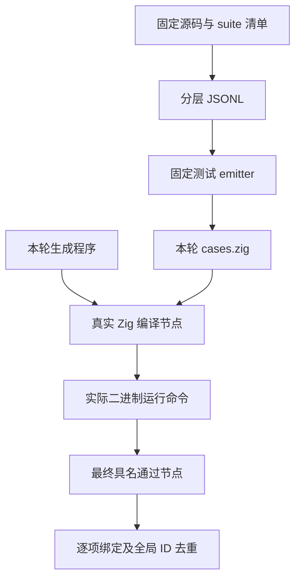
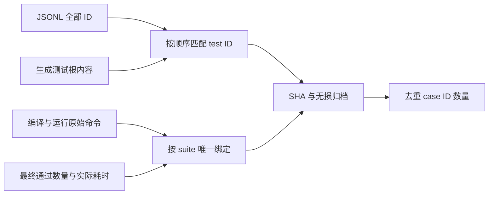

# 完整根回归唯一用例执行绑定

## Intent：最终目标

直接证明超过 30,000 个不同仓库测试 case ID 已在真实生成程序上执行，而不是用目录规模或构建汇总代替执行。按 IDEA 框架保存固定 JSONL、实际生成测试根、编译命令、运行命令及最终成功节点之间的逐项绑定。

## Data：可用证据

固定 `bbd92b5c536139a6a36ce3ad4e0062768bf1337f` 的完整根 Debug 已取得真实终态。完整日志与输入身份已发布于 `9bb05da81`，根回归本身退出 1。只读审查发现其 runtime 子集有 526 个成功运行节点，可逐项核对至 84,786 个不同 JSONL case ID。

## Edges：边界与限制

- 统计单位是不同仓库 case ID，不是不同 Test262 原文，也不是独立语义种类。
- 每项要求固定 suite 名唯一、编译命令唯一、实际二进制运行命令唯一、最终成功节点唯一；不能把 cached 或 reused 标记当作新增实际执行。
- 必须读取本轮生成的 cases.zig，与固定 JSONL 中的所有 test ID 按顺序核对，并绑定实际输入 SHA。
- 成功节点的通过数量必须与 JSONL 和生成测试数量一致；缺失、重复、数量不符或未成功的节点不能纳入。
- 只证明固定旧版 Debug 的该子集。完整根仍失败，ReleaseSafe 根回归尚未执行，当前 HEAD 的共同验证仍未完成。
- 不为得到数量修改输入、降低断言或新增机械重复用例。

## Answer：交付格式与成功标准

保存可复现的绑定脚本、全部链路索引、所引用源码与生成测试根 SHA、无损生成测试根以及核验记录。独立核验应能复算 526 个成功节点、84,786 个不同 ID、零绑定异常，随后单独以英文 Conventional Commits 提交推送。

## 架构图

## 数据流图

## 自我批判

前面只掌握汇总和可见具名输出，无法证明全量唯一执行。逐节点绑定解决的是执行身份与数量问题，仍不能自动证明测试 oracle 完备、每个用例都是不同语义或 Test262 已完整适配；这些验收仍须按原文和特性逐项推进。
