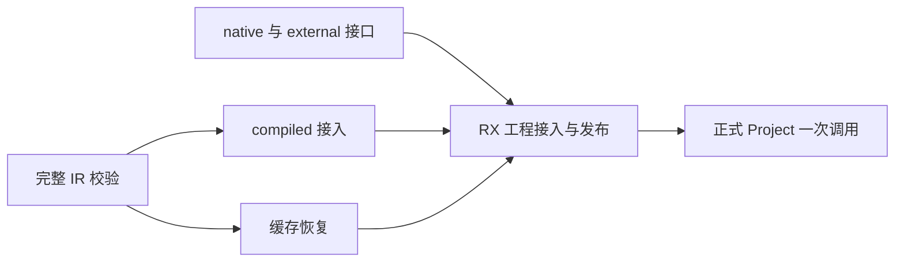
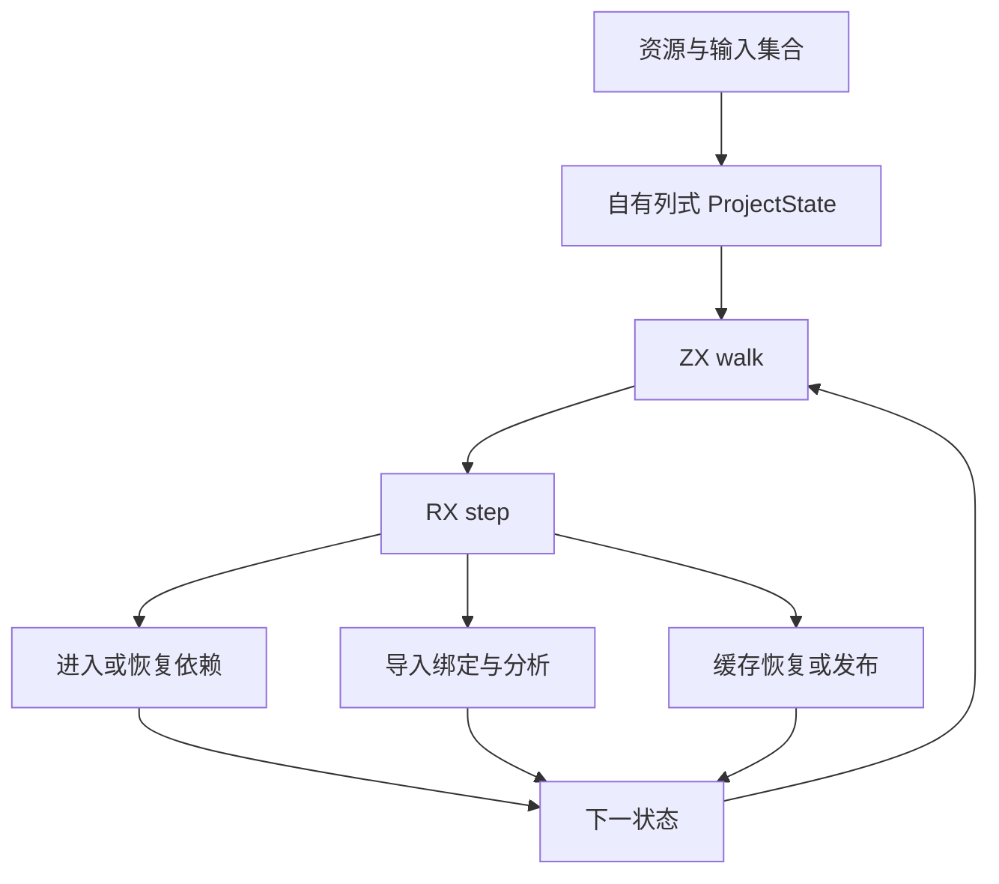

# 工程模块接入自举方案

## Intent：最终目标

迁移依赖驱动的工程模块装载与发布闭包，包括 source/native/external/compiled 导入、共享类型与函数状态、缓存恢复及结果发布。不得以 Zig 调度 generated nextAction 的状态桥替代真正 RX 编排。

## Data：可用证据

- 正式 Indexed 正文、签名和独立表达式入口已迁入 RX/ZX，阶段提交至 1307b6237。
- project.zig 仍持有 units、frames、pending import、共享 types/functions/native_modules，以及四类导入与缓存命中分支。
- compiled/load 和 semantic_cache/restore 仍有身份隔离、映射及回滚规则，均属编译器语义。
- 最终 ir/validate 是所有接入路径共用的安全前置；各 canonical 原子已迁，但全局结构预检、逐函数调用次序及最终错误契约仍由 Zig 编排。
- contracts/walk.zx 已示范 ZX 集合循环调用普通 RX 模块；可复用这一模式，无需新增 RX Loop 标签。

## Edges：边界与限制

- 依赖遍历保持首次诊断、signature 对默认函数导入的特例、pending 恢复语义与 ID 分配顺序。
- 冷构建与缓存恢复都不能静默降级；恢复失败须回滚并作为 miss，OOM 继续传播。
- host 可持有资源与 arena、读取字节、执行通用哈希；模块选择、冲突判断、缓存等价规则与结果登记必须进入 RX/ZX。
- ZX walk 仅处理集合迭代，RX step 显式表达业务阶段和分支；step 不回调 walk，保持静态图无环。
- 不新增测试、不运行全量测试；每个完整职责集中验证并提交。

## Answer：交付顺序与成功标准

先完成共享 IR 校验闭包，再收口编译库接入、缓存恢复与外部接口剩余规则，最后接通完整 Project 状态与 RX step。各阶段必须记录正式入口、传递依赖及未完成范围，不把共享前置完成表述为工程调度完成。

## 自我批判

之前把缺少 RX Loop 标签直接视为能力缺口是不充分的；既有 ZX→RX 统一模块调用已经能保留循环与阶段的正确边界。真正工作量在共享状态、接入身份和缓存语义，不能用 action bridge 掩盖，也不能只迁移 DFS 即宣称完成。

## 传递依赖复核

- `compiled/load` 仍负责 library 实例的 source/native/external 名义来源隔离、非 std 原生模块重绑定、函数与 Store 路径重绑定、exports 和 initializers 映射。不能只替换外层入口。
- `compiled/validate` 除共用 IR 验证外，还检查名义来源覆盖、native reference owner、initializer、导出路径/函数与 Input/Output 一致性，以及全库 Store 路径的类型一致性。
- `semantic_cache/restore` 在恢复前检查依赖身份与导入形状，恢复后检查原生接口和函数签名；任何非 OOM 失败变为 miss，同时回滚 types/origins 前缀。
- `artifact/nodes` 的 planned 路径已调用生成映射，但 compiled/cache 使用 mapped 路径时仍执行 Zig 重映射与函数组装。迁移装载时必须覆盖这一传递路径。
- `link/native` 仍持有接口合并与冲突判定；`compiled/identity` 的实例名称规则属于编译器语义，SHA-256 本身可留在通用标准库。
