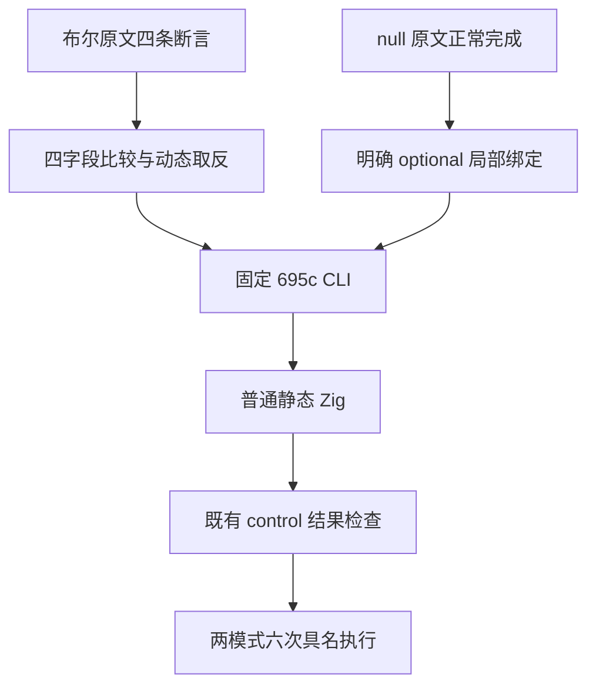
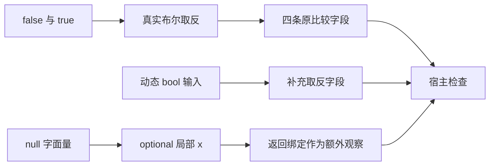

# 布尔取反与空值绑定原文适配

## Intent：最终目标

完整适配 boolean/S8.3_A3.js 的四条布尔取反比较，以及 null/S8.2_A1_T1.js 的正常完成要求，不把补充观察写成原文已有断言。记录遵循 IDEA 框架。

## Data：可用证据

固定上游为 `7ab7fafa0003f73fc85c1b95d88094d33f7eb8bd`，两份原文已完整阅读并对当前 reviews 排重。

- 布尔原文分别要求 `!false === true`、`!false == true`、`!true === false`、`!true == false`，没有转换、typeof 或对象前提。
- null 原文只有 `var x = null;`，没有显式运行断言，成功标准是正常完成。适配时保留局部 null 初始化与绑定，提供 ZX 所需的明确 optional 类型上下文。
- 既有 logical_not、optional equality 与 control helper 提供同职责成熟实现；本轮不新增运行库或修改 production。

## Edges：边界与限制

- 四条布尔比较分别保留字段身份。两个操作数始终为 bool，ZX `==` 保留本输入域的严格和非严格比较结果，不宣称支持 `===` 语法或动态抽象相等。
- 布尔入口额外返回真实输入的取反值，使用 false、true 两个输入；后一条仅为补充对照，防止恒定输出蒙混过关。
- null 入口使用明确 optional 局部绑定，返回该绑定作为适配后的可观察控制。该返回值不是原文自带断言，也不能证明 ECMAScript 独立 Null 类型或无上下文 null 推导已经支持。
- 两份 parse negative 原文 `true = 1`、`false = 0` 将另行按解析阶段和精确 target span 验证，不混入本批已执行数量。
- 使用来源已核验的固定 695c CLI 生成普通 Zig，以既有 control helper 执行 Debug、ReleaseSafe。构建注册静态复核与实际显式执行分别记录。

## Answer：交付与成功标准

布尔入口两条目录用例、null 入口一条目录用例，共三条逻辑用例，在两模式完成六次具名执行；保留四条原断言和一项正常完成要求的准确映射。归档完整原文与上游 harness 实际结果、固定源码身份、生成普通 Zig 和实际终态后，才登记两条 review，并按英文 Conventional Commits 单独提交推送。

## 架构图

## 数据流图

## 自我批判

布尔同型比较可等价映射，不意味着 JavaScript 动态相等协议已实现。null 原文没有显式断言，不能为了统一 review 结构而伪造一条原断言。原始操作本来是常量初始化，忠实保留常量不属于针对用例返回预设结果；仍需实际解析、分析、生成和执行局部绑定。此时尚未生成适配或登记 review。
