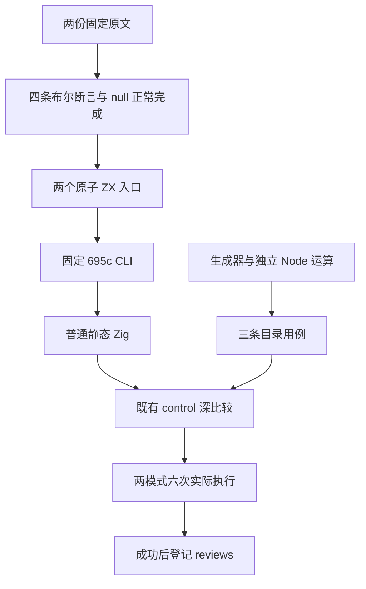
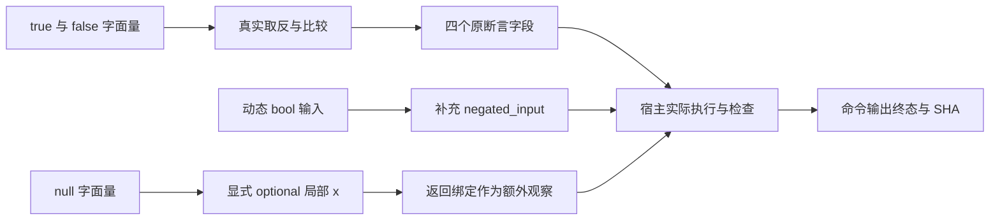

# 布尔取反与空值绑定执行记录

## Intent：最终目标

完整保留两份基础类型原文的成功标准：布尔原文四条比较断言，null 原文一项正常完成要求。按 IDEA 框架记录真实执行、适配边界与可恢复的证据。

## Data：可用证据

上游固定为 `7ab7fafa0003f73fc85c1b95d88094d33f7eb8bd`，两份原文与 sta/assert harness、LICENSE 无损归档。原 harness 在 sloppy、strict 各执行两份原文，共四次实际通过；每模式共有四条显式原断言，全部来自布尔原文。

| 原文                 | 保留的原始观察                                                           | 适配后的目录用例                                  |
| -------------------- | ------------------------------------------------------------------------ | ------------------------------------------------- |
| `boolean/S8.3_A3.js` | `!false === true`、`!false == true`、`!true === false`、`!true == false` | `language/types/boolean/negation/original`        |
| `null/S8.2_A1_T1.js` | `var x = null;` 正常完成，零显式断言                                     | `language/types/null/binding/original_completion` |

布尔入口保留四个独立结果字段。原始比较两侧始终是 bool，因此 ZX 同型 `==` 在此输入域保留严格与非严格比较的结果。入口还实际计算 `!in`，false 原始行要求 true，true 补充行要求 false；这个动态字段及第二行不计为新的原断言或原文。

null 入口以 `u64?` 显式上下文初始化局部 `x = null`，返回这个绑定作为额外宿主观察。原文没有修改绑定，因此这里使用 const 不改变所观察的行为。review 的 assertions 保持空数组，不将返回 null 伪装成原文自带断言。

### 实际执行

固定编译器源版本为 `695c654ce3350eaa7f561d661135a2682fcb6ea8`，CLI SHA 为 `b944df937c62b5d1dbb57278f73bfdc82dffc642dd3d166975b4d1b8f51303f4`。其来源构建的起点、源码身份与 Debug 退出 0 终态一并归档。

R1 从 `2026-10-10T00:49:16.466214+00:00` 运行至 `00:49:47.362123+00:00`。生成器 --check、两次 CLI 生成、两次 control 测试生成和四次 Zig 测试，九个阶段全部实际退出 0。十四个冻结输入、工具及 SDK 身份核验未发现变化。

| 程序               | Debug            | ReleaseSafe      | 逻辑用例数 |
| ------------------ | ---------------- | ---------------- | ---------- |
| `boolean_negation` | 两个具名测试通过 | 两个具名测试通过 | 2          |
| `null_binding`     | 一个具名测试通过 | 一个具名测试通过 | 1          |

合计三条逻辑用例、六次具名执行。四个测试二进制的 SHA、完整输出、命令和退出码保留在终态，二进制保留在外部运行目录。四份生成的普通 Zig 源码无损归档；这里没有生成额外 ABI 文件或新增专用运行库。两个 ZX 文件分别 19、9 行，满足 120 行硬限制。

TypeScript 检查、Prettier 检查与仓库 Zig/ZX 格式检查实际退出 0。只读复核逐项核对原文、输入、四个字段、正常完成与接线，未发现实质语义遗漏。

### 目录与证据核验

目录审计实际退出 0，审计输入 SHA 未变化。登记两条 adapted review 后，53,597 份上游原文中 adapted 860、equivalent 103、excluded 2,089、unreviewed 50,545；catalog 共 140,785 条，runtime 96,728，已关联用例 6,990。

当前目录审计只识别顶层 expected 字段。布尔 review 沿既有惯例用 `field=value` 保存整体对象，并以四个 observation_field 分别标注原断言；它不会自动检查这些子字段。此次人工复核及《核验执行证据.py》另外逐项检查四个子字段与 true 预期，不能把这部分归功于通用目录审计。

本部分包含 58 条运行、编译器来源、审计与正式源码归档，以及 9 条原文、harness、LICENSE 和原文执行归档，共 67 条 gzip。每条均检查压缩 SHA、解压 SHA、字节数和无损解压。正式交付八个代码/目录文件的 SHA 与实际冻结输入相符；review 在实际成功后登记。采集器复用时曾残留旧轮次的 manifest 路径，首次采集因此中止；修正采集器路径后完整重采并核验，没有修改执行输入或终态。

## Edges：边界与限制

- 这里不宣称 JavaScript 动态抽象相等、`===` 语法、独立 Null 类型或无上下文 null 推断已支持。
- 正式执行覆盖固定 CLI 的源码路线；不包含库路线，也不代表最新 HEAD 编译器通过。
- `test-boolean-null` 与 `test-runtime` 的构建注册已静态复核。本轮显式执行相同 emitter、control helper 和程序，未执行这两个 canonical build 目标。
- 两份布尔字面量赋值 parse negative 尚未适配，不混入本批数量。
- catalog 数量表示目录，不表示全部执行或 Test262 已完整对齐。

## Answer：交付格式与成功标准

交付一个生成器、两个原子 ZX 入口、三条目录用例、两项 runtime suite 与专项构建入口、两条原文 review，并保留本轮完整证据。仅本部分八个代码/目录文件和本目录文档单独提交推送，标题和正文使用英文 Conventional Commits。完整 Test262 与全部 zxc 特性目标仍然进行中。

## 架构图

## 数据流图

## 自我批判

常量原文可被编译器折叠，不能据此声称动态类型能力；额外动态 bool 输入只证明自身取反行为。null 的类型上下文与宿主返回观察必须披露，不能用补充断言增加原断言数量。通用审计对子字段映射的能力有限，所以本轮保留单独逐项核验，而没有顺手扩大 audit API。来源已验证的旧 CLI 成功与当前自举编译器整体成功是不同结论，仍需后续 canonical 回归。
