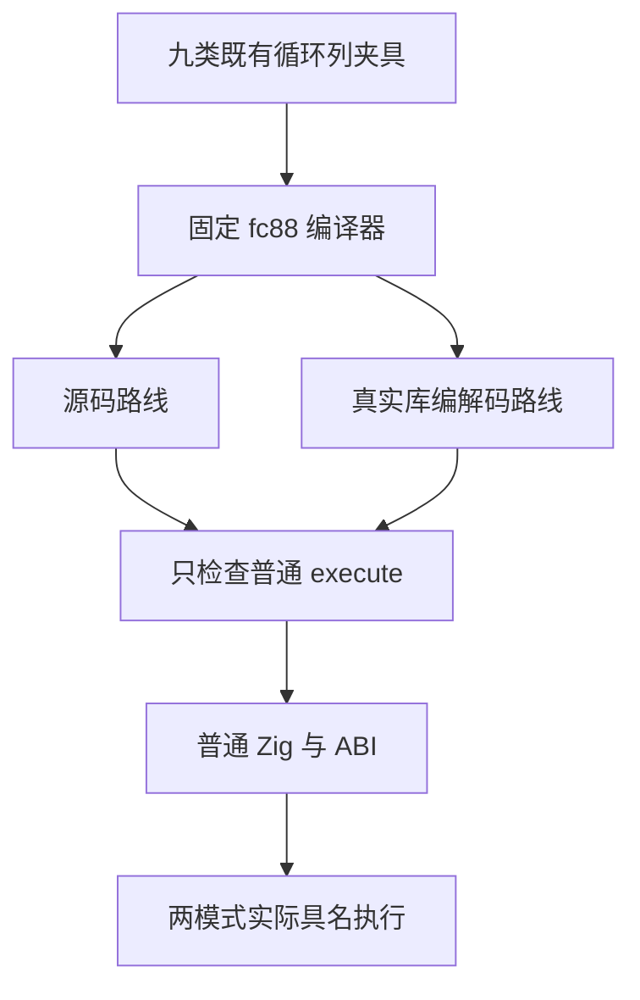
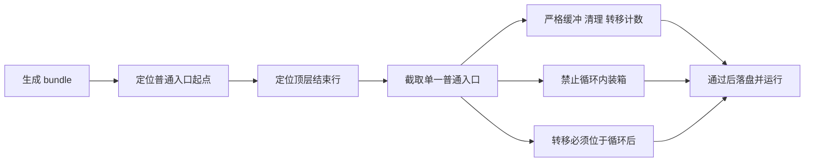

# 循环列普通入口范围门禁

## Intent：最终目标

让 loop columns 的资源结构门禁准确检查普通 `execute`，保留所有列缓冲、清理、转移与循环后转移约束，通过实际 source/library 两路线证明修正后的检查没有隐藏真实成本问题。记录遵循 IDEA 框架。

## Data：可用证据

固定 `bbd92b5c5` 的原完整根 Debug 尚未结束，已观察到 mixed、direct、borrowed、shrink、nested、dual、leaves 七类夹具报 `InvalidFrameValueBufferCount` 或 `InvalidColumnBufferCount`。这些错误均在 source 第一次 emit 的结构检查发生，四份输出尚未落盘，library 编解码路线也尚未到达；不能根据命令中列出两路线输出参数就声称两路线均失败或已执行测试。

现有 shape 取 `source[start..]`，把普通入口之后的 `executeValue`、可能存在的 `executeBuffered` 一起计数。genz 会按资格追加这些入口，与本门禁要求检查的普通入口范围不一致。已完成的 aggregate_loop 与 product_transfer 门禁采用查找顶层 `"\n}"` 的方式收口，可直接沿用同职责成熟实现。

consumer 的两路线已有输出，普通入口实际含 1 个 frame buffer、3 个 ArrayList、3 次清理、1 次转移，没有后续公开入口；fallback 普通入口 frame buffer 为 0，当前检查随后返回。它们能解释旧检查为何仅部分失败，但不能替代七个失败夹具的新产物证明。

## Edges：边界与限制

- 只修改 `packages/test/tests/collections/loop_columns/shape.zig` 的普通入口截取范围，缺少顶层结束位置仍明确报错。
- 保留 fallback frame buffer 为 0、其他为 1；保留普通模式 3 个 ArrayList、dual/leaves 4 个，以及对应严格清理次数。
- 保留普通模式 1 次、dual 2 次、leaves 3 次转移；保留每次 transferred owner 的 errdefer free。
- 保留循环体禁止 frame 装箱与所有 selected 转移均在循环后的要求，不改 production、夹具或运行测试。
- 不修改已经冻结并排队的 fc88 六目标工作树、manifest、缓存或队列。该旧队列若遇到本次旧 shape 问题，必须原样保留失败，不能倒推为通过。
- 新专项固定 `fc88b9ef4019b5b8c337a4fc1354dda904f1f27f` 加唯一 shape 覆盖，以 canonical `test-loop-columns` 运行两个模式，各自使用新缓存。

## Answer：交付与成功标准

九类夹具、两路线，每模式实际运行 18 个二进制节点与 124 次具名测试；两模式预期 36 个节点、248 次执行。这些是既有测试的重执行，不新增 catalog 用例。每模式保存 36 份普通 Zig/ABI、实际命令、进程终态、全部输入身份及严格结构检查结果。只有真实结果满足条件后，才以英文 Conventional Commit 单独提交推送。

## 固定输入与资源调度

正式工作树绑定 6,768 个非 docs 源文件，只有 `loop_columns/shape.zig` 一项覆盖，内容与交付工作树字节一致。两个模式各使用新的局部和全局缓存，仅预置身份已核验的 libyaml 下载归档。原 consumer、fallback 的 source/library 普通 Zig 与 ABI 共八份既有产物也已无损归档，仅用于解释已观察的结构，不能作为新专项结果。

资源队列等待模块产物资源夹具队列 PID 96002 退出，核对其命令身份以避免 PID 重用，再顺序启动本项目 Debug 与 ReleaseSafe；Debug 失败时不启动 ReleaseSafe。等待前一项目只用于限制冷构建竞争，不将其结果当作本项目通过证据。

## 架构图

## 数据流图

## 自我批判

统计范围错误已经由源码与生成策略确认，但七个旧失败的 source bundle 没有落盘，不能断言收窄后全部资源计数必然正确。实际运行若仍失败，需继续归因，不能删除断言。当前最小修正已完成、格式检查通过并冻结排队，尚未执行修正后的专项；旧完整根也没有成功终态。
