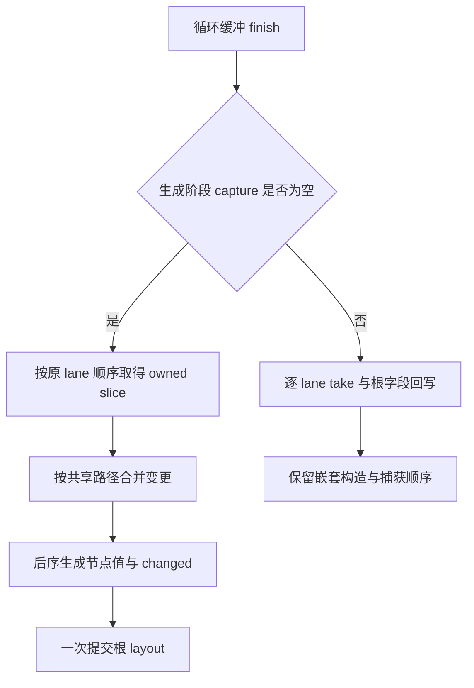
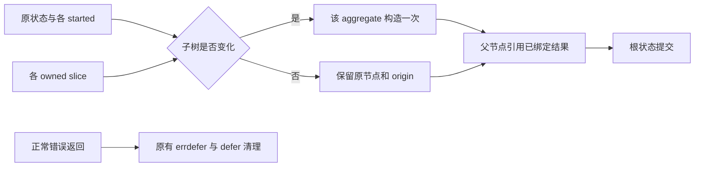

# 循环缓冲回写生成膨胀修复

## Intent：最终目标

让同一次循环结束时共享路径的缓冲变更合并回写，每个受影响的嵌套对象或元组只重建一次，减少生成源码及后端编译成本。

## Data：可用证据

原始 Safe 所有权专项工具编译耗时 14 分钟。analyzer 的 function_238 约 1.1 MB，其中同一嵌套类型构造 88 次；逐 lane replaceLayout 会重复展开路径上的大型 aggregate。

根字段单步改动只使全部产物缩小约 4.27%，不足以消除主要嵌套膨胀，已据此调整为批量路径合并。最终 92 个产物缩小约 34.7%，上述嵌套类型构造变为一次，同一工具 Safe 编译摘要降至 8 分钟。三个既有专项 301/301 通过，详见执行记录与原始证据。

## Edges：边界与限制

同一 finish 内按原顺序 take，所有叶子路径终止于 list，不会互为 aggregate 祖先。生成期按路径分组，后序生成节点结果并绑定一次；没有后代 started 时直接选择原节点，保留其身份和 origin；发生变化时构造新节点并使 origin 失效。根 layout 在有实际变化时一次提交。

两个 finish 分别处理，不合并跨 owner 生命周期。批量路径只用于 capture 为空的情况；capture 路径继续原顺序，根字段直接回写，嵌套保持原构造方式。deep 不变。保留所有 owned 的错误释放作用域，不加入专用运行库或额外应用数据复制。

不新增用例、不执行全量测试。保留现有所有权、嵌套缓冲、模块化循环目标及其生成缓存 OOM 检查。运行时校验通过不能推广为任意 IR 的形式化证明，也不能把这个 Zig 生成器修复称为自举完成。

## Answer：交付与成功标准

四个 genz 生产文件，IDEA 执行记录，两份 Mermaid 图，完整 Safe 专项结果，以及生成规模、哈希和实际源码对照。通过后独立提交推送；旁支语义缓存恢复工作分开提交。

## 自我批判

源码体积、编译时间和语义正确性需要分别证明。本次提供产物差异、正式构建摘要和既有 OOM/身份检查，但机器并发负载与 -j1 调度限制使耗时对照不是严格隔离基准。每 lane 的清理代码仍在，生成期路径过滤也未线性化；不把已确认的重复构造消除扩展为全部性能问题解决。
