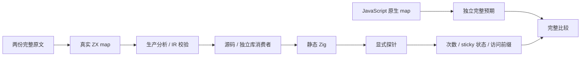
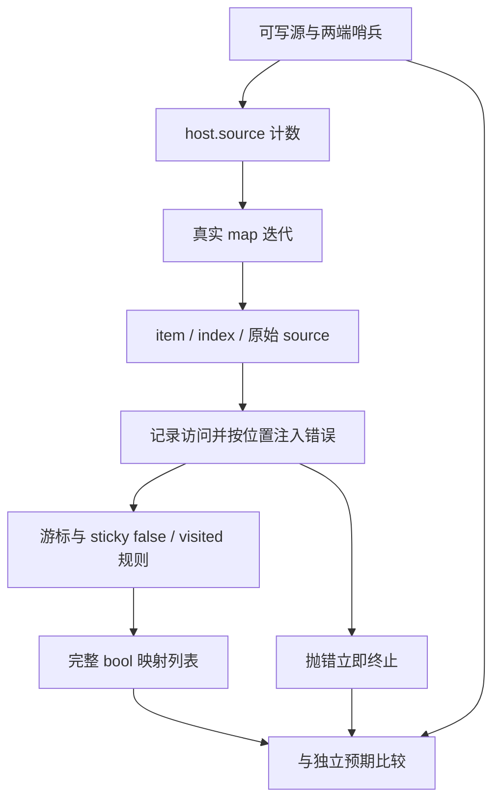

# 映射回调顺序与单次访问

## IDEA

- **Intent：** 完整保留 map 的外部 sticky false 顺序状态和逐次违规输出，验证真实回调顺序、单次访问、源表达式单次求值及回调错误停止。
- **Data：** Test262 固定 7ab7fafa0003f73fc85c1b95d88094d33f7eb8bd；zxc 固定 dbe0e352eecc6accc43a455480c9a83415682ba2。map ii4 / ii5 尚未登记；现有 map 原生轨迹不观察这一组状态规则。
- **Edges：** 仅改测试包及本目录；不改生产实现。显式静态 native probe 只记录观察与状态，不执行 map 算法。ii4 原输出被丢弃，静态适配增加 bool 返回，但必须完整保留 called 与 sticky result，不宣称 undefined 列表协议。稀疏泛型 ii7 不转成 dense 后登记。
- **Answer：** cursor / violations 两类具名目录，完整原文和独立 JavaScript map oracle；两种模式、源码/独立库路线实际执行，签名、逐条名称和跨模式源码核验后英文 Conventional Commit 并 push。

## 执行步骤

1. 保存两份完整原文、SHA 与官方 harness 观察，普通/严格模式实际执行。
2. cursor 真正保持游标、调用数与 sticky false；violations 真正保持 visited 状态并返回完整违规列表。
3. 空源、重复值、有符号项和 257 / 1024 项；故意错配初始游标，错误后续恢复匹配也不能清除失败标志。
4. 在首、中、末与越界调用位置注入 CallbackFailure，比较包含抛错那次调用的完整访问前缀，证明不会继续执行；source_calls 始终为 1。
5. 复用现有带 native 的生产分析/编译库消费者与执行驱动；探针检查原始 source 指针、长度、值与 item-index 对应，可写源两端加入哨兵。
6. 新建普通测试 build 模块，接入正式 test-runtime 和生成 --check，不泛化或改写旧 filter 用例。
7. 新工作树重建当前 83 个模块，全部门禁通过后精确暂存并提交 push；仅确认的新实现缺陷通知授权实现会话。

## 架构图

## 数据流图

## 自我批判

不能用 map 输出全 true 代替 ii4 的真实 sticky 状态，也不能用恒 false callback 代替 ii5 的 visited 规则。原生探针属于测试观察边界，不是语言实现或新运行库；仍需真实执行普通 map 并保留所有原断言。补充错误控制不登记成 sparse generic 原文兼容，单次 source 表达式也不冒充 species 构造次数原文。总体目标继续保留。
