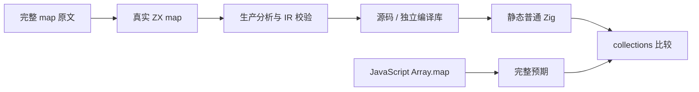
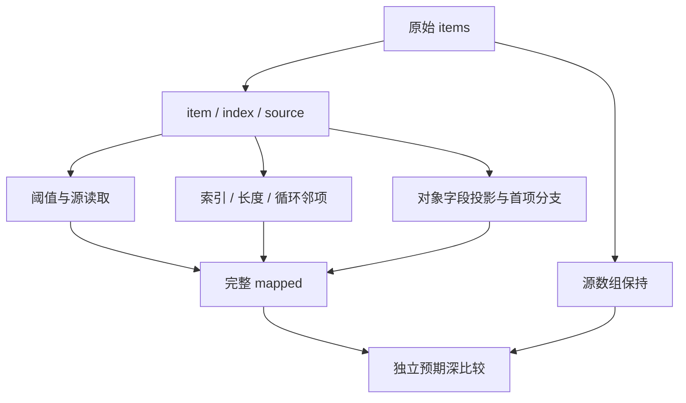

# 映射索引与对象投影

## IDEA

- **Intent：** 完整适配 map 的真实三参数源读取原文，并用数值与对象列表观察 index/source，验证计算、索引及聚合结果的编译库消费。
- **Data：** Test262 固定 7ab7fafa0003f73fc85c1b95d88094d33f7eb8bd；zxc 固定 40839e2a5eb2b8252534b7cb34b5ac3cd686587d。原文 8-c-ii-12 尚未登记；现有 map arguments 只返回布尔值，不能独立观察完整索引、源长度与对象投影字段。
- **Edges：** 仅改测试包及本目录；不改生产源码，不新增专用运行层。不把 array-like 的通用 map.call 接收者改成列表后冒充整份适配，也不把 arguments[2] 直接换成第三形式参数。
- **Answer：** 五类具名用例，完整原文及独立 JavaScript map oracle；Debug / ReleaseSafe × source / library 全部实际执行。证据、精确提交范围、英文 Conventional Commit 和远端一致回执可恢复。

## 执行步骤

1. 保存完整原文与 SHA，官方 harness 普通/严格模式实际执行。
2. source_value 保留 item>10 后 source[index]==item 的原谓词及顺序；indices、length、rotate、records 为明确的 zxc 补充控制。
3. 用重复值与长数组分离元素值和索引；rotate 的最后元素读 source[0]；records 在 index==0 时使用显式 first，不读取负索引。
4. 返回完整 mapped 和原 items；复用 collections 支持，检查可写输入副本和全部输出。
5. 全新工作树重新生成当前 83 个模块；生产分析、IR 校验及普通 Zig 生成；库路线毒化编码字节、释放提供者后独立消费。
6. 静态检查、逐条执行名称、签名、跨优化源码一致性与精确发布门禁通过后提交 push。仅确认的新实现缺陷通知授权实现会话。

## 架构图

## 数据流图

## 自我批判

完整输出能观察各位置与字段，但不能单独证明回调调用次数或源指针身份。空数组不得进入 callback，rotate 无空数组越界，records 的前驱读取必须只在 index>0 分支执行。对象列表不是标量列表的语法换写：必须真实验证聚合类型、存储与独立库 ABI，不能遇到失败就改成几个标量数组以规避能力缺口。整体 Test262 与所有特性的目标仍未完成。
