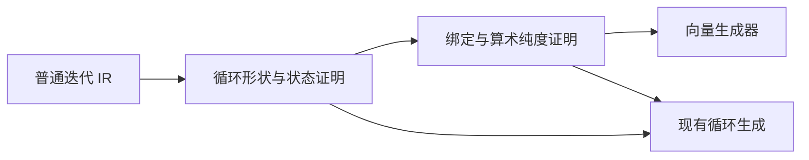
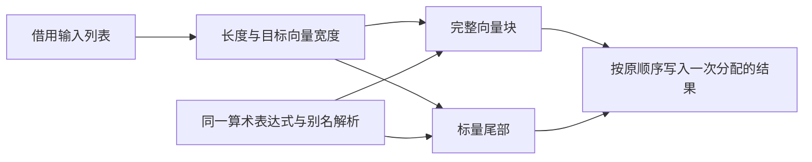

# 普通循环向量化修复

## Intent：最终目标

让普通迭代 IR 的同类型浮点逐元素纯算术映射继续生成 SIMD 和标量尾部，保持 zero runtime 与原运算树。

## Data：可用证据

测试会话在固定提交 bbd92b5c5 发现 f32 WASM 行为正确，但生成源码无 Vector，汇编无 f32x4.mul。集合已降级为 iteration，genz SIMD 仍只接受 Transform。证据位于主工作区普通循环降级与SIMD回归记录。

## Edges：边界与限制

不恢复旧集合 IR，不按变量名识别，不降低汇编断言，不新增测试。识别必须证明零起点、严格长度边界、步长一、源保持不变、每轮一次结果追加，且所有被省略的绑定与求值均无副作用。失败时保持现有循环生成。仅消费最终列表的上下文允许替换完整状态循环。窄 SIMD 路径继承已有错误捕获与事务提交边界；不改变普通循环消费器的限制。

## Answer：交付与成功标准

在 genz 内分离循环形状证明、算术表达式识别和向量生成，复用原向量生成器；运行现有完整 SIMD 专项检查行为及汇编。编译库迁移构建继续，不用其未含修复的二进制作为 SIMD 验收证据。本次修改 genz 过渡 Zig 实现，不宣称其已自举。

