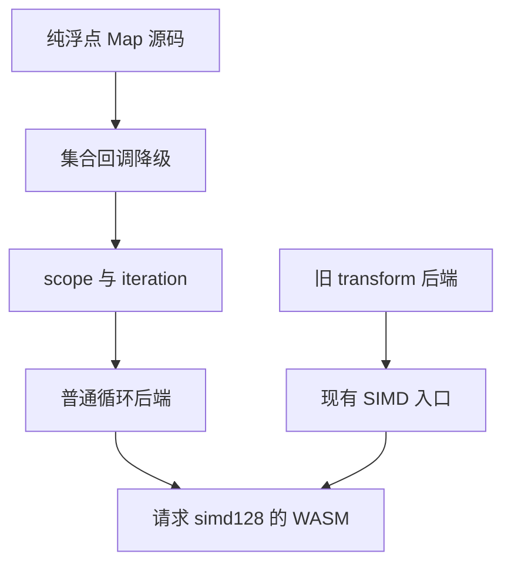
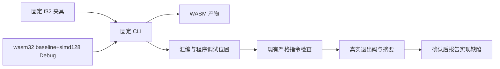

# 普通循环降级与 SIMD 回归

## Intent：最终目标

核对根回归的 WASM SIMD 指令检查失败是否属于真实优化能力回归。保留语义执行与优化证据的区别，不通过删除指令断言或恢复旧 transform 来掩盖问题；确认后向已授权实现会话报告。

## Data：可用证据

- 原始根 Debug 固定在 `bbd92b5c5`，日志第 6577 行的 `checkAssembly` 未找到归属于生成程序的 `f32x4.mul`。
- 失败前 f32 的 84 项 Node 行为检查、42 项 baseline WASM 检查通过；SIMD 分支在行为循环之后进入指令检查。其最终 banner 尚未输出，不能把整个 SIMD 专项计为通过。
- `packages/genz/README.md` 与 `docs/2026-10-05/SIMD参考.md` 仍规定同类型 f32/f64 纯四则 Map 产生显式 Vector。
- SIMD 入口位于 `packages/genz/src/zx/transform.zig`，普通集合源码目前降级为 scope 与 iteration，可能绕过该入口。
- `f32.zx` 的 `value * value` 属于承诺的纯浮点四则范围。

## Edges：边界与限制

- 不修改生产实现、既有测试断言或任何正在运行的输入。
- 用原始根生成的固定 CLI 复制件和原始 fixture 创建独立产物，记录源码、CLI、工具链、参数与退出码。
- 指令检查归属于 `program.zig` 的调试位置，不用标准库中偶然出现的向量指令代替语言自身的向量化。
- 语义等价的标量实现不能单独证明已履行显式 SIMD 优化契约；同时也不能把缺少 SIMD 误报为数值结果错误。
- 最新提交只做源码比较时明确标注静态范围，不把旧 CLI 的真实执行报告为新版本执行。

## Answer：交付格式与成功标准

保存可重现命令、成功编译的 WASM 与汇编身份、真实指令检查结果，以及源码到后端入口的调用关系。若确认承诺范围内的 Map 绕过 SIMD，发送一次具体缺陷报告到已授权实现会话，要求保持普通 iteration、zero runtime、zero copy；等待修复后在新固定源码上重跑完整现有 SIMD 门禁。

## 架构图

## 数据流图

## 自我批判

仅凭旧 SIMD 入口仍在源码，不能断言当前程序一定失去向量化；可能存在其他后端路径或等价指令。必须核对实际产物和请求的 CPU 特性。反过来，数值结果通过也不足以证明显式优化能力仍然存在。诊断应支持修复当前普通循环模型，而不是以旧内部节点替代新语言架构。
