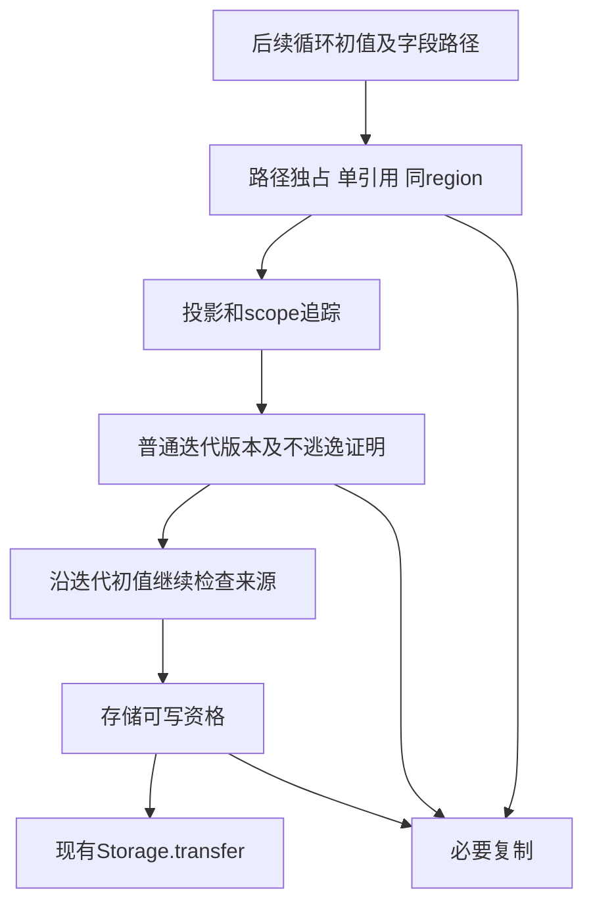
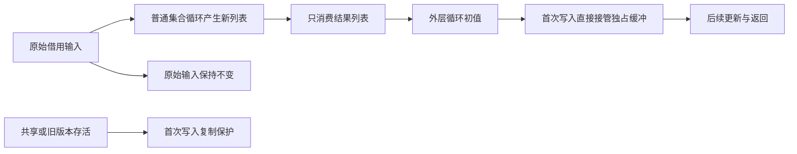

# 普通集合初值所有权转移修复

## Intent：最终目标

让可证明独占、可写的新建列表结果在进入后续循环首次写入时直接转移缓冲，避免动态复制；共享、借用、旧版本仍可观察及跨重复区域的来源继续保留必要复制。

## Data：可用证据

测试会话在 bbd92b5c5 的既有 test-loop-initial-ownership 中确认 map/filter/local/nested/tuple 五种模式的真实动态复制，非单纯统计到了 executeValue。已有 shared/borrowed/repeated 是必要复制的对照。

本会话又用刚完成 SIMD 验证的新 CLI 对既有 map.zx 生成普通 Zig，退出 0。只截取普通 execute 后仍有两处 dupe：一处是 `dupe(u64, (&[_]u64{}))` 空列表初始化；另一处是 `state_items_10 = ...dupe(u64, operand_15)` 动态列表复制，且无 constCast 转移。证据见修复前普通入口.txt；完整临时产物和哈希见验证输入.json。

ownership/root.zig 不处理 field/tuple_field，fresh 终点仍仅接受旧 transform 和已证明分配的 call。普通集合经 scope、iteration 与 result 投影生成，追踪因此提前失败。

## Edges：边界与限制

- 不恢复旧 transform，不按集合名称、变量名、字段名或 fixture 硬编码。
- Graph 的 exclusive、符号单引用、唯一绑定及相同执行 region 检查继续保留；不能只检查最终 allocation 节点。
- allocation/trace 的 fresh 与实际可写存储不是同一件事。非空静态 literal 不能因 constCast 变得可写。
- 新直接 list 来源先只接受空列表；没有元素可被写坏，后续 push/concat 的非空结果来自实际分配。非空来源必须另有与 lowering 一致的存储证明。
- 现有 iteration_buffer/analysis 能证明当前版本更新、分支汇合及结果只保留在指定路径，可复用它避免另造 Map matcher。无 Calls 模式的内部标量返回调用没有充分的逃逸约束，新的转移证明应使用严格 Calls 输入，保守拒绝涉及候选 backing 的未知调用。
- 不因只返回 result 投影就忽略循环中的 Store、task、capture 或保存旧版本的行为。
- 空列表 dupe 不等于非空元素复制；既有 shape 检查应依据实际普通入口及动态复制成本细化，继续拒绝有害复制和缺失转移，不能只减少计数让门禁通过。
- 不新增测试用例，不执行全量测试。修复后执行完整既有 test-loop-initial-ownership 的 source/library、Debug/safe 路线及原有行为/OOM 检查。

## Answer：交付与成功标准

补齐投影路径追踪，组合现有独占区域证明、循环版本不逃逸证明与初值存储资格，复用现有 Storage.transfer 落点。Graph 不为命中用例放宽，证明失败继续复制。保存普通生成入口与现有专项结果后作为独立修复提交推送。

## 自我批判

Trace 的分配来源集合不能替代 reference 链检查，也不能自动证明静态常量可写。循环版本证明与初值来源证明必须组合；若严格的版本保留已经蕴含来源连续性，不应重复实现一套同职责 Trace。实际接入前还需核对该组合的调用边界与已有函数分配摘要。当前生产修复已通过既有 Debug 专项的行为、边界与 OOM 检查；safe 专项也已通过 128/128 项，验证完成。
