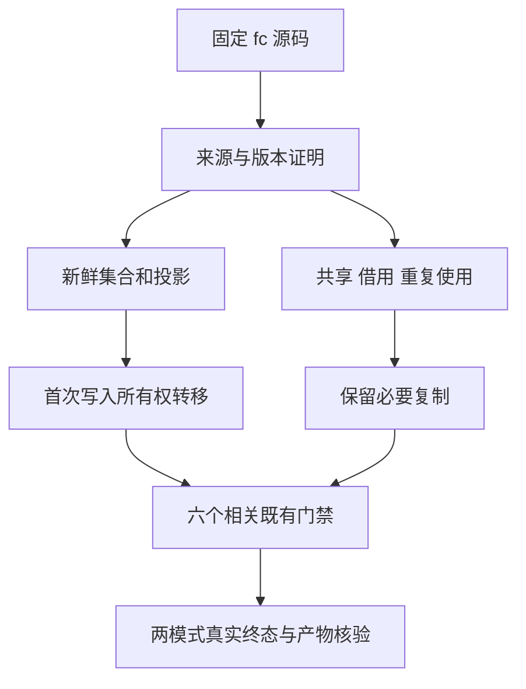
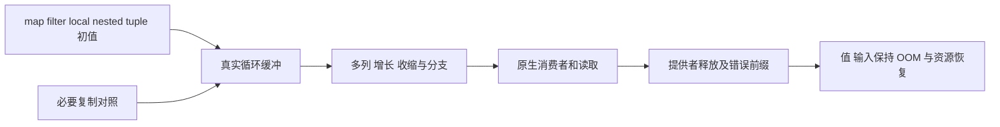

# 普通集合所有权修复关联回归

## Intent：最终目标

在固定 fc88b9ef4 源码上验证已报告的新鲜集合结果复制缺陷的修复，并检查相邻缓冲、版本、复杂路径和消费者寿命边界，避免只验证五个正例就宣布一般所有权安全。

## Data：可用证据

生产提交 fc88b9ef4019b5b8c337a4fc1354dda904f1f27f 增加 field/tuple 投影及普通 iteration 初值的来源追踪。既有独占、单引用、唯一绑定和同 region 条件保留，不把所有 iteration 直接视为新鲜内存。非空静态列表字面量没有被允许转为可写缓冲。

只读审查复核维护者保存的 32 份 source/library Zig 与 ABI：五类新鲜结果普通入口有目标缓冲转移、没有动态列表 dupe；shared/borrowed/repeated 对照保留必要复制。已有 Debug/Safe 日志均为 79/79 步骤、128/128 测试。本轮尚未执行自己的关联回归，不把上述局部证据扩展为六目标或完整根通过。

## Edges：边界与限制

- 固定新工作树，不修改生产源码或已有严格断言。
- 执行 test-loop-initial-ownership、test-iterate-buffer、test-nested-buffer、test-loop-columns、test-aggregate-loop、test-detached-reader 六个现有目标。
- 每模式一次 canonical 构建共享依赖；Debug 与 ReleaseSafe 分别使用新的本地、全局缓存，核验完整固定源码、工具、SDK 与 Node 依赖身份。
- 仅排除显式零长度数组的 dupe，不能跳过非空共享、借用或重复使用对照；AST 入口范围和实际目标转移行均需复核。
- 原完整根仍是旧 bbd 源码，本轮不更换其输入、不重启其句柄，也不将其失败或通过挪用为 fc 结果。
- 冷生成器按资源队列串行：先等当前六目标组合序列结束，再完成已开始装载专项的 ReleaseSafe，随后执行本轮两模式。任何观察超时均不等于进程终止。
- helper 未知调用的来源证明仍保守，专项不代表所有集合返回路径均消除复制，也不证明编译期分析成本已解决。

## Answer：交付与成功标准

取得六目标的实际两模式终态、源码不变证据、真实命名测试数和产物身份。分别核对新鲜转移、必要复制、旧版本保护、多列/复杂叶、原生消费者、脱离寿命读取及 OOM；不以目录和 catalog 数量代替执行。确认实现缺陷才报告授权实现聊天，完整部分以英文 Conventional Commits 单独提交推送。

## 架构图

## 数据流图

## 自我批判

来源追踪代码合理不代表所有权安全已经证明。AST 中出现 constCast 也不足以代表转移正确，必须核对普通入口中的目标缓冲及生产 Graph 证明。已有 u64 专项结果不能代替复杂叶、多列及外部消费者，关联回归完成前保持结论范围明确。
