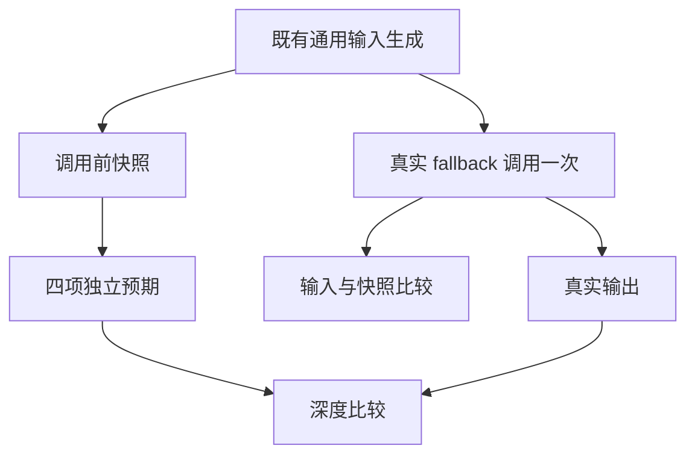

# 标量回退输入保持执行计划

## Intent：最终目标

采用 IDEA 框架，补齐 SIMD 门禁中标量 fallback 的输入保持检查。返回值参考必须来自调用前快照，避免实现若修改输入，参考模型也随之改变而误通过。

## Data：可用证据

前一批固定 e4d 两模式的 756 次语义观察已通过，但 fallback 的预期使用调用后的 input，且缺少显式 input/before 比较。f32/f64 Node 路线已经使用快照，作为同职责成熟样例。现有 42 个长度和四项 fallback 结果保持不变。

## Edges：边界与限制

- 仅修改 `packages/test/tests/targets/simd/run_test.ts` 的 fallback 检查，不修改生产实现、夹具、长度、参考算法、汇编检查或 catalog。
- 每次调用先复制测试输入作观察快照，调用一次，核对输入不变，再从快照计算四项预期。快照仅存在于测试支撑，不进入应用产物。
- 使用已完成 canonical 联合门禁的固定 e4d Debug、ReleaseSafe CLI，冻结实际测试驱动和传递输入，真实重跑现有目标驱动。
- 不把新断言算作新独立用例，不把固定版本结果归于当前 HEAD 或完整 root。
- 运行器仍清理临时输出，只报告保留下来的真实日志、命令、身份和终态，不补造 Node/Wasm/汇编 SHA。

## Answer：交付格式与成功标准

交付最小测试修正与中文执行记录。两模式重跑完整 SIMD 驱动，各 378 次既有观察；其中每模式 42 条 fallback 输入须显式不变，四项参考必须使用调用前快照。核对 TypeScript、格式与 diff，保留外部不可改写终态，使用英文 Conventional Commits 提交并推送。

## 自我批判检查点

调用后参考依赖可能掩盖输入变化。修正应保持参考独立，同时不引入额外应用复制或特殊输入答案。新断言通过只证明既有输入域内的保持性质，不能外推所有宿主对象或目标路线。
