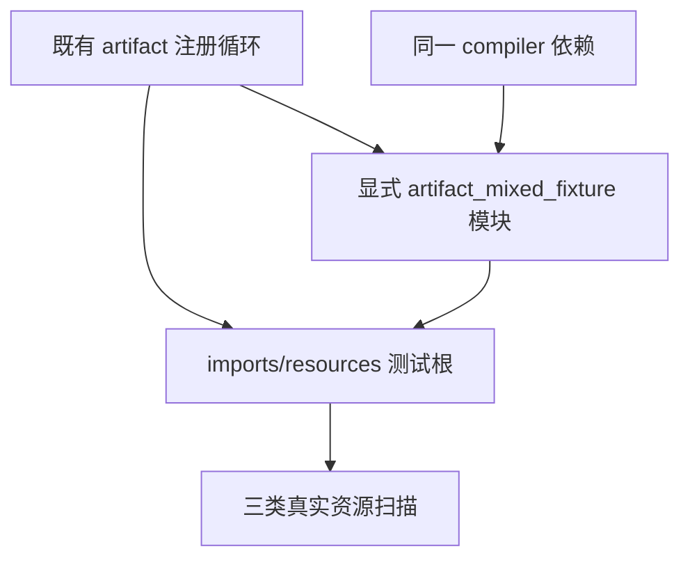

# 模块产物资源夹具接线门禁

## Intent：最终目标

让 artifact imports 资源门禁真实执行，恢复合法 aliases 以及非法 alias_input/alias_output 的全部分配失败扫描和输入列保持验证。

## Data：可用证据

固定 bbd92b5c5 的原完整根 Debug 在实际日志第 16563 行暴露 Zig 编译错误：imports/resources_test.zig 使用 @import("../mixed/fixture.zig")，导入文件越过该独立测试根的模块范围。错误发生在测试执行前，不能当作 OOM 实现缺陷，也不能将这三个具名测试计为通过。

只读审查核实当前相关源码与旧基线一致。test-module-artifacts 将 imports/resources 单独注册为根；现有 record_fixture 已正确接线，与该错误无关。mixed/fixture.zig 的 copyColumns 和 sameColumns 是成熟的列快照实现，需通过显式具名模块复用。

## Edges：边界与限制

- 预期仅修改 packages/test/build.zig 与 imports/resources_test.zig。
- 在既有注册循环的 imports/resources 分支添加 artifact_mixed_fixture 模块，显式提供相同 compiler、target、optimize；测试改用具名导入。
- 不移动或复制 helper，不扩大文件导入边界，不修改生产代码。
- 完整保留三项命名测试、checkAllAllocationFailures、两组列保持断言、非法变异时才接受 InvalidModule 以及继续传播 OOM 的规则。
- 新 native 冲突专项正在使用 build.zig 的独立正式覆盖；先完成该部分发布，再修改同一注册文件，避免混入未完成接线。

## Answer：交付与成功标准

最小接线修复在固定源码上通过 Debug 与 ReleaseSafe 的真实三项资源测试，核实合法及两个非法变体均进入分配失败扫描。通过既有 `test-module-artifacts` 构建目标运行，真实执行具名模块注册分支；同时保留该目标其余测试的结果。归档原失败、最终源码身份和实际终态，复核本次 diff 后以英文 Conventional Commits 单独提交推送。

## 固定输入与资源队列

正式工作树固定为 `695c654ce3350eaa7f561d661135a2682fcb6ea8`，覆盖上述两个文件的相同语义改动，共绑定 6,765 个非 docs 源文件。`resources_test.zig` 与交付工作树字节一致；该旧基线的 `build.zig` 不含之后独立提交的 native 冲突测试注册，因此完整文件 SHA 与当前工作树不同。本次新增的具名模块注册块逐字一致，不将后来无关注册加入旧基线。

两个模式分别使用新的局部和全局缓存，只预置身份已核验的 libyaml 下载归档，由实际构建重新生成编译器普通 Zig。没有采用直接拼接 `zig test` 命令代替构建注册分支，也没有将其他专项的旧生成源码视为本次冷构建结果。

为控制冷构建的内存竞争，队列等待已有所有权关联回归队列退出，再顺序运行本项目 Debug 与 ReleaseSafe。等待只表示资源调度；前一个项目的结果不充当本项目的语义证据。Debug 失败时不启动本项目 ReleaseSafe。尚未得到真实进程终态时不得计为通过。

## 架构图

## 数据流图

## 自我批判

只修复编译入口不代表资源门禁已经通过，必须实际越过编译并进入扫描。具名模块要共享原 compiler 依赖，不能建立另一套不兼容类型实例。静态复核已确认三项扫描与全部断言未删减，但不能替代运行。固定旧生产基线上的冷构建也不能证明最新 HEAD 或完整根门禁通过。此时接线已修改并冻结，门禁尚未开始，没有向实现聊天报告该测试自身问题。
