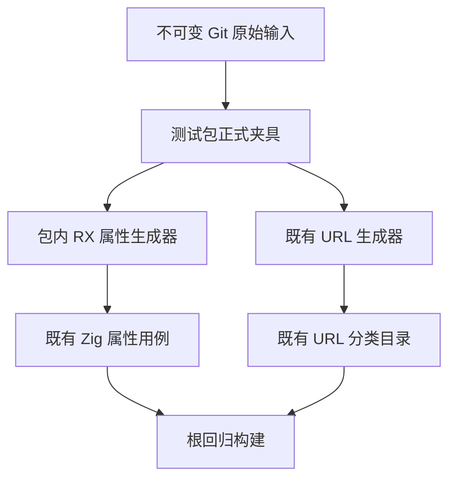

# 测试输入脱离文档产物

## Intent：最终目标

遵循 IDEA 框架，修复正式测试生成器对已清理 docs 数据文件的依赖。测试包需要独立保存正式输入，使仓库克隆后的根回归不再因为文档过程产物缺失而中断。

## Data：可用证据

当前测试构建仍引用三份缺失 JSON：RX 属性解析 70 条、属性校验 78 条，以及文件 URL 的 1,449 条参考记录。原始字节可以从不可变版本 `695c654ce3350eaa7f561d661135a2682fcb6ea8` 读取。RX 旧 Python 生成器仍位于 docs，URL 生成器与根构建依赖指向 docs。

既有 shared/json.ts 的 asciiJson、parseJson 与 shared/catalog.ts 的 writeOutput 可生成与旧 Python 相同的 JSON 和 Zig 文本，不需要引入新抽象或格式化子进程。当前 parsing_test.zig、schema_test.zig 及 URL 分类目录作为输出身份基线。

## Edges：边界与限制

- 原始三份输入完整迁移到 packages/test/tests，仅按仓库 Prettier 规则调整 JSON 排版，并核对解析内容及顺序相同。原始字节另存本地外部证据，不恢复 docs 下数据，不改变已有用例、预期、ID 或 review。
- RX 生成器迁入包内 TypeScript，沿用既有确定性序列化与 freshness 检查机制；旧 Python 生成器在引用迁移后删除。
- 必须先保留当前缺失文件的真实失败，再验证迁移后的生成器检查通过，并核对所有已有输出逐字节不变。
- 文件 URL 参考记录另外使用 Node 独立重新计算，比较案例内容；运行环境版本字段与数值观察分开记录。
- 本批修复测试基础设施，不以生成器通过声称编译器语义回归或全量根回归通过。
- 无分支、无生产源码修改、无 docs 日志或数据提交。运行证据保存本机外部目录。

## Answer：交付格式与成功标准

交付包内三份正式输入、RX TypeScript 生成器、三处构建/加载路径修复和旧生成器移除。生成器实际检查成功，RX 两份测试源码和全部 URL 输出与基线相同，Node 参考案例内容一致，活动测试源码不再通过 docs 读取输入。记录按英文 Conventional Commits 单独提交推送。

## 架构图

## 数据流图

## 自我批判

正式测试输入曾混在 docs 过程产物中，文档清理因而影响根回归。恢复到旧位置只能暂时掩盖职责错误。本批应迁移真实输入边界并保持所有观察不变；如果参考环境产生差异，保留差异证据，不能直接重写预期以获得通过。
