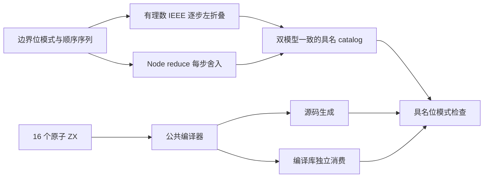
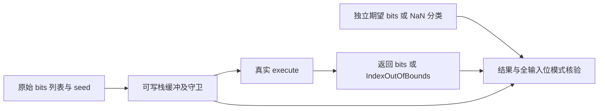

# 浮点归约顺序与位模式计划

## IDEA

- Intent：补齐 f32/f64 reduce 的严格逐步运算、首项初始化、空输入、正负零、非有限值及输入保持，避免整数测试掩盖重结合或额外精度错误。
- Data：基线 3c15e0f349a7c9166003f2e85796e0cf345a44e0；IR 契约规定严格 f32/f64、运算产生非有限值及无初值空列表 IndexOutOfBounds。既有 reduce 直接夹具没有 f32/f64 声明。锁定 Test262 reduce 260 份原文未发现可完整保留全部前提的新纯浮点候选；已有顺序、首项、单项原文已适配。
- Edges：只改测试包与本记录，不改生产实现；不将原型、泛型 length、异质数组改成密集浮点列表后计为适配。位模式保存特殊输入；非 NaN 输出按位比较，NaN 只验证分类，不规定 payload。f32 每一步舍入，不能先用 f64 算完整总和再收束。
- Answer：两种精度、四种运算、显式/缺省初值形成 16 个分类套件，经源码与编译库两路、Debug 与 ReleaseSafe 执行。具名目录及正式专项入口纳入测试包；完整归档生成源码、签名、实际日志、期望模型、版本及发布范围，英文 Conventional Commit 提交 push。

## 方案

复用成熟 IEEE 有理数模型逐步左折叠，独立使用 Node Array.reduce 对照；f32 的 Node 回调在每次运算后 Math.fround。两套模型必须在生成 catalog 时一致。输入与结果用十六进制位模式 JSON 编码，不经过普通 number JSON 序列化。

每种精度包括正负零、子正规边界、正规边界、舍入邻值、整数精度边界、最大有限值、无穷及 NaN。系统枚举二元边界、单项/空输入，并增加能区分左折叠与重结合、逐步溢出及长输入的顺序控制。source 与 library 使用现有纯编译工具，后者在解码后释放提供者及污染编码缓冲，再由独立消费者生成。

## 架构

## 数据流

## 自我批判检查点

不能混淆 f32 与 f64 的舍入位置；不能只比较浮点相等而忽略正负零；不能对 NaN 使用普通相等或强制 payload 一致；不能把审计计数代替真实执行。先完成仓库空行格式和严格类型检查再冻结运行输入。原文适配计数本批保持不变，全部新增用例明确属于 zxc 自有语义边界。
