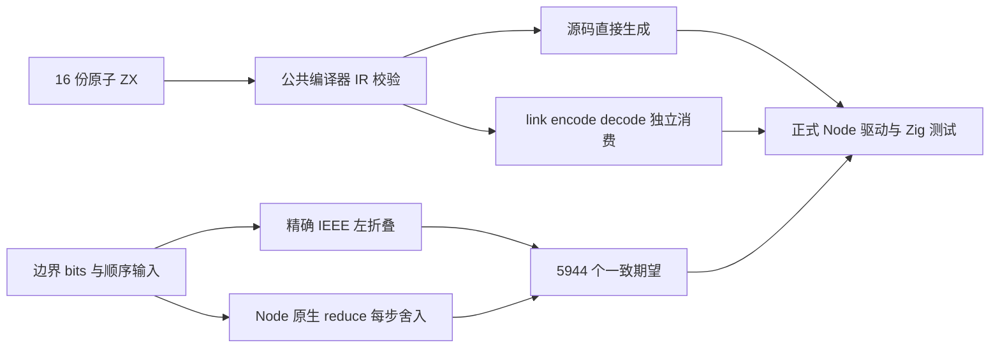
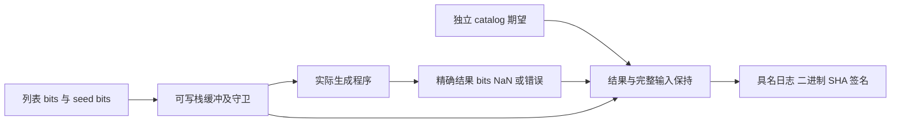

# 浮点归约顺序与位模式执行记录

## IDEA

- Intent：补齐 reduce 的 f32/f64 严格逐步运算和初始化边界，验证数值语义、结果位模式与输入保持。
- Data：冻结版本 3c15e0f349a7c9166003f2e85796e0cf345a44e0；43 个正式测试包路径；16 个套件共 5944 个唯一具名用例。精确 IEEE 模型与 Node 原生 reduce 的结果逐条一致，14 条数值锚点另行核对。Debug、ReleaseSafe 各完成 11888 次具名执行，共 23776 次；64 个二进制签名核验通过，833 份原始证据记录已归档。
- Edges：本批验证当前宿主的源码/编译库消费及 Debug/ReleaseSafe，不代表整个仓库、JSON/Wasm 应用接口、其他宿主或全部浮点状态环境已经验证。NaN 只核对分类，不规定 payload。Test262 没有可完整保留全部前提的新纯浮点原文，本批属于 zxc 自有契约测试，上游适配计数保持不变。
- Answer：将分类 catalog、原子 ZX、位模式检查、正式驱动与专项构建接入测试包；归档实际生成源码、编译和执行命令、签名二进制身份、完整测试名称及冻结输入；准确范围核验后以英文 Conventional Commit 提交 push。

## 为什么需要这一批

既有 reduce/sum 与数值观察夹具使用 i64；字符串拼接可以验证顺序，但不能证明浮点每步舍入。普通 number JSON 序列化会丢失负零与非有限值，不能作为此处的输入/输出协议。

本批直接使用十六进制位模式编码输入列表、seed 与结果。check 以可写整数栈缓冲重解释为 f32/f64 slice，执行后比较整个原始位模式数组、两端守卫、seed、原 slice 指针与长度；不对含 NaN 的输入使用浮点相等比较。

## 独立期望

精确模型复用成熟的有理数 IEEE 算术实现，每一步加减乘除都按当前 width encode，得到的位模式进入下一步。无初值直接取首项，并从下一项开始；空无初值为 IndexOutOfBounds。模型不会先计算一个无限精度总和后只舍入一次。

第二模型使用 Node 原生 Array.reduce；f32 回调在每一步运算后 Math.fround，f64 使用原生 Number 运算。每个 catalog 行均要求两模型一致。负零、无穷及有限值比较精确 bits；NaN 比较分类。14 个额外锚点明确验证：大数加 1 后抵消得 0、先抵消再加 1 得 1；先溢出与先抵消的差异；无初值单项负零、有初值正零加负零及空输入返回负零 seed。

## 分类与数量

| 每种精度、每种运算 | 空输入 | 单项 | 二元边界 | 顺序序列 | 长输入 | 合计 |
| ------------------ | -----: | ---: | -------: | -------: | -----: | ---: |
| 无初值             |      1 |   18 |      324 |       10 |      9 |  362 |
| 有初值             |     18 |  324 |        0 |       30 |      9 |  381 |

两种精度 × 四种运算 × 两种初值模式，共 16 个套件、5944 个具名用例。seeded 的 324 项是 seed 与唯一列表项的完整边界笛卡尔积；unseeded 的 324 项是两个真实列表项的边界积。它们实际经过不同的初始化路径，不以同一用例重命名充数。

18 个边界包含正负零、正负最小子正规数、最大子正规数、正规边界、半值、正负一、1 的后一邻值、整数精度边界、最大有限值、正负无穷及 NaN。顺序控制保留完整三项输入；长输入为 17、257、1024 长度的三种重复/交错模式。

生成器产出对应的 16 份 ZX，每份 7 个物理行，直接使用有初值或真正省略初值的 reduce。没有把缺省初值替换成加法单位元，这对空输入与负零都不等价。

## 架构

## 数据流

## 真实执行路径

复用现有 field_facts 纯编译工具：source 直接 analyzeProject、validateIr、emitModules；library 经 link、encode、decode，污染原编码字节并释放提供者和库，再由独立 consumer 分析及生成。两个路径均要求 native 模块清单为空，没有加入 zxc 专用运行层。

正式 Node 驱动复用成熟的模块依赖闭包参数构造，读取真实生成模块，执行 Zig 测试，保存命令、退出状态、信号、完整名称及二进制 SHA。门禁额外核验实际日志名称顺序和成功总结，再验证代码签名，不接受 compile-only 或 test-no-exec。

专项入口在测试包内为 `zig build test-reduce-floating`，并通过 test-runtime 接入默认 test。源码/编译库两个路径均注册；通用 JSON runner 跳过新 floating_reduce kind，防止特殊数值落入普通 JSON 转换。

## 执行结果

| 模式        | 套件 | 源码/编译库组合及二进制 | 具名执行 |
| ----------- | ---: | ----------------------: | -------: |
| Debug       |   16 |                      32 |    11888 |
| ReleaseSafe |   16 |                      32 |    11888 |

64 个真实测试二进制全部执行通过并验证签名，源/库路由集合完整，所有日志测试名称顺序与 catalog 一致。两个模式的生成 Zig 与具名测试源码逐字节一致。83 个新生成编译器模块、六个生成步骤、全部消费命令和退出状态均核验，未使用 test-no-exec。

四个 Zig 文件 AST、16 份 ZX 的 120 行上限、六个自有 TypeScript 文件严格类型检查、七个 Python 脚本语法及仓库空行格式检查，共 29 项静态检查通过。另有 14 条数值锚点断言、catalog 生成一致性检查与全包 catalog 审计。构建接线已读取复核，实际公共编译工具和正式 Node 驱动已执行；没有执行全仓库默认测试或宣称 GitHub CI 已验证该专项。

所有进程均已结束后才整理发布范围。本批未发现新的实现缺陷，没有修改生产实现，也没有给指定实现会话发送无缺陷消息。

## 上游对齐边界

锁定 Test262 reduce 目录的 260 个文件身份已记录；关键词检索及关键原文全文核对用于判断适配边界，不是对 260 份原文作出的全部语义等价证明。字符串顺序、首项与单项原文已有适配。特殊 length 为正负零、NaN、负无穷的原文使用泛型对象；含 5.5 seed 的原文使用异质数组。去除这些前提会改变原文要验证的功能，因此没有将它们计为新增密集浮点归约适配，也未执行或冒充执行这些原文。

catalog 审计现为 137201，其中 runtime 93144；本批新增 5944。上游 53597，adapted 848、equivalent 103、excluded 2081、unreviewed 50565，关联用例 6978。审计明确不衡量实际执行次数，不能从这些计数推断全部 catalog 已运行。

## 工具复核与自我批判

运行前只读复核发现，标准库的空 slice 转换会规范化指针，不能要求它仍指向栈缓冲的第一个槽。夹具已改为保存实际传入的 slice 并在执行后比较，不修改业务输入与期望，也不把该问题报作编译器缺陷。

受控的 corpus append helper 在正式运行前按仓库规则收束为 args，并再次严格类型检查与 catalog --check；所有 5944 行字节不变。运行输入冻结后未修改执行中的脚本、夹具或数据。

双模型一致仍不能成为所有输入上的数学证明；本批只有明确列出的边界与序列。没有要求 NaN payload、没有通过普通浮点相等掩盖负零，也没有把长输入循环次数计为额外具名用例。编译成功与生成文件后缀不构成完整自举证明。全仓库回归、GitHub CI、完整 Test262、其他 zxc 特性及所有成本边界仍需继续验证。
