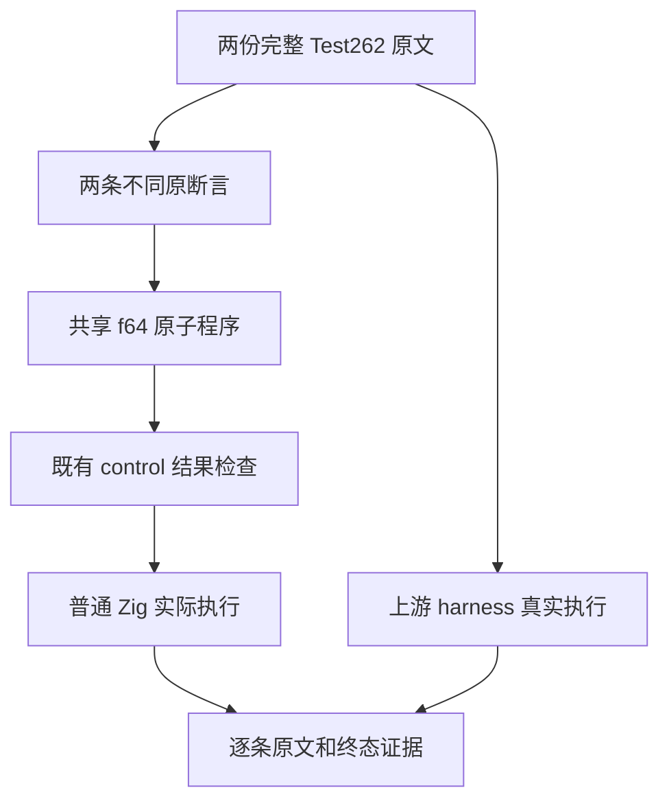
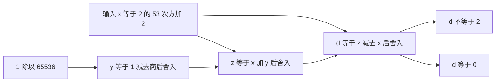

# 浮点逐步舍入原文审查

## Intent：最终目标

完整适配 number/S8.5_A2.1.js 与 S8.5_A2.2.js，验证 binary64 在每步运算后的舍入，不把多步表达式化简成数学上的等式，也不删除较弱但不同的原断言。

## Data：可用证据

固定上游 revision 为 7ab7fafa0003f73fc85c1b95d88094d33f7eb8bd。两份原文均从精确可表示的 9007199254740994.0 开始，依次计算 y=1.0-1/65536.0、z=x+y、d=z-x。第一份要求 d===0；第二份只要求 d!==2，不能把后一条登记为 d===0。

主 agent 已完整复读两份原文；只读分析核验了缓存与索引 SHA，全部 reviews 中没有这两条路径。language/literals/numeric 已全部登记，不重复添加；本轮候选来自仍有 21 份未登记的 language/types/number。

## Edges：边界与限制

- 保留 f64 与四个语义绑定，通过输入传入原 x 值，使真实普通入口参与运算。
- 沿现有 control 输出检查和 runtime suite 接入，不新增 native Math 包装或专用测试运行库。
- 精确模型按每步 binary64 舍入计算，并与 Node 原运算链交叉核对；不能只由实现本身提供期望。
- 两份原文、两条原断言分别映射；共享程序不减少原文追溯，也不把两种模式或路线当作新原文。
- 其他极值、NaN、负零原文含一元正号、布尔相加或 Math.pow 等实际前提，不因部分断言可表达就批量排除或删除前提适配。
- 初始阶段仅收集原文证据，未登记 adapted；正式源码与两模式实际执行的后续结果见《执行记录》。

## Answer：交付与成功标准

保存两份原文、SHA、原 harness 执行终态和精确断言映射；在固定源码上真实运行 zxc 两模式，完成排重审计与最小范围复核后，再独立提交推送。记录遵循 IDEA，附架构图、数据流图与自我批判，提交标题和正文使用英文 Conventional Commits。

## 架构图

## 数据流图

## 自我批判

两个原文运算相同但成功标准不同，不能为统一输出而篡改断言。常量值正好出现预期结果也不能证明运行中的舍入链，需要输入进入实际程序。原 harness 通过只证明原文的参考行为，不能作为 zxc 适配通过的证据。

## 原文预执行结果

两份原文已使用固定上游 sta.js/assert.js，在隔离 VM 的 sloppy/strict 模式各真实执行一次，共四次执行，退出 0；每模式两条原断言。完整原文、harness、执行脚本及终态已无损归档。此时尚未新增 zxc 源码、reviews 或 catalog 用例，adapted 数量保持不变。

独立精确模型复用既有 Rational、IEEE encode/divide、add 与 subtract，对每一步执行 binary64 舍入，再逐字段与 Node 的原运算链比较 bits；实际执行退出 0，模型源码哈希未变。结果为 x/z=4340000000000001、商=3ef0000000000000、y=3fefffe000000000、d=0000000000000000。两条原断言均为 true，参考证据已无损归档并解压核验；这仍不是 zxc 执行结果。
