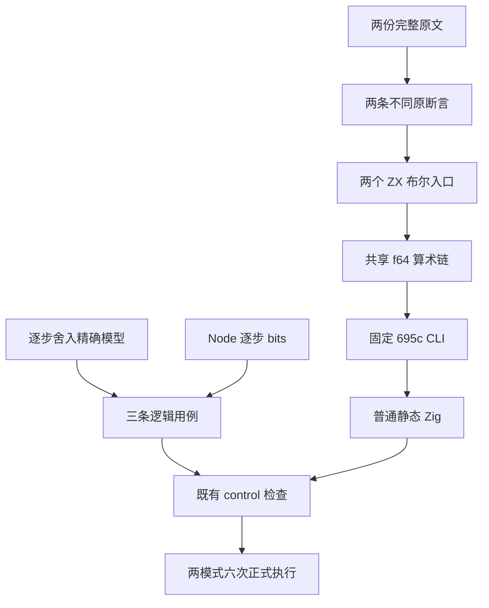
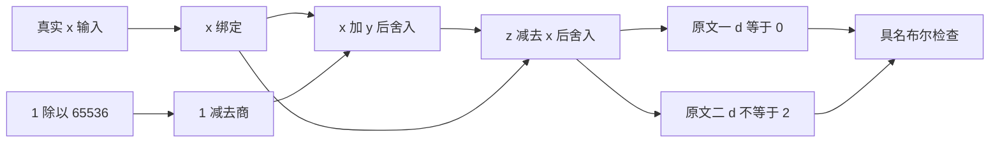

# 浮点逐步舍入适配执行记录

## Intent：最终目标

完整适配 `S8.5_A2.1.js` 与 `S8.5_A2.2.js`，分别保留 `d === 0` 与 `d !== 2`，验证真实输入进入 binary64 运算链。记录遵循 IDEA 框架。

## Data：可用证据

上游固定为 `7ab7fafa0003f73fc85c1b95d88094d33f7eb8bd`。两份原文及 harness 完整归档，原 harness 在 sloppy、strict 中共执行四次，实际退出 0，每模式两条原断言。

| 原文           | 实际运行断言      | 具名用例                                              |
| -------------- | ----------------- | ----------------------------------------------------- |
| `S8.5_A2.1.js` | 只检查 `d == 0.0` | `language/types/number/rounding/equals_zero/original` |
| `S8.5_A2.2.js` | 只检查 `d != 2.0` | `language/types/number/rounding/differs_two/original` |

两份原文的 x 均为 `9007199254740994.0`，依次计算 `y = 1.0 - 1.0 / 65536.0`、`z = x + y`、`d = z - x`。共享 `difference.zx` 保留 x、y、z、d 四个绑定；两个入口分别返回各自的布尔断言。`x = 0` 仅作为 `equals_zero` 的补充对照，预期 false，能够拒绝始终返回零的算术实现。共三条逻辑用例，没有将补充对照计作第三份原文。

独立模型使用 Rational 与既有 IEEE 编码，在除法、减法、加法、减法之后分别舍入为 binary64，再将位模式传入下一步。生成器逐项核对 x、商、y、z、d 与 Node 的 bits，并独立核对最终布尔值。原始输入的 x/z 为 `4340000000000001`、商为 `3ef0000000000000`、y 为 `3fefffe000000000`、d 为 `0000000000000000`。

### 正式 R3 执行

执行使用来源已核验的 `695c654ce3350eaa7f561d661135a2682fcb6ea8` CLI，二进制 SHA 为 `b944df937c62b5d1dbb57278f73bfdc82dffc642dd3d166975b4d1b8f51303f4`。来源八项装载门禁的 Debug 构建实际退出 0，输入未变；其源码身份、实际起点与终态一并归档。

R3 从 `2026-10-10T00:22:23.041172+00:00` 运行至 `00:22:55.378665+00:00`。生成器核验、两次 CLI 生成、两次 control 测试生成和四次 Zig 测试全部实际退出 0，21 个固定输入、工具及 SDK 身份核验未发现变化。

| 程序          | Debug            | ReleaseSafe      | 原文 / 补充 |
| ------------- | ---------------- | ---------------- | ----------- |
| `equals_zero` | 2 个具名测试通过 | 2 个具名测试通过 | 1 / 1       |
| `differs_two` | 1 个具名测试通过 | 1 个具名测试通过 | 1 / 0       |

这是三条逻辑用例的六次正式执行。四个测试二进制的 SHA、完整具名输出、实际命令与进程退出码均已保留。两份普通 Zig 与两份具名测试源无损归档；实际生成函数接收 f64 输入后执行加减链，没有引入 zxc 专用运行库。

三个 ZX 分别为 12、9、9 行，模型 27 行、生成器 84 行。只读复核确认弱断言没有被强化、所有输入和共享源均接入已有 control suite。

### 失败预执行

- R1 生成器核验退出 0；复制 CLI 时未保留执行权限，宿主在创建 CLI 进程前拒绝启动，没有编译器退出码或具名测试结果。
- R2 保留了执行权限与包的模块配置，CLI 实际退出 1。生成器误用单引号 ZX 导入路径，词法器在该位置报告 unexpected character，仍未执行 Zig 用例。
- 修复发生在生成源，按既有 `call_arguments` 成熟语法改为 `import difference from "./difference"`，重建两个 ZX 后冻结 R3。R1/R2 的源码、日志和终态没有改写，失败没有被当作生产实现缺陷转发。

128 条本轮记录与此前原文、精确参考模型的 16 条记录共 144 条 gzip 均可无损解压核验。工具和测试二进制保留在外部运行目录，以 SHA 绑定，没有将二进制提交进仓库。

### 发布目录审计

`src/audit_matrix.ts` 实际退出 0，所有审计输入哈希未变。新增两份 adapted 原文和三条 runtime 用例后，目录为：53,597 份上游、858 adapted、103 equivalent、2,089 excluded、50,547 unreviewed；共 140,782 条 catalog 用例，其中 runtime 96,725，已关联用例 6,988。

该审计只核对目录完整性、身份和关联，不测量全部用例执行，更不表示完整 Test262 已对齐。

## Edges：边界与限制

- 正式执行仅覆盖固定 CLI 的源码路线，不包含库路线，也不声称最新 HEAD 编译器通过。
- `test-number-rounding` 和 `test-runtime` 的 suite 注册已静态复核；本轮用显式 Zig 命令执行同一生成器、control helper 与生成程序，未运行这两个 canonical build 目标。
- 实际生成程序只检查两份原文要求的最终布尔值。五个中间值的 bits 核对属于独立模型与 Node 的参考证据，未成为第二份原文的附加运行断言。
- 这里只覆盖所选两个 Number 原文，不覆盖 NaN、Infinity、一元正号、布尔相加或 Math.pow 等尚未适配前提。
- 当前文档里的原文候选身份与历史终态保留初始阶段状态；正式登记以新 reviews 文件为准。

## Answer：交付与成功标准

交付一个原子算术模块、两个断言入口、三条目录用例、独立参考模型和生成器、两个 runtime suite、一个专项构建入口及两条原文 review。11 个代码与目录文件的身份列入《正式源码身份》，本部分单独按英文 Conventional Commits 提交推送。完整 Test262 与所有 zxc 特性验收仍未完成。

## 架构图

## 数据流图

## 自我批判

首轮未保留二进制权限、第二轮未先采用成熟导入语法，均属于执行准备失误。只修正最终副本会抹掉证据，因此分别保留两轮，并从生成源修复后重新冻结。首次暂存时，三份语义编译缓存的归档路径沿用了被忽略的 `.zxc` 目录名，范围门禁拒绝了不完整暂存；随后仅把归档保存路径整理到“编译缓存输出”，原始运行文件、压缩内容与 SHA 均未改动，没有强制绕过忽略规则。独立模型的 bits 证据不能自动扩展成实际生成程序逐位通过；固定 CLI 的六次执行也不能扩展为最新自举源码或全部 canonical 目标通过。目录中的 140,782 条用例不是本轮新增或本轮全部执行的数量。
