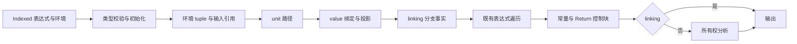
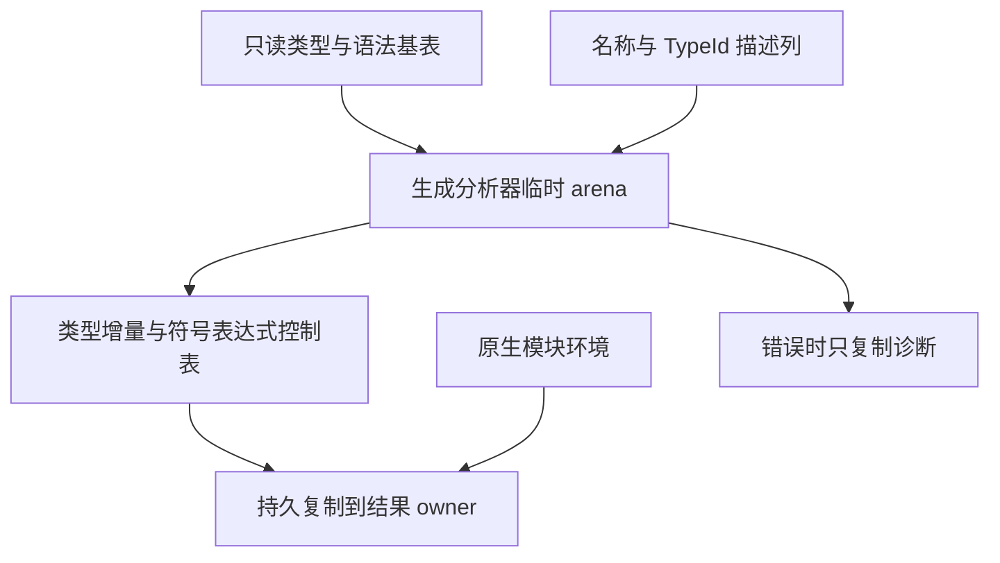

# 独立表达式整块自举

## Intent：最终目标

把正式 Indexed 独立表达式编译迁入 RX/ZX。RX 显式编排类型初始化、环境建立、注入绑定、分支事实、表达式分析、控制块与所有权；复用已有表达式遍历算法，移除正式入口对旧 Analyzer.expression 的调用。

## Data：可用证据

- 17e262516 已完成正文与签名正式入口接线，集中构建及现有 RX 聚合应用通过。
- expression_program.compileInput 的 Indexed 分支仍创建旧 View，并进入 Zig build 流程。
- analyzer/expressions/traversal 与 injected lookup 已实现表达式核心及路径遮蔽规则；core 表追加与 refinement facts 已有 ZX 原子能力。
- 旧入口先初始化类型，再检查 binding/expected ID，建立环境，注册 unit/value 绑定，最后按 linking 模式处理 nonnull 与 ownership。

## Edges：边界与限制

- 不伪造普通 ModuleInput、声明或正文；建立独立表达式输入输出契约。
- 环境 tuple 只包含 value bindings；保留原顺序、@environment symbol 和 tuple_field 投影。
- unit 先于 value 注册；路径合法性、关键字、重叠以及 void 错误次序保持一致。
- nonnull 只允许 linking，且只精确匹配可见 value binding；不新增 optional 限制。
- expected 原样传入表达式遍历，保留上下文推导和 coercion。
- linking 跳过独立 ownership，待外层整体联结；普通模式执行 ownership。
- 不开放 functions、function imports 或 Store 授权；native_modules 仅由宿主按原契约持久化。
- 生成输出与诊断不能引用已释放 scratch；保留 Native seed 兼容路径并如实记录。
- 不新增测试、不运行全量测试、不调用浏览器；所有 ZX 文件不超过 120 行。

## Answer：交付格式与成功标准

交付独立 RX 流程、注入绑定及环境逻辑的 ZX 原子实现、正式 host 接线、构建注册和集中验证记录。通过现有 RX 属性应用验证真实表达式调用链；不能只以生成成功宣称完成。

## 自我批判

表达式算法迁入 RX/ZX 不等于外部环境与编译流程已自举。此次必须保持 binding 路径和分支事实的精确语义，并将阶段决策留在 RX。Indexed 入口迁移后，Native API、模块调度与缓存、阶段自编译仍需继续收口。

## 整块实现与审查

- 新 compile.rx 依次连接 types、environment、bindings、facts、evaluate、finish 与 ownership；各阶段保留首个诊断。
- 路径校验复用 lexer 的 keyword DFA，按点分段检查合法字符；value 注册使用 core symbol/projection 原子，保持 @environment 与绑定顺序。
- 表达式沿用既有 traversal；外层常量和结果在内部控制块构建之后集中追加，保持根控制块的连续语句区间。
- linking 未分析的默认 ownership 保持旧接口的 Borrowed；只读审查指出初稿 Copy 会改变语义，已修正。普通模式由 ownership 结果覆盖。
- 宿主接线使用原始 Indexed expression 输出，完整类型基表和输出表由结果 owner 持有；原生模块环境继续复制挂接。
- 引导时 RX 模块图尚不能直接注册本次 core 包调用；现由表达式请求构造器通过普通 ZX 模块导入空函数表，ownership 请求直接表达该入口没有函数上下文。未绕过图校验或新增运行层。
- 构建注册、ABI 与正式 Indexed compileInput 接线已完成，完整构建和现有 RX 应用验证已通过，见下方记录。

## 源码约束修正

集中生成发现 environment/type 的结果名与关键字冲突，已按职责命名为 tuple。expected 的 nullable 字段先绑定局部值再判空，符合当前流式收窄规则。两处修正后完整表达式生成与最终编译通过；没有放宽语法、类型或模块图规则。

## 验收结果

- `zig build --summary all`：36/36 步骤成功，正式入口实际实例化 generated_expression_analysis.execute。
- 新 zxc 构建仓库已有 aggregate.rx 成功；输入 `[1,2,3]` 输出 `{"items":[2,3,4],"total":9}`。
- 新 zxc 构建仓库已有 optional_return.rx 成功；输入 `null` 输出 `null`，输入 `7` 输出 `7`。
- 新增 ZX 文件均不超过 120 行，本次 diff 空白检查通过。
- 未新增测试、未运行全量测试、未调用浏览器。

## 交付自我核查

Indexed compileInput 已不再创建旧语法 View 或调用旧 Analyzer.expression；真实阶段、错误短路与 linking 分支在 RX 中可见。独立表达式的环境和规则来自 ZX，宿主保留布局借用、结果内存持有及 native_modules 挂接。

现有应用验证覆盖了注入输入、前序 Call 输出和 nullable 结果，但不能替代全部路径、分支事实及所有权回归。Native compile/analyze API、跨模块装载与缓存状态仍为过渡依赖；stage 1/2/3 自编译和全闭包验收尚未完成。
