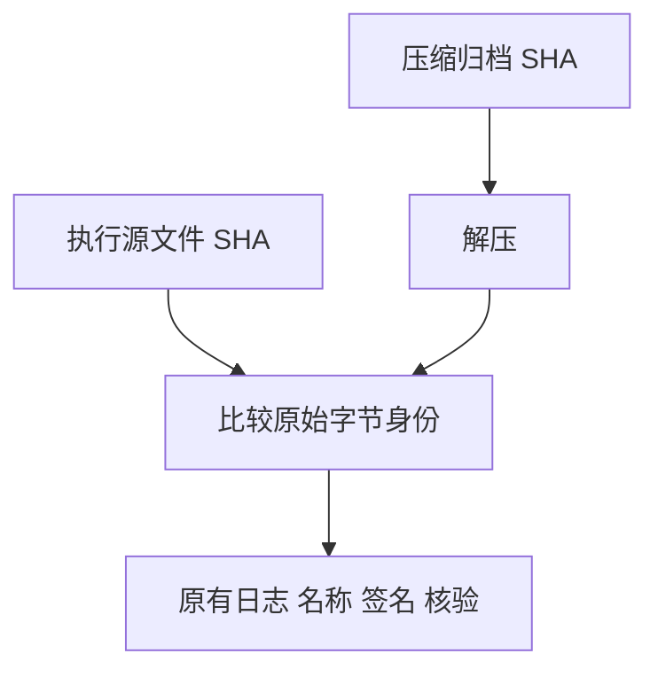

# 生成证据无损压缩

本文采用 IDEA 框架。

## Intent：最终目标

降低大型生成文本在当前检出中的存储成本，同时保留完整原始证据和所有执行结论。

## Data：可用证据

66af160bd 已推送，GitHub 指出 analyzer.zig.txt 为 82.42 MiB，超过建议文件大小。基线与 Indexed 两组同名证据原始字节完全相同，每份 86,421,464 字节、SHA 为 12e0b0bc331b571059da9fcf561117412c3082b5056cf6530a4c355dffd427b8。

两份文本分别无损 gzip 保存，每份 4,959,210 字节，固定 mtime=0 保证同内容压缩结果可重复。清单保留原始 SHA，并以 encoding=gzip 指明存储格式。独立核验先解压再比较原始字节，同时继续检查真实源文件、测试日志及签名。

## Edges：边界与限制

- 只调整记录、收集器和独立核验器，不修改测试输入、被测实现或运行命令。
- 通用归档规则按原始大小超过 50 MiB 压缩，不按具体文件名特判。
- 已发布历史提交保留；压缩降低当前检出大小，不重写历史对象。
- 既有 2,016 次矩阵执行和 20 次官方断言不重复计数。

## Answer：交付格式与成功标准

两份 gzip 可解压为完全相同的原始文本；更新后的完整执行证据核验通过。精确暂存本次文件，正常 hooks 后以英文 Conventional Commits 提交、push 并核对远端 SHA。

## 自我批判

首次归档忽略了生成分析器文本体积，虽然 Git 能按相同 blob 去重，82 MiB 文本仍增加检出及审阅负担。应从通用收集源头按大小无损压缩，避免只移动产物却保留未来再次产生大文件的规则。
