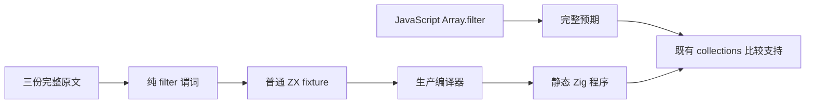
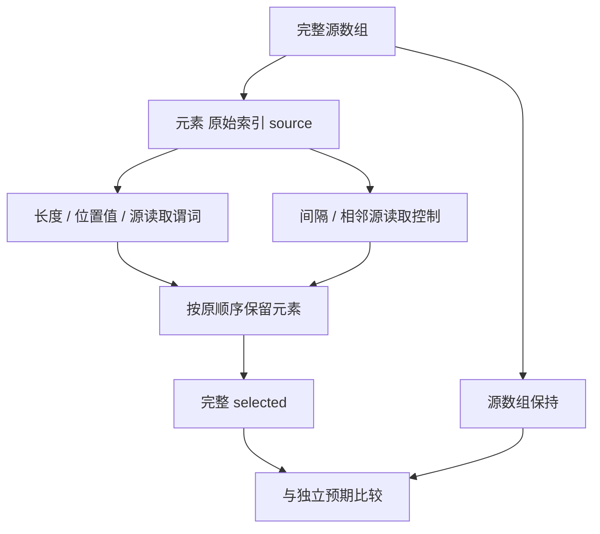

# 筛选源长度与原始索引

## IDEA

- **Intent：** 完整适配 filter 源长度、选中原始索引和值、source[index] 三份原文，验证过滤后的输出位置不会污染源索引。
- **Data：** Test262 固定 `7ab7fafa0003f73fc85c1b95d88094d33f7eb8bd`；原文 2-2、4-12、9-c-ii-12 全部未登记。zxc 固定 `e9abeacfcf14bd82f8298a68d2771a552feea8e7`。既有 arguments 用例总保留所有元素，不能独立验证输出出现空隙后的索引关系。
- **Edges：** 仅修改测试包及本目录，不修改生产源码。不用 native 探针或 reduce 模拟纯 filter；参数化原常量但保留原行的输入和值。own data property 只出现在原文描述，没有反射断言，不扩展为动态 JS 属性协议。
- **Answer：** 五类具名目录，完整原文与独立 JavaScript oracle；两种模式和源码/独立编译库路线实际执行全部用例，保留证据，英文 Conventional Commit 后 push。

## 执行步骤

1. 固定原文完整字节、SHA 与官方 harness，在普通/严格模式实际执行。
2. length、position、source_value 保留三份原谓词；stride 与 neighbors 是 zxc 补充控制，覆盖过滤前缀、输出空隙、长数组及相邻源读取。
3. 每个 ZX 只有一个内聚筛选算法；输出完整 selected 与源 items，既有 collections 支持另对可写输入副本作执行后深比较。
4. 生成器从同一源生成 fixture、目录和 review；接入正式 --check 与既有 collections 登记，不增加运行时或新的执行抽象。
5. 重新生成当前 83 个模块，通过生产分析、IR 校验、静态编译、签名与执行；库路线释放提供者、毒化编码字节后独立分析消费方。
6. 审计登记、严格 TypeScript、逐条名称、跨优化生成一致性及精确发布范围。仅确认的新实现缺陷发送授权实现会话。

## 架构图

## 数据流图

## 自我批判

纯输出比较不单独证明每次回调调用次数；上一批轨迹用例覆盖那个独立观察。本批重点是谓词真正读取的 index/source 关系。neighbors 的 index==0 分支必须避免 source[-1]，stride 的 period 为正整数；不把 JS 动态转换或取模零语义混为静态整数契约。完整 Test262 与全部特性仍未完成。
