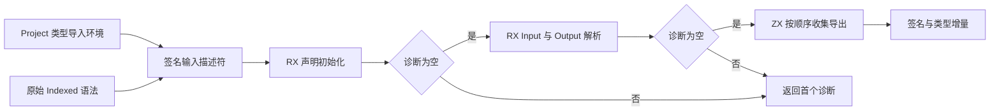
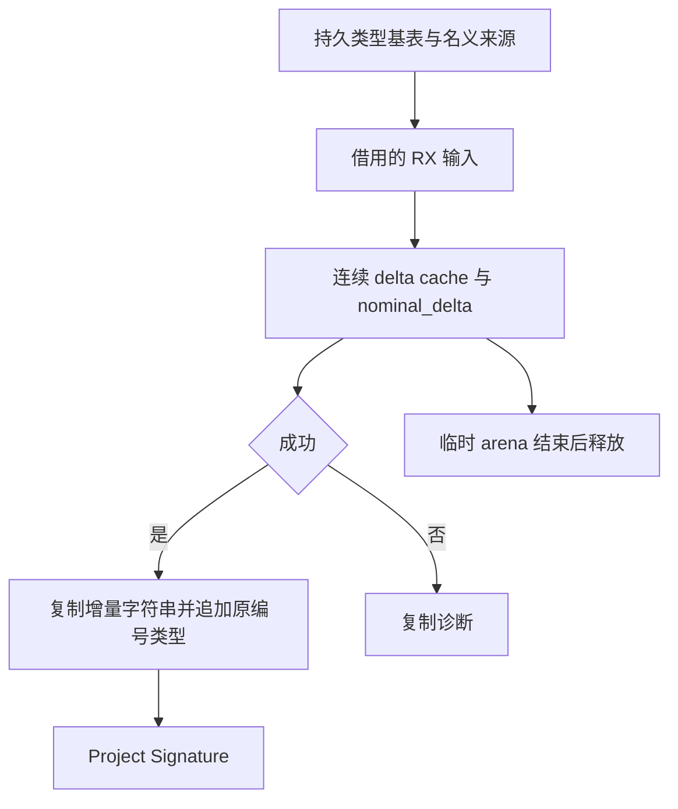

# 签名预解析整块自举

## Intent：最终目标

将正式 Indexed 签名预解析的声明初始化、端口解析、导出收集与错误短路迁入 RX/ZX；保留既有模块签名接口，由宿主提交类型增量并持久化结果。

## Data：可用证据

- 上阶段 13abc0312 已接通正文主分析器，集中构建 36/36 与现有 CLI 示例通过。
- Indexed.signature 仍创建语法 View，经 Zig 调度 initialize、Input/Output 和逐声明导出查询。
- analyzer/declarations.rx、signature.rx 及 exports.zx 已具备相同原子能力；当前输入携带正文/函数/Store 环境或 Local 状态，超出签名职责。
- Project 在签名阶段已处理类型依赖与 aliases；既有 SourceSignature.Result 是外部调用契约。

## Edges：边界与限制

- 不分析正文，不提前检查 Store 授权；has_store 仅来自语法事实。
- 保持声明初始化 → Input → Output → 声明顺序导出的次序与首个诊断。
- 类型 delta/cache 连续传递；初始化的 nominal_delta 必须保留，不重编号。
- 输入仅包含源码、索引语法、类型基表、别名及名义来源；不创建空正文环境凑接口。
- 成功后提交增量；错误仅复制诊断。输出和字符串不能引用已释放的临时 arena。
- Native seed 与 Project 模块装载仍属过渡依赖，不宣称完成全部自举。
- 不新增测试、不运行全量测试、不调用浏览器。

## Answer：交付格式与成功标准

交付 RX 签名流程、收窄并复用的 ZX 原子接口、正式宿主接线及生成构建注册。集中构建后用现有 RX 应用验证签名预解析实际调用链；记录结果与剩余边界，每个新增或修改 ZX 保持不超过 120 行。

## 自我批判

类型解析算法已在 RX/ZX，并不代表签名职责已自举；当前问题是正式流程仍由 Zig 发起多次解析。迁移验收必须检查真实调用链及 RX 中的阶段顺序，不能只比较输出或增加一个入口包装。预解析不能为了复用完整 Analyzer 而引入正文和授权语义。

## 整块实现

- declarations/request 的输入收窄为源码、syntax 和类型环境；主 Analyzer 在 RX 调用点显式组装。
- signature 的输入收窄为 syntax 与连续 Types；failure 调用同步，端口诊断仍采用原 body span。
- exports 集合算法只接收 types 与 diagnostic，主 Analyzer 的 Local 等状态在 RX 调用点保留。
- 新 source_signature/analyze.rx 编排声明、端口与导出阶段；错误分支短路，nominal_delta 连续保留。
- Indexed.signature 已调用 generated_source_signature；不再创建旧 Program View，也不再由宿主逐次查询名称。宿主仅布局借用、执行、检查诊断、提交增量并复制导出名。
- 生成器、ABI、构建模块及 frontend import 已接通。只读审查未发现确定的顺序、编号、生命周期或契约问题；集中构建与现有 RX 应用验证已通过，结果如下。

## 验收结果

首次生成在新 initial.zx 的导入排序处被内置风格规则拒绝；使用仓库格式化器处理本次 ZX/RX 文件后重新构建。

- `zig build --summary all`：36/36 步骤成功，生成的主分析器和签名入口都已实际实例化。
- 新二进制构建仓库现有 `packages/test/tests/rx/runtime/fixtures/aggregate.rx`：成功。
- 生成应用输入 `[1,2,3]`，输出 `{"items":[2,3,4],"total":9}`，覆盖两个 ZX 调用的签名预解析、RX 类型联结和正文分析。
- 本次新增或修改的 ZX 文件均不超过 120 行；diff 空白检查通过。
- 未新增测试、未运行全量测试、未调用浏览器。

## 交付自我核查

正式 Indexed.signature 已不再调用旧 Program View、Types.initialize 或 SourceSignature.resolve 的 Zig 调度流程。RX 明确承载阶段次序和错误短路；ZX 仅提供声明请求、端口解析、导出集合算法及结果组装。宿主保留输入输出布局与持久化边界。

该阶段消除了正式签名预解析中的旧调度，并未完成跨模块装载/缓存状态迁移，也未完成独立表达式入口与 stage 1/2/3 自编译。现有聚合示例验证不等于全部签名语义回归；其余回归继续由测试会话负责。
