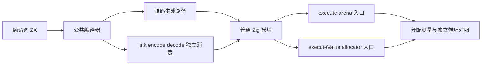
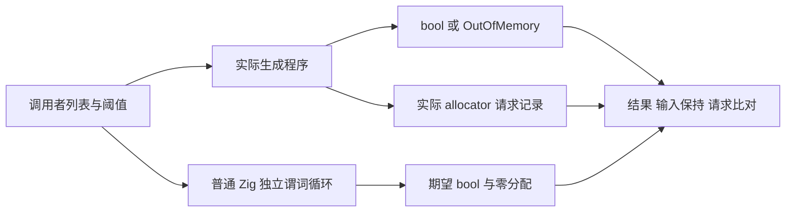

# 纯谓词捕获分配验证计划

## IDEA

- Intent：验证 every/some 的纯词法捕获是否引入无语义必要的堆分配，补齐此前仅验证容量不随访问次数增长的边界。
- Data：基线 7eb37ce6e05d08f71dd0a3345020b45fe5e99828；既有集合上下文容量记录显示常数初始化分配尚未解决；公开集合指导约定生成普通循环且不分配动态闭包。
- Edges：只修改测试包及本记录，不改实现；无 native 观察器、无结果列表；分别观察execute arena 入口与 executeValue allocator 入口。零成本要求不意味着所有应用都禁止分配，必须定位分配是否用于这个纯标量结果的临时封装。Test262 不规定分配次数，本批属于 zxc 自有性能契约验证，不增加虚假的上游适配计数。
- Answer：以实际签名二进制执行、完整结果和输入保持、实际 allocator 行为及失败行为（pointer 记录 arena 后备申请，value 记录直接申请）、生成 Zig 对照形成证据。只有确认新缺陷才发送指定实现会话；完成部分以英文 Conventional Commit 提交并 push。

## 验证步骤

1. 冻结当前工作树、工具链及生产输入；重新生成编译器模块。
2. 对 every/some 比较无捕获、阈值捕获、对象字段与列表捕获、index/source 参数等真实源码。每个 ZX 保持原子职责且最多 120 行。
3. 对空、单项、提前结束、完整访问及长输入验证结果；独立普通 Zig 循环作为语义和分配基准。
4. 分别执行源码和编译库路径、Debug 与 ReleaseSafe，记录真实 allocator 调用及失败状态，不从 arena 保留容量推断精确请求。
5. 对生成源码、输入身份、工具签名、实际具名测试与发布范围复核；归档失败，不通过放宽契约消除缺陷。

## 架构

## 数据流

## 自我批判检查点

不能把对象语义所需的持久化与未逃逸临时状态混为一谈；不能用 instrumented native 调用证明纯回调本身的成本；不能把接口包装分配归咎于循环每次访问；不能仅凭生成源码出现 create 就证明真实执行会调用 allocator。结论必须限定到实际测量的接口、模式及源码。

两个入口的 Input ABI 必须从实际生成签名读取；executeValue 不是输入按值复制的承诺。本批 bool 输出的实际签名均使用输入指针。
