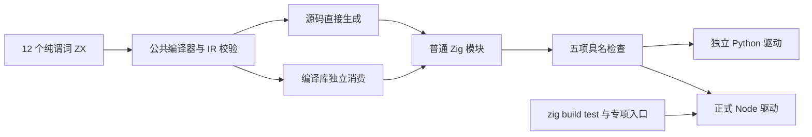
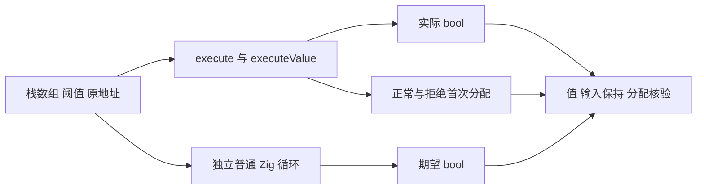

# 纯谓词捕获分配验证记录

## IDEA

- Intent：验证 every/some 的纯回调及词法捕获满足零堆分配要求，并形成可持续执行的测试入口。
- Data：冻结源码版本 7eb37ce6e05d08f71dd0a3345020b45fe5e99828；重新生成 83 个编译器模块；正式驱动在 Debug、ReleaseSafe 共 48 个程序组合完成 240 项具名检查、3456 条实际分配观察，全部通过；独立驱动另完成同一矩阵的 240 项对照执行。690 份证据原始文件已归档并通过核验。
- Edges：本批 bool 输出下，execute 与 executeValue 的输入 ABI 均为指针；两个入口不是按值复制与指针传递的对照。pointer 日志记录 arena 的后备请求，value 日志记录 executeValue 的直接 allocator 请求。零请求证明这些实际路径未分配堆内存，不证明所有集合、输出结构、所有权组合或性能维度均无成本。
- Answer：将 12 个 ZX 程序、公共检查、正式驱动和专项构建接入测试包，保存实际生成 Zig、签名二进制身份、具名日志、分配观察及输入 SHA；核验准确范围后按英文 Conventional Commit 提交 push。

## 实际验证职责

本批属于 zxc 自有零成本契约验证。Test262 不规定 allocator 行为，因此不新增上游 review，也不把 native 测试循环伪装成 JSONL catalog 用例。

每个 every/some 分别有六种源码：无捕获的 item 谓词；局部 i64 阈值捕获；通过 in 读取阈值的对象捕获；回调自带 index/source；标量捕获与 index/source 组合；外层列表捕获。每份 ZX 仅有一个纯表达式职责，共 7 或 9 个物理行。没有 native 观察器、结果列表、显式堆对象或外部副作用。

每个程序通过源码直接分析与编译库消费两路生成。后者复用现有 field_facts 编译工具，执行真实 link、encode、decode，释放 provider/library 并污染编码字节后，使用独立 consumer 分析及生成。工具强制生成结果不含 native 模块。

公共检查使用 0、1、2、17、257、4096 六个长度，分别填充全 11、全 -3、按索引变化的混合整数，覆盖空、首次短路、较晚短路及完整访问。每个入口均运行正常 allocator 与拒绝首次分配两种条件。两种阈值分别为 0 和 7，期望结果由独立普通 Zig 循环计算；不从生成源码或程序返回值生成期望。

每次执行后核对整个栈数组及两端守卫、输入阈值、列表原地址及长度。FailingAllocator 记录实际成功分配及是否触发失败，断言程序在禁止首次分配时仍返回正确 bool。每个生成程序有五项具名检查：两个入口的结果与输入保持、两个入口的无分配执行，以及普通 Zig 循环基线。

## 架构

## 数据流

## 运行数量

| 驱动        | 模式        | 程序组合及签名二进制 | 具名执行 | 分配观察 |
| ----------- | ----------- | -------------------: | -------: | -------: |
| 正式 Node   | Debug       |                   24 |      120 |     1728 |
| 正式 Node   | ReleaseSafe |                   24 |      120 |     1728 |
| 独立 Python | Debug       |                   24 |      120 |     1728 |
| 独立 Python | ReleaseSafe |                   24 |      120 |     1728 |

正式入口共 48 个二进制、240 次具名执行；独立驱动是额外 48 个二进制、240 次交叉核对，覆盖种类相同，不能翻倍计算用例覆盖。参数循环产生观察行，不额外增加具名测试数量或 catalog 计数。所有正常及拒绝分配条件均成功，allocations、allocated_bytes 均为 0，induced 均为 false。

两个模式对应的生成 Zig 逐字节一致。48 份正式执行记录均检查了完整名称顺序、进程退出、信号、通过摘要与签名；对照驱动亦核验独立二进制身份。所有本批进程均已结束后才准备发布。提交前仓库空行格式器对专项 builder 与 check.zig 调整了空白行；格式对齐清单保留执行版与提交版 SHA，逐条核验非空源码行完全一致，并保留原始执行版。没有改动表达式、字符串、断言或生成程序；不为这次纯空行调整重复运行同一矩阵。

## 反证结果与边界

前一批 map 对象投影的生成源码存在 allocator.create，不能由此推断所有纯谓词捕获都会分配。本批 Debug、ReleaseSafe 的独立测量均为零请求；生成的对象捕获使用局部 state_type、捕获元组和普通 while，execute 中 arena 未使用，executeValue 中 allocator 未使用。没有发现新的实现缺陷，也未向实现会话发送绿色进度或预备消息。

这也不推翻先前原生上下文借用测试记录的常数初始化分配：两批源码、输出与观察器结构不同。成本结论必须绑定到实际源码及生成路径，不能跨结构推广。

## 测试工具修正

第一次夹具假定 executeValue 的输入始终为结构体值。Debug 与 ReleaseSafe 均在首个无捕获程序编译时因指针结构体初始化失败，尚未执行任何该批测试。两个进程终止后归档原输入、脚本、夹具、生成源码及失败日志，才进行修正。

修正仅根据两个实际生成函数的参数类型决定构造值与传入指针，不改变 ZX、期望语义或零分配断言。先用旧的冻结无捕获生成程序实际执行五项检查验证夹具，再在 r2 重新生成 83 个模块并执行完整矩阵。初次失败是测试类型假设错误，不是编译器缺陷。原始诊断清单以保存文件的 SHA 校验，原路径可能已被明确修正，不把当前修正版当作原始输入。

## 构建与审计

正式专项入口为 `zig build test-predicate-allocation`，并接入测试包默认 `zig build test`。构建遍历两种方法、六种源码及两种消费路径；正式 Node 驱动复用成熟的模块闭包参数构造，检查全部测试名称、执行状态、信号、错误与通过摘要，输出真实执行记录和二进制 SHA。

本批直接执行公共编译工具及正式 Node 驱动，并检查构建接线源码和 Zig AST；未运行整个仓库的默认测试，也未证明 GitHub CI 已执行该专项。27 项静态检查覆盖 4 个 Zig 文件、12 个 ZX 行数、TypeScript 严格检查及 9 个 Python 脚本语法及一次本仓库空行格式检查。

catalog 审计保持 131257；上游文件 53597，其中 adapted 848、equivalent 103、excluded 2081、unreviewed 50565，关联 catalog 用例 6978。审计明确不衡量实际运行次数，本批不增加这些计数。

## 自我批判

从 map 产物出现 create 推测纯谓词存在相同问题，证据不足；无观察器的完整执行反驳了该推测。首次接口假设也说明函数名不能代替真实签名，需要读取生成 ABI。

栈上的测试快照只用于检测输入变化，不属于正式生成程序；不能把测试自身的数组复制算作编译器的数据复制。FailingAllocator 的 arena 后备字节不等同于捕获对象大小，两个入口的字节数不能直接用来比较封装成本。本批证明规定样本和纯 bool 结果路径的无堆分配；整个 zxc、完整 Test262 及所有零成本要求仍未完成。
