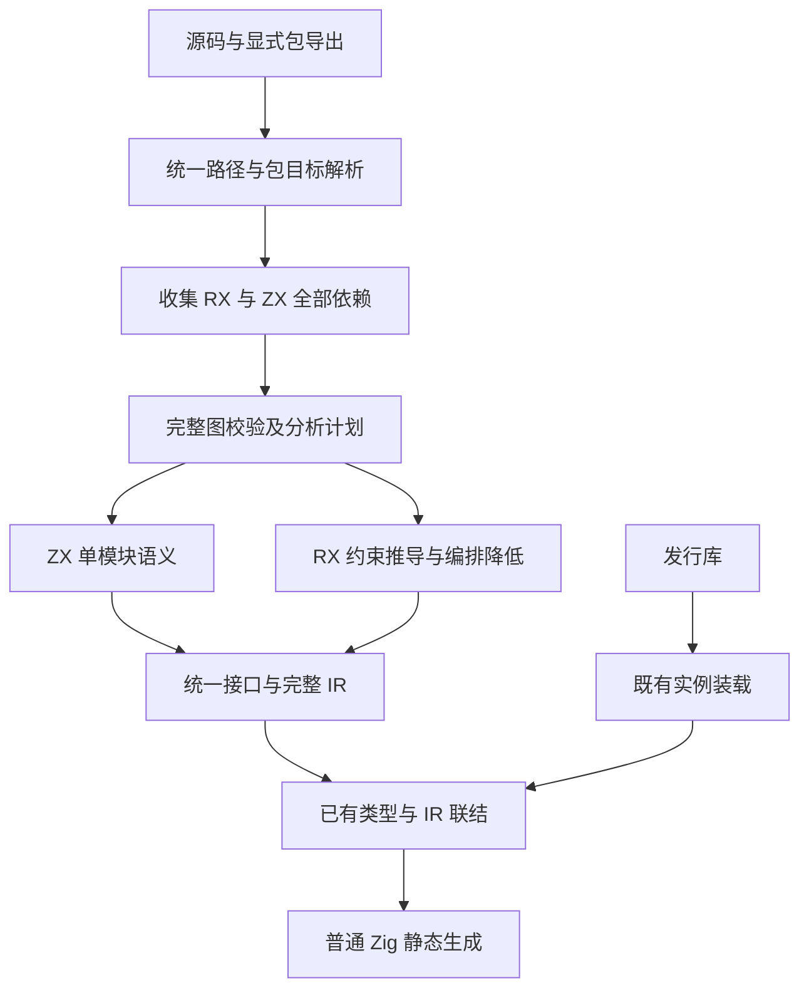
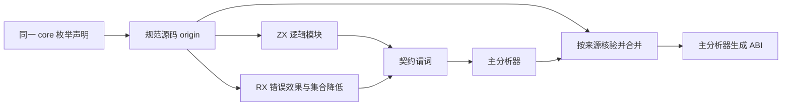
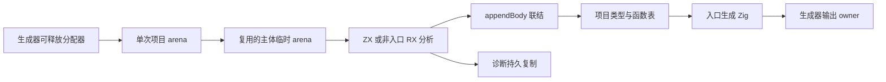

# 统一源码模块编译方案

## Intent：最终目标

让同一次编译中的 RX 编排和 ZX 原子逻辑通过统一模块图组合。ZX 默认导入能够消费显式包导出指向的源码 RX 模块，RX 调用仍消费统一 Input/Output；共享声明只具有一份源码身份。该能力用于移除主分析器构建中人为设置的两层发行库边界。

模块内部依赖保持静态、无环，不增加解释器或运行时调度。正式发行库仍以依赖实例隔离名义类型、原生资源与 Store，不修改发行身份协议来迁就自举。

## Data：可用证据

1. 集中构建在 `analyzer/expressions/errors.zx` 导入错误效果模块时失败。具体差异为函数表中 `contracts[].expressions[].binary_operators[]` 的 BinaryOperator，源码与库装载后的 source origin 不一致，见[诊断日志](主分析器集中构建/接口类型身份诊断.log)。
2. `zx/modules/compiled/load.zig` 在发行库装载时为 source origin、函数路径、Store 与非标准原生模块绑定实例。这是明确的发行边界，不是普通源码合并接口。
3. `build/analyzer_libraries.zig` 将 analyzer.zxlib 和 contracts.zxlib 注册为同一 compiler-bootstrap 实例，违反现有一实例对应一产物规则。改成不同实例也不能使源码模型与库模型共享身份。
4. `zx/modules/project.zig` 的 package 源码入口只接受 .zx；本地导入省略扩展名并固定解析成 .zx。`rx/analysis/project/prepare.zig` 在 RX 类型推导前分析 Call.fn，现有两个前端的调度不能处理跨语法的源码依赖闭包。
5. `zx/modules/link/types.zig` 已能按原名义来源合并类型；`artifact/nodes.zig` 已有 IR 索引重映射；`library/link.zig` 已有完整 Program 的函数与原生模块合并。无需发明第二套类型等价规则。
6. 单模块 `artifact.Module.functions` 是 SignatureTable，只有 `function` 保存一个函数体。`semantic_cache/restore.zig` 要求这些签名由已完成的导入绑定重建。RX 的完整 Program 含真实函数闭包，当前结果也没有对应的完整 ModuleRecord 集合，因此不能直接把 RX Program 当作单模块缓存恢复。

本方案对照[统一库设计](../2026-10-05/统一库设计.md)、[自举完成标准](../../rules/自举完成标准.md)和用户关于“RX 对应模板、ZX 对应逻辑”的明确要求。上述事实记录实施前的源码与失败构建；当前实施与验收状态见文末，历史判断不代表最新状态。

## Edges：边界与限制

- 包名及公开子路径沿现有 Package.entry/exports 解析；.rx/.zx 只是内部解析器选择，不新增库种类。
- 优先完善显式 package entry 指向 RX 的源码导入。相对路径仍遵守既有省略后缀规则；不依据“文件是否存在”在 .zx/.rx 之间猜测。若扩展本地解析，需单独确定明确且无歧义的规则。
- 同一规范路径只有一个实现 owner；预分析结果不能静默覆盖另一份源码。缓存替代必须核对源码摘要和编译配置。
- 图校验覆盖全部声明依赖，包括未使用 import、嵌套分支中的 Call.module、包别名和跨 RX/ZX 回边。两个子图各自无环不能替代整体校验。
- 保留 RX 现有输入输出推导行为。不能简单按文件后序独立推导每个 RX，从而丢失现有模块间约束；实施前需明确跨模块约束如何在统一调度中保留。
- 预分析完整 Program 不是独立发行库；不能增加 compiled.load 的“关闭身份隔离”选项，也不能使用 compiler-bootstrap 专用规则。
- 不改变 Store 授权及初始化、原生依赖实例或输出所有权规则。源码闭包复用必须同时保存这些信息。
- 结果内存由编译结果 owner 持有；输入借用期覆盖本次编译。重映射所需的输出所有权复制沿现有边界进行，不为模块分层反复拼接类型表。
- 当前手写调度本身仍属待自举内容，后续须迁入 RX/ZX；本次完善通用能力不构成自举最终完成。

## Answer：交付格式与成功标准

### 架构

统一协调层放在同时能够访问 RX 分析与 ZX 前端的编译器层，不能让底层 ZX 项目反向依赖 RX 分析包形成 Zig 模块环。两个前端共用规范路径、依赖目标和已经完成的模块接口；语言专有解析和原子语义继续留在各自 owner。

### 数据流

### 实施块与接口决策

1. **完整图与调度契约。** 统一注册源码路径和依赖位置；ZX 从已解析 header 收集 import，RX 从现有规范解析结构收集 Import、Call.fn、Call.module 等依赖。保留缺失目标、跨包越界、路径冲突、回边的明确诊断位置。发布库作为已封闭外部依赖处理，源码预分析不得隐藏边。
2. **模块结果复用。** 首选复用现有分析结果的 Program、nominal_types、Store initializer 与模块依赖证据，不增加第二套 IR。若采用 artifact.Module 集合，必须先补齐 RX 各函数 owner 与模块记录，证明局部生成函数及整个依赖闭包都可表达；否则使用完整源码分析闭包合并入口，并从已有 library/link 提取共享合并职责。不能复制 compiled/load 然后删除 scope。
3. **分析接线。** 协调器负责安排跨 RX/ZX 依赖；ZX 项目仅消费已解析接口与必要 IR，RX 保留现有约束推导和降低。整个图的校验必须发生在信任预分析结果之前。源码类型来源、函数引用、原生引用和 Store 信息一起重映射。
4. **自举构建切换。** 将 analyzer_libraries 的手排发行库准备改为普通源码图编译，三项 compiler 包映射回实际源码入口，删除两份临时发行产物及 compiler-bootstrap 身份接线。由真实依赖决定顺序，不能把 lower/errors/contract 名称硬编码成调度特例。
5. **集中验证与主分析器恢复推进。** 整块接线完成后执行一次集中构建，再按失败范围修复。构建成功后运行现有模块身份、导入拒绝、RX 依赖图及相关库专项；不新增用例、不跑全量测试。随后继续主分析器生成 ABI 与正式入口适配。

表示选择采用完整源码分析结果与显式依赖图，不把 RX 的完整函数闭包塞入单体 artifact.Module。既有 artifact 仍用于其已支持的单模块缓存；本次不扩大缓存协议。源码联结复用 Program、名义表与 Store 初始器，协调层保存真实源码依赖证据。

RX 约束检查确认：constraints.collect 为所有模块创建未知输入输出，再把调用方属性与被调模块输入统一；因此 `Return $in` 等模块可以从调用方获得类型。统一调度分为接口与函数体两个阶段：先解析 ZX 声明的 Input/Output 及类型导出，用这些接口参与完整 RX 约束图；约束完成后，按已验证的混合依赖顺序分析 ZX 函数体及降低 RX。源函数的输出所有权仍由真实函数体分析获得，不能从接口阶段猜测。

ZX 接口阶段不伪造可执行 Program，不通过占位函数骗过 IR 校验。它只返回输入输出类型、公开类型、type_only 和 has_store，完整函数体仍走原语义及能力检查。现有类型导入必须来自纯类型源码模块的约束保持不变。

### 验收

- 本次真实主分析器闭包能生成，BinaryOperator 等共享源码声明不会因中间分析阶段改变来源。
- 不同源码声明、不同发行实例仍按既有规则隔离；同一实例别名保持一致。
- 真实统一图拒绝跨 RX/ZX 环，包括未使用导入；合法共享与菱形依赖可用。
- 没有 compiler-bootstrap 特例、名义结构强转、源码字符串重写或新的运行库。
- RX 仍显式表达主分析各阶段；通用源码调度只决定编译顺序，不代替应用编排。
- 既有专项结果与剩余缺口如实记录；主分析器正式接线和阶段自编译仍分别验收。

### 自我批判

上一方案选择普通发行库，是为了复用现有静态消费能力，但混淆了“同一个源码模块图的中间分析结果”与“重新实例化的发行单元”。两者都承载 IR，却具有不同的身份边界。继续对库装载追加例外会扩大错误边界。

新的统一源码图方案也有风险：只开放一个预分析结果列表、继续人工排列自举步骤，会绕过完整图并形成另一种专桥；只复用单模块 artifact 名称则可能遗漏 RX 生成的内部函数。实施必须以完整调用关系和实际模型为依据，不能以目录或接口命名替代证明。

### 首批实现记录

- 已把完整 Program 的类型、依赖函数及原生引用联结从 library/link 提取到 zx/modules/link/program.zig，原库链接器已消费该入口；仍保留原函数追加次序、来源身份与重映射实现。入口返回当前映射以供根函数、公开导出和 Store 初始器继续使用；其临时索引映射由 scratch owner 持有。
- 已提取 zx/modules/signature.zig。现有 Analyzer 在原有阶段调用共享的 Input/Output 解析及导出解析，保持主体校验先于导出校验的诊断顺序。Native/Indexed ModuleInput 均新增独立 signature 方法，为接口阶段解析类型，未分析或伪造函数体。
- 以上是统一调度的公共构件；完整混合图收集、接口调度、源码结果装载和生成器替换尚未接通。发行库 compiled.load 没有修改。
- 本批仅格式和 diff 检查；按整块迭代要求，待完整接线后集中构建，不将格式通过当作类型检查通过。

### 统一源码依赖图实现

新增 source_graph 注册、收集与排序模块，并在 RX 项目推导入口接入校验。注册表按项目根规范化 ZX 与 RX 路径，拒绝跨两类输入的重复路径；从入口收集可达依赖，ZX 使用真实 Native/Indexed parser header，RX 遍历所有嵌套节点中的 Import、Call.fn 和 Call.module。

包引用共用新增 resolveModuleTarget：显式 package entry 可以定位 .zx 或 .rx，编译库仍返回实例、产物与公开名称。旧 ZX resolveTarget 保持 .zx 入口限制，待统一函数体调度接通后再由新入口消费源码 RX；没有让旧 ZX parser 接受 RX 文本。RX 本地路径继续沿现有 resolveFunctionPath/resolveModulePath，包作用域禁止本地引用越界。

图保留源码、编译库和原生依赖目标。源码依赖使用规范路径映射后的节点编号，全部声明 import 和嵌套 Call 均参与检查；遇到回边时报告产生该边的导入或属性位置，已完成节点可再次被共享引用。不可达源码不会被错误当作根编译；既有 RX 集合校验仍先于此图检查，不降低其对显式注册 RX 集合的要求。

此批已完成格式与 diff 检查，尚未集中构建。图目前用于正式 RX 推导前的校验，完整接口阶段和混合函数体调度尚未消费其顺序；当前人工发行库准备仍需撤换。Store 定义依旧交由现有 registry 和授权步骤处理，不将特殊 .store.rx 当普通模块节点。

### 源码签名阶段与 RX 约束输入

ZX 项目增加 analyzeSignatures，返回单独的 signature_project.Result：类型表、名义来源、原生模块表及按请求入口排列的源码接口。它复用现有项目导入状态机、原生/编译库类型装载和名义来源登记。类型及枚举导入仍必须来自纯类型源码；默认函数导入只验证绑定和目标解析，函数体与调用能力留给完整阶段，整体依赖环由前置统一图检查。

Project 的帧遍历从返回 Program 拆出 loadFrames，主体阶段仍调用原 finishInput；签名阶段调用 ModuleInput.signature，不创建任何虚构 Program 或函数体。每个接口结果都持有自己的 Arena，诊断带原 ZX source_index；调用者必须保持该结果直到借用它的约束准备完成。

RX prepare 新增 loadSignatures，Call.fn 使用真实 Ports 进入新的 signature 分支，constraints 对它建立与普通函数相同的已知输入输出约束。局部 RX 模块调用继续连接共享未知类型节点，保留调用方参与推导。源码接口表同时保留 has_store，setter 仍要求目标声明 Store 参数；完整授权和所有权分析没有移入接口阶段。降低器遇到尚未替换成真实函数体的 signature 分支会明确失败，不允许把接口当可执行实现。

当前 prepare 的签名路径已实现本地 Call.fn；包源码 RX/ZX 的 Call.module 与完整函数体替换仍需在统一协调阶段补齐。正式 infer 仍走原 prepare.load，避免在完整调度接通前产生半成品输出。本批格式、diff 及分支穷尽性源码复核通过，未集中构建或测试。

### 源码包调用与源码结果联结

新增 project/reference 统一解析 Call 的本地及包目标。源码包导出指向 RX 时映射到同一注册模块编号，输入输出仍通过 RX 约束图连接；指向 ZX 时签名阶段查询真实源码接口，完整调用入口沿现有 ZX 项目分析执行。发行库目标仍交给 compiled 装载。独立 Call 分析若遇到源码 RX，明确要求项目推导，不尝试用 ZX parser 解析 RX。

原 RX dependency_order 会跳过包调用，所以不能用于新增源码包 RX 目标。统一图增加显式 additional_roots；RX 项目将所有已注册 RX 模块作为附加根，保留原有对整个显式集合的分析要求。降低顺序改为从完整图后序筛选 RX 节点，确保包别名依赖同样先完成；单入口图 API 默认仍只扫描入口闭包，未改为扫描全部未引用 ZX 源码。

新增 link/source.append，复用已提取的 Program 联结入口，将完整源码函数闭包、根函数、公开类型和 Store 初始器映射到目的表，source origin、原生身份、函数路径和 Store 身份均保持来源语义。此入口没有发行实例参数，也不改 compiled.load。它是后续源码 RX 结果装载构件，尚未替换 ZX 项目的实际导入路径。

本批格式与 diff 检查通过。完整的“ZX 导入已完成 RX 源码结果”和两阶段协调器仍未完成；尚未开始集中构建，不将源码包目标解析及排序接通描述为整个混合编译完成。

### 已解析导入的函数体分析入口

新增 frontend.analyzeResolvedModule，Native/Indexed 共用原 analyzeInput、Analyzer 与所有权检查。输入包含真实类型别名、函数导入绑定和完整已分析函数表；不调用旧项目解析器重新猜测来源，也不创建占位 callee。普通 analyzeModule 的“有导入必须走项目入口”限制保持不变。

Resolved 绑定校验检查源码导入名称、重复绑定、别名类型 ID、枚举导入、函数 ID 及 Input/Output 与实际函数签名是否一致。返回结果仍按 AnalysisResult 的独立所有权契约持有其函数闭包和 Store 初始器身份；函数复制复用现有 Nodes 映射，输出不借用随后可能释放的输入结果。完整 IR 仍做校验。该内部入口只消费前序已验证、已分析的依赖；它不替代统一图的环检查、包解析或依赖授权。

签名项目结果补充每个模块的 type_imports 与已解析 native function_imports，以及共享真实函数表和 Store 初始器。默认源码函数导入仍需在对应函数体完成后绑定；不会仅根据端口猜测函数 ID。协调器可据此复用原生解析及类型别名，避免另写一套 namespace 规则。

此批只完成格式与 diff 检查，尚未构建或测试。当前完整协调器仍未接入，原主分析器构建阻断状态没有改变。

### 共享上下文追加与函数图增长控制

进一步核对总调度的数据流后，上一批独立结果式 analyzeResolvedModule 需要修正：若每个模块都深拷贝全体已完成函数，再把该闭包追加回同一张全局表，函数数量会反复增长。不能靠后续缓存掩盖这种边界错误。

已把新入口收束为 analyzeResolvedIn：结果分配到调用方提供的 owner，明确借用同一编译上下文的函数表、原生模块表和 Store 初始器；普通独立分析 API 继续返回自有 Arena。移除本批刚引入而尚未发布的函数全表复制 helper。借用结果只在共享表下一次改变前用于追加模块体，不能作为长期独立快照保存。

source_link 新增 appendBody，与追加独立闭包的 append 分开。appendBody 要求输入函数表和原生表确实是目的表的同一列视图，复用已有函数/原生编号，只追加模块根函数。类型联结使用已有 appendFrom 的 first 前缀能力，核对既有类型前缀并保持编号，只合并新类型；未增加新的类型等价算法。

下一步 RX 降低也必须直接引用已完成函数 ID。现有 program.Builder.importFunction 会复制 callee.functions，若把全局前缀交给它仍会产生冗余；协调器不能在这条路径未收口前直接接入。需要给已解析调用保留函数编号，让共享上下文下的 RX 降低复用现有函数，普通独立模块降低仍保留原接口语义。

本批格式和 diff 检查通过；这些调整尚未进入集中构建。它们纠正上一记录中的新入口生命周期设计，未改变已发布分析 API，也不表示完整调度已完成。

### RX 共享函数编号与局部函数增量

已将已完成函数编号从 target.Function 传到 Module.Call、flow_compile 和最终 Call IR 生成。共享降低模式下，Builder 对已有编号核对签名、归属和 Store 元数据后直接引用；普通独立模式仍使用原闭包导入路径。

共享模式使用不变的 base_functions 与本模块新增的 functions 增量。Parallel Task 的环境捕获和内部函数仍按本模块语义生成，但导入它们时只映射共享前缀之后的局部函数，根函数编号以 base 数量加本地数量计算。表组装只拼接列描述中的元素，不深拷贝共享函数体；原生表在共享模式下沿用同一已联结上下文，不再次改写原生编号。

source_link.appendBody 同步支持上述增量：调用方明确提供当时的共享 base 视图，校验它与目的表一致、输入保留该前缀，再映射新增类型、追加局部函数和模块根。这样 ZX 主体与 RX 生成 Task 都可以进入同一共享函数表，而不会把已有图重新追加。

本批保持旧接口字段默认值，未切换正式协调器。已完成格式和 diff 检查，正在静态复核函数偏移与嵌套 Task；集中构建仍留到完整调度接线后执行。

静态审计确认 base/增量的编号偏移及嵌套 Task 映射未见确定偏差，但发现复用已有函数 ID 时提前返回会丢弃调用携带的 Store 初始器。已将两条路径统一到 initializer 合并方法，并让预置初始器也经过同样校验；同时核对已有函数的源码路径及每个 Store 槽位的路径、类型和读写权限。此为源码审查发现并修正，尚无构建证据。

协调器还必须保留现有 Call.fn setter 的按调用授权上下文分析语义。同一 setter 源码可能被不同 Store 绑定调用，不能仅按源码路径缓存一个已完成函数就把授权混用。实现应沿现有上下文信息决定静态函数实例，保持显式调用映射，不为自举无 Store 的输入偷减通用边界。

### 混合协调器的共享状态与 ZX 主体步骤

新增 mixed/state，集中持有已求解类型、共享函数/原生表、已完成源码模块结果与已装载库导出。签名项目结果补充 library index 与已装载 exports 的对应关系，主体阶段直接继承原函数编号；mixed/library 只装载尚未出现的实例，并沿用一实例一产物和公开导出检查，避免重复装载同一库及 Store 初始器。

新增 mixed/imports 与 mixed/zx 主体步骤：按真实 parser header 与统一图边逐项绑定默认函数导入，复用签名阶段的类型别名及原生 namespace；源码依赖必须已经完成，编译库从同一缓存取公开函数。随后执行源码校验、analyzeResolvedIn 和 appendBody，将新主体真正追加到共享上下文。

Prepared.Call 现在保留已解析的 setter 授权。ZX 主体步骤接受该明确授权，沿原规则创建 Store 参数上下文，并将结果槽位绑定到实际 Store 路径；普通源码模块结果与按授权生成的调用实例由协调器分别登记，不能把后者写成同路径的无条件公共结果。

本批已完成格式与 diff 检查。RX 主体步骤及整个调度循环尚未接通，因此这些新增步骤还没有被正式入口执行；仍未进行集中构建或测试。

### 完整调度与正式入口接线

已接通 mixed/rx 与混合图调度循环：先求解全部 RX 接口约束，再按完整源码图顺序分析 ZX 与 RX 主体。RX 调用绑定真实共享函数编号；setter 按每次调用携带的 Store 授权生成实例。源码函数、编译库公开函数及 RX 生成的 Task 均进入同一上下文，入口输出从最终共享表重建。调用元数据保留稳定的列快照，主体内容仍由共同 arena 持有。

正式 project.infer 已切换到签名准备、约束求解和混合主体调度。构建生成器从统一图选择实际可达的 RX 输入，撤去此前为主分析器临时设置的两层发行库。单独词法生成器仍使用原输入收集职责。

集中构建已开始。首轮发现新增源码签名 helper 覆盖了原有外部接口签名模块；现已恢复原文件，新职责改为 source_signature.zig，并修复诊断位置条件表达式的类型。此问题说明仅做格式检查不足以发现模块职责冲突。主分析器正式宿主入口与阶段自编译仍是后续独立验收项；本次不新增测试、不执行全量测试。

### 集中构建与共享上下文审计

生成器宿主代码已通过 Zig 编译，构建推进到主分析器 RX 源码验证。首个源码诊断是 contracts/predicate/bind.rx 在顺序 Task 内 Return 后继续读取 Task 结果；现改为 Task.out，使子步骤只汇总输出、由外层 Return 返回。未放宽原有不可达校验。

只读审计发现 prepare 会为 RX 直接引用的发行库增加类型及 nominal origins，而 mixed.State 原先使用较早的 ZX signature origins 初始化完整类型表，可能导致同一发行库类型被再次实例化。已改为使用 prepare 完成后的项目上下文初始化 origins 与 native 表；签名函数及库缓存仍保持其已有编号。当前等待修复后的构建结果。

### ZX 主体校验与临时分配生命周期

RX Task 结果命名冲突已按现有作用域规则修正：输入绑定和输出绑定分别由 Task.out 发布。ZX 主体校验随后发现任务捕获中的重复整数扩宽、状态选择 fallback 缺少可选类型上下文，以及特殊投影的局部默认结果被推导为错误整数字段；均修正源码声明或索引使用，未更改语言规则。

集中生成过程中观察到约 20 GB 的驻留内存，检查发现新 ZX 主体流程把每个模块的中间类型表和校验分配永久放进项目 arena。mixed.State 现提供一个复用的临时 arena；每个 ZX 主体开始时重置，分析及联结临时工作在其中完成，Source.appendBody 仍把新类型、根函数、导出及初始器写入项目持久表。联结路径会复制应持有的名字、表达式列和控制表，既有共享函数仅按编号引用。此调整不引入运行时层，也不改变输入/输出语义，仍待构建验证实际峰值。

本批新增及修改的 502 个 ZX 文件已检查，全部不超过 120 行；diff 空白检查通过。尚未构建通过，不宣称主分析器或自举已完成。

生成器的每次分析现由 init.gpa 承载，输出源码仍分配到进程 owner；分析结果释放不再依赖进程 arena 回收。为避免继续占用约 20 GB 且持续增长的内存，主动终止了尚未完成的一轮生成，再以新分配关系构建；该轮不能作为通过证据。

非入口 RX 的完整 Contract 未被 driver 保存，现也使用复用的临时 arena：先完成依赖装载与 setter 特化，再重置临时区、降低主体并通过 appendBody 持久联结。只有入口保留调用元数据快照。审计指出错误诊断可能引用临时字符串，因此返回诊断前统一复制到项目 owner。此改动已做源码生命周期核对，仍等待集中构建。

### 构建推进到 Zig 生成阶段

进程采样确认主分析器已完成 infer，当前阻断迁移到 emitBundle 的 genz 缓冲区别名分析，而非 RX/ZX 源码类型检查。生成器的宿主编译、统一图签名及主体分析已有执行证据，但 Zig 产物尚未生成完成。后续排查和单调依赖图方案见[缓冲区别名分析收敛方案](缓冲区别名分析收敛方案.md)。

需要修正前述内存判断：临时分配边界确有必要收束，但不能单独解释后续 48 GB footprint；也不能把这些调整描述为整个生成链内存问题已修复。

### 本批集中构建结果

`zig build --summary all` 已正常结束，退出码为 0，**36/36 steps succeeded**；生成器及最终 zxc 编译完成。证据见[集中构建日志](主分析器集中构建/统一源码图集中构建.log)。此次没有执行测试，日志中的 compile test 只构建既有测试程序，不代表运行回归。

主分析器源码和 ABI 已生成，正式 Indexed 模块分析入口仍调用旧 Analyzer；本次是生成链验收，不是新分析器运行验收或完整自举完成。502 个本批新增/修改 ZX 均不超过 120 行，diff 空白检查通过。
