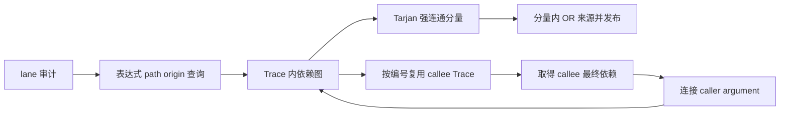
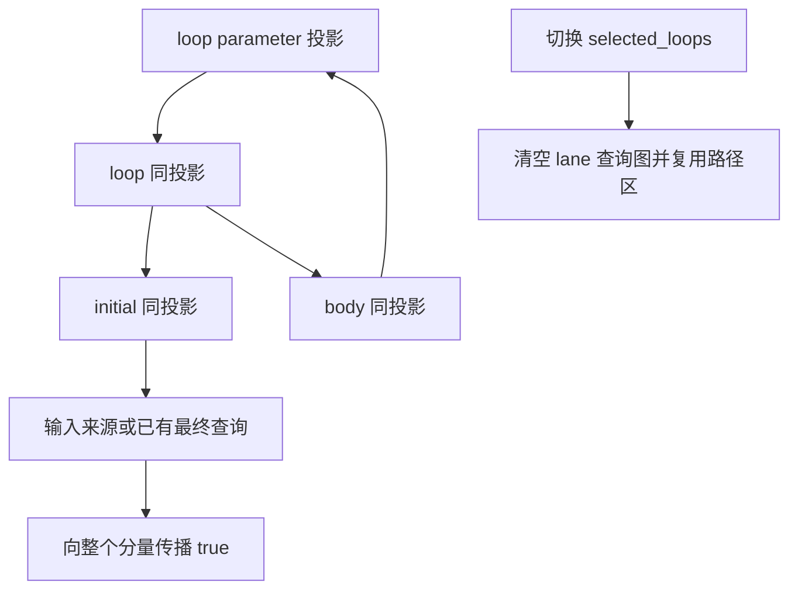

# 缓冲区别名分析收敛方案

## Intent：最终目标

让 genz 在大型静态模块图上完成缓冲区来源与独立性证明，保持安全的原地更新条件、零运行时和零成本抽象，不按源码路径、递归深度或输入规模跳过分析。

## Data：可用证据

统一源码图已完成主分析器的 RX/ZX 分析。集中构建进入 generate_parser.generate 的 emitBundle 后持续消耗内存。首次进程采样显示约 48 GB footprint，主要栈为 render.initialize → buffer_call.analysis.flow → audit.count → may.contains → independent.parameter/projection；已终止该轮生成。采样没有查询实参，不能据此断言同一状态无限递归。

首批修正为完整假设上下文缓存，复用被调函数 Trace。后续采样仍在同一证明链，footprint 已达约 22.4 GB，尚未完成，因此再次终止。完整上下文不会混淆证明，但仍可能产生大量假设组合；不能把加缓存当作问题已经解决。

现有转移规则可以表达为正向 OR 依赖：

```text
M(loop, path, origin) = M(initial, path, origin) OR M(body, path, origin)
M(loop_parameter, path, origin) = M(loop, path, origin)
```

它从零次迭代开始累计有限次迭代可能产生的别名。不带输入来源的纯环为 false；任一节点接入来源后，其强连通分量为 true。当前改为 Tarjan 求强连通分量，分量关闭时统一发布最终结果。

## Edges：边界与限制

- 查询键为当前 Trace 的表达式、投影路径和输入来源；遇到活动节点只记录低链关系，不能把暂时 false 当作已完成答案发布。
- selected loop 必须按 expression 与 path 内容精确匹配，命中后仍只追踪 initial 的同一投影；切换 lane 时清空对应查询图。
- 非输入且无法追踪的 reference 仍为 true；list_update、transform、optional、capture 和 pop 的已有保守路径规则保留。
- 被调函数以空 selected_loops 的独立 Trace 求最终依赖，再连接 caller argument。函数编号严格递减，跨函数图仍无环。不能用 caller 的暂时 false 决定是否分析 callee。
- 非 selected loop 的同投影不动点比旧证明失败后退到 whole-path 更精确，不宣称逐项判定完全相同；安全性依赖完整循环参数边与分量收敛。
- 缓存持有路径内容，lane 临时路径使用可重置 arena；callee Trace 与输入叶路径按函数编号复用。
- 不新增测试、不运行全量测试；当前核验为源码审查与集中构建，不替代后续专项回归。

## Answer：交付格式与成功标准

交付单调别名查询图、被调函数 Trace 复用及明确的临时路径生命周期，记录实际构建与内存证据。主分析器生成通过仍不代表正式宿主切换或阶段自编译完成。





## 实施状态

已实现 queries.zig 的低链、活动栈与分量发布；may.contains 沿原非循环规则建立正向边；independent.prove 只查询收敛后的 loop 整体别名。修正后生成器已完成主分析器 Zig 源码与 ABI 输出，构建已进入最终 zxc 可执行文件编译。当前仍等待完整构建结论；正式主分析器宿主尚未切换，未完成阶段自编译。

## 自我批判

前面的临时 arena 调整解决了中间结果保存边界，但未解释整个 48 GB 消耗；进程采样才确认热点已转到 genz。第一版上下文缓存仍未完成生成，因此已撤换，不能把它作为交付成果。新的分量求值改变了循环投影精度，必须检查暂值不外泄、未知来源保守性与完整依赖边，不能仅以耗时下降宣称优化正确。

### 当前执行证据

[采样摘要](主分析器集中构建/别名分析采样摘要.log)分别保留原递归、假设缓存及分量查询阶段的 footprint 和调用栈片段。分量查询采样时约 16.8 GB，随后该轮生成器正常完成；该数字只是采样时值，不宣称为完整运行峰值或严格性能对比。生成的 analyzer.zig 与 analyzer_abi.zig 已实际出现。

### 本批集中构建结果

`zig build --summary all` 已正常结束，退出码为 0，**36/36 steps succeeded**；生成器及最终 zxc 编译完成。证据见[集中构建日志](主分析器集中构建/统一源码图集中构建.log)。此次没有执行测试，日志中的 compile test 只构建既有测试程序，不代表运行回归。

主分析器源码和 ABI 已生成，正式 Indexed 模块分析入口仍调用旧 Analyzer；本次是生成链验收，不是新分析器运行验收或完整自举完成。502 个本批新增/修改 ZX 均不超过 120 行，diff 空白检查通过。
