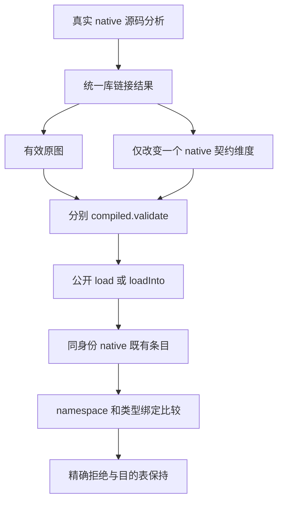

# 编译库原生身份直接冲突门禁

## Intent：最终目标

直接验证同一编译库实例连续装载时的 native 兼容边界。两个图各自合法，但同身份的 namespace 内容、namespace 长度、类型绑定名称或重映射后的类型不同，应精确返回 ConflictingInterface。

## Data：可用证据

只读审查基线为 6943ecf5d44f058059c47b11607550b0aa172053。现有 imports/native_test.zig 的同实例公开别名会命中 compiled_units 缓存，不会第二次进入 native/intern；不同实例则生成不同 key。因此已有用例不能证明 compatible.zx 的已有条目比较分支。

成熟 native_fixture.zig 使用真实分析和 library.link 形成包含 Mode enum、flip 函数与公开导出的库。沿公开 compiled.validate、load、loadInto 接口构造有效图和连续装载，不新增内部桥。Scalar 普通标量绑定已有 native/modules/bindings_test.zig 的合法样例。

## Edges：边界与限制

- 仅修改 packages/test 的测试与既有 test-library-link 注册，不修改生产实现。
- 保留相同 instance、artifact、native key 和 import name，让第一轮实际装载自然生成目标身份，不手写重绑定散列。
- 每份变体先通过独立 validate，再加载原图、重复装载原图并核对 native 数量不增长，最后加载冲突图并核对精确错误。
- 分别执行 load 与 loadInto。失败后核对目的类型、origins、函数和 native 表保持原值；只证明这类语义拒绝，不扩展为所有 OOM 回滚保证。
- 使用 arena 管理测试临时数据，保留真实库结果的原有 deinit，不模拟库内容或返回值。
- 现有 695c 装载专项的 Debug 结果不覆盖新负例。新源码必须冻结并实际执行后才能登记通过，不修改运行中的旧工作树。

## Answer：交付与成功标准

四条具名冲突用例覆盖 namespace 同长度内容差异、长度差异、类型绑定名称差异和类型 ID 差异，每条包含两种公开装载接口与重复加载成功对照。Debug 和 ReleaseSafe 实际成功、源码和终态身份可复核后，独立使用英文 Conventional Commits 提交推送。确认实现缺陷才向授权实现聊天报告。

## 架构图

## 数据流图

## 自我批判

必须证明两个图各自合法，避免在 validate 早期失败却误称命中兼容分支。相同 specifier 不等于相同身份，不能换 instance 或伪造 key。测试直接公共接口的静态装载行为，仍不证明所有发布路线、所有恶意库或所有 native 分支已经覆盖。

## 固定执行安排

采用固定 695c654ce 工作树加三个测试文件覆盖（两个新增测试文件、build.zig 注册），共 6767 个源码输入。直接 Zig 测试命令来自已完成装载专项的真实 native_test 编译 argv，仅替换测试根、优化模式、独立缓存、二进制输出及移除构建协议 listen 参数。复用该固定源码真实生成的 93 份普通 Zig 编译器源码，不重新启动冷生成器；这属于已注册测试根的专项执行，不宣称重新完成八目标冷构建。

初轮 r1 Debug 四条命名测试真实通过，输入哈希未变。自查发现初轮额外依赖的 options/catalog 等显式模块尚未全部单列身份；其结果保留为预验证。正式 r2 在源码不变的条件下补全 114 个显式 -M 模块身份，使用新的两模式缓存重新执行。测试源、SDK、工具、93 个生成文件和114个显式模块均在执行前后核验，不修改原 r1 证据。

只读复核确认两图各自 validate、原图重复加载及 base 冲突路径成立；已补充重复加载的完整 types/nominal_types 深比较，使 options 接续前提也成为真实断言。JSON 快照仅证明目的表语义内容保持，不证明容量、地址或 OOM 回滚。

正式 r2 的 Debug 与 ReleaseSafe 已真实退出 0，四条命名测试每模式均实际执行，两种公开接口合计十六次正式观察，输入摘要未变。最终结果及限制见执行记录，初轮预验证另计。
