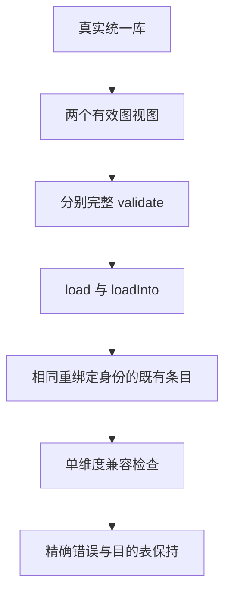

# 编译库原生身份直接冲突门禁执行记录

## Intent：最终目标

补足 compiled loader 既有 native 身份兼容分支的直接负例，验证有效库之间的单维度契约冲突被精确拒绝，原图重复加载成功且冲突不改变目的表。

## Data：可用证据

正式源码为固定 695c654ce3350eaa7f561d661135a2682fcb6ea8 加三个测试覆盖文件：新增 native_conflicts_test.zig、native_conflicts/graph.zig，并在既有 test-library-link 中注册新根。两个原图视图共享真实分析与 library.link 的其余有效内容，不伪造名义类型或身份散列。

| 具名用例       | 唯一冲突维度              | 每条的共同检查                                                                                    |
| -------------- | ------------------------- | ------------------------------------------------------------------------------------------------- |
| namespace 内容 | Left 与 Right，长度均为一 | 两图分别 validate，首次与重复装载成功，native 数量为一，精确 ConflictingInterface，完整目的表保持 |
| namespace 长度 | 单段与空路径              | 同上                                                                                              |
| 绑定名称       | Scalar 与 Other，类型不变 | 同上                                                                                              |
| 绑定类型       | Scalar 的 u64 与 u32      | 同上                                                                                              |

每条分别通过公开 load 与 loadInto 执行。options 路线接续第一次 Loaded 的类型和 origins，重复装载还深比较返回表与目的表；JSON 快照覆盖 types、origins、functions、native_modules 的完整语义内容。

| 正式阶段    | UTC 开始            | UTC 结束 | 终态 | 具名执行 | 接口观察 |
| ----------- | ------------------- | -------- | ---- | -------- | -------- |
| Debug       | 2026-10-09 23:34:20 | 23:35:42 | 0    | 4        | 8        |
| ReleaseSafe | 2026-10-09 23:36:29 | 23:51:05 | 0    | 4        | 8        |

两模式均逐名核对四条测试真实输出，执行前后 6767 个源码输入、工具、SDK、93 份生成编译器源码以及 114 个显式模块的哈希不变。正式共八次具名执行、十六次接口观察，只有四个新增唯一命名测试。

初轮 Debug 另有四次预验证执行，保留在 r1，不合并进正式数量。初轮未单列所有 options/catalog 模块身份，正式 r2 补全身份后使用新缓存重新执行，两轮源码一致。

130 份输入、模块、日志与终态使用 gzip 无损保存；核验器逐份比较解压 SHA、原始字节、运行脚本及日志哈希，并复核保存在外部目录的三份运行二进制身份。所有普通 ZX 文件保持原样，本次没有新增 ZX 或专用运行库。

## Edges：边界与限制

- 这是已注册测试根的独立 Zig 专项，复用固定源码真实生成的编译器源码；不是再次执行八目标冷构建。
- 验证源码为 695c，明确不声称覆盖后续 SIMD、所有权转移或内存释放实现变更。
- 只验证跨图既有 native 条目冲突；不扩展为同轮 delta 身份碰撞、所有 OOM 回滚或全部恶意库覆盖。
- JSON 快照证明语义内容保持，不证明容量、地址或 allocator 内部状态。
- 不新增 Test262 原文适配或 catalog JSONL 数量，四条测试属于 zxc 公共装载能力的补充覆盖。

## Answer：交付与成功标准

三文件实现、四个唯一命名测试、两模式终态及无损归档完成，执行证据核验通过后独立发布。提交标题和正文使用英文 Conventional Commits；发布前后的范围检查保护所有其他工作区文件，推送终态和远端 SHA 写入外部运行目录的 publication/push-receipt.json。

## 架构图

## 数据流图

## 自我批判

初轮证据身份不够完整，不能仅因四条测试通过就直接发布；正式重跑补全了所有显式模块身份。测试保留图的合法性和重复成功对照，避免提前 InvalidLibrary 或缓存复用造成假覆盖。ReleaseSafe 编译耗时约十五分钟，保持原句柄等待终态，未缩减快照、放宽断言或重启构建；该耗时只是本测试编译观测，不能据此推断应用运行性能或一般编译性能结论。
