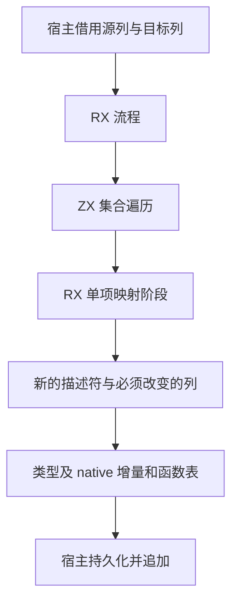

# 编译库接入整块自举

## Intent：最终目标

把 compiled library 的验证、实例隔离、类型合并、原生接口去重、函数及契约重映射、公开导出与 Store 初始化器发布组成真实 RX/ZX 流程。宿主只借用输入、管理 arena、持久化生成结果，不继续调用旧语义总控。

## Data：可用证据

- 完整 IR 校验已在 2aa8a888c 迁入 RX/ZX；类型 preflight/merge、native owner 查询已有可复用实现。
- compiled/load 当前仍调度验证、identity、merge、native append、Nodes.function 与 exports/initializer 映射。
- artifact planned mapping 使用 ID + 1，compiled indexed mapping 使用直接 ID，不能混用。
- 普通 ZX 当前没有借用字符串区间操作；Store 实例路径要求移除已验证的 `store.` 前缀。需要通用字节区间视图，不能通过复制尾部或新增专用身份原生桥规避。

## Edges：边界与限制

- 原有库身份文本、字节长度、std native 共享例外、SHA-256 原生导入名保持一致。
- 结构与完整 IR 检查先于 nominal、initializer、export、跨函数 Store 检查和任何映射。
- 函数 ID 以追加前的 destination count 固定；原生 ID 由去重结果决定。
- 同身份 native 的 namespace、类型名称顺序与映射 ID 必须相等，否则保留 ConflictingInterface。
- contracts 内 symbols/expressions、Store 类型和路径、external.module、公开类型和 initializer.function 都必须映射。
- 宿主在 scratch 释放前持久化所有返回内容；不能让新结果悬挂引用临时 arena。
- 不新增测试、不运行全量测试；采用集中构建及现有库应用限定验证。

## Answer：交付格式与成功标准

交付列式库输入输出模型、完整 RX 阶段图、ZX 单项/集合规则与正式宿主接入。通用编码模块提供按字节索引的只读字符串区间视图，校验边界但不改变原始字节；它不认识库身份或编译器状态。新路径通过既有 lib 消费验证后提交推送。整体 Project 与缓存恢复仍是后续范围。




## 自我批判

入口迁移、文件变成 RX/ZX 或合法库跑通均不足以证明闭包完整。必须逐项核对原规则、ID 编码和持久化深度；不能把原生类型合并或 Nodes.function 留作语义桥。限定应用验证也不能替代全部畸形库及分配失败回归。

## 实现复核

名称唯一性使用排序后邻接比较，跨函数 Store 类型一致性复用已有 names/types 同步排序；避免把旧 HashMap 校验迁成逐项重复扫描。首次构建快照早于这一修订，已主动终止该生成器并从最新源码集中重建。

完整 IR 结构检查要求 Call payload 按顺序消费全部 call_functions，并以 payload 计数等于列长度收尾；contracts 同样完整检查 expression 列及符号端口绑定。因此加载阶段直接按已验证 ID 读取映射表，不新增重复防御扫描。此安全前提仅适用于先经过完整 validate 的接入路径。

集中构建的风格校验拒绝 merge_status 的嵌套条件表达式；已改为 match，保留原状态映射。

公开 load 的目标名义来源检查也纳入 destination.rx；宿主只逐列复制原始输入，不再调用 Origins.seed 来编排检查。loadInto 复用已建立的目标状态，无额外重复校验。该收口发生在上一生成快照之后；检查时旧生成器已完成，已停止其最终 Zig 编译并重建最终源码。

## 剩余边界

正式 compiled.validate/load/loadInto 的规则、顺序与状态转换进入新生成流程。CLI 的 `project/compiled_native.zig` 仍调用公开 `compiled.identity` Zig 辅助 API 注册原生模块；该调用方路径与 CLI 资源编排尚待迁移。因此本轮不是 compiled 所有公开符号、整个 CLI 库接入或整体自举的完成声明。

生成通过后的 Zig 编译发现 sliceBytes 的独立结构体与生成 ABI 对象指针不兼容。该原语改为明确的 text/start/end 三个标量参数，避免跨生成 ABI 结构体耦合，仍仅返回借用区间。

## 限定验收入口

使用仓库既有 library_publish/native_test.ts 与 store_test.ts，并显式传入本轮 CLI 产物、同一 Zig 工具链及现有 fixtures 路径。前者验证独立原生 ABI 和资源、源码移除后的消费、再次发布及失败回滚；后者执行迁移后的 Store 初始化器与宿主，再验证只公开类型的再次发布。相比手工抽查元数据，这两个现有入口同时覆盖行为与身份重绑定。不会执行全量测试，也不新增用例。

本轮集中构建退出 0，36/36 构建步骤成功。原生库专项 1/1 通过，Store 专项 2/2 通过；后者包括既有 nullable 算术拒绝检查。原生专项实际执行迁移与再次发布后的 ZX 消费以及 Zig 消费；Store 专项实际运行首次发布和再次发布的初始化器，而非只比较元数据。

执行命令（工作目录为仓库根，Zig 使用同一 0.17.0 工具链）：

```sh
zig build --summary all
node packages/test/tests/library_publish/native_test.ts <本轮 zig-out/bin/zxc> <zig> packages/test/tests/library_publish/fixtures/native
node packages/test/tests/library_publish/store_test.ts <本轮 zig-out/bin/zxc> <zig> packages/test/tests/library_publish/fixtures/store
```

证据：[构建日志](主分析器集中构建/编译库接入构建.txt)、[原生库发布验证](主分析器集中构建/编译库原生发布验证.txt)、[Store 发布验证](主分析器集中构建/编译库Store发布验证.txt)。

本次 diff 中 41 个 ZX 文件（含标准库声明）最长 48 行，均满足 120 行上限。限定验证没有覆盖全部恶意库输入、OOM 路径或阶段自编译；不得由此宣称整体自举完成。SIMD 修复晚于本轮 CLI 的源读取，使用独立构建和专项验收，不混入本批验证结论。
