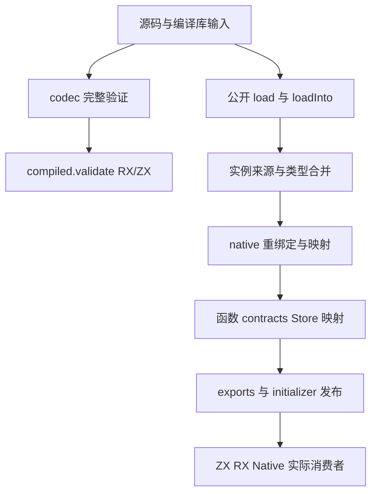
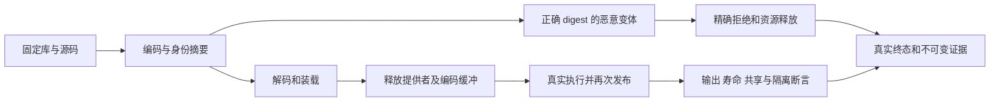

# 编译库装载迁移完整门禁

## Intent：最终目标

在包含 23b2fb2fb 编译库装载 RX/ZX 迁移及已提交读取形态修正的固定源码 695c654ce 上，实际验证 compiled.validate/load/loadInto 的既有恶意输入、身份重绑定、公开导出、初始化器和释放后寿命门禁。以新执行覆盖新迁移，不沿用 fe7 的旧结果。

## Data：可用证据

正式迁移记录说明原先只执行集中构建、原生库发布 1 项、Store 发布 2 项，未覆盖全部恶意库和 OOM。只读审查沿调用关系选定八个现有目标，使用同次构建共享该模式的冷编译依赖：

| 目标                           | 主要证据                                                                  |
| ------------------------------ | ------------------------------------------------------------------------- |
| test-library-link              | 实例身份、别名、nominal、native 重绑定、Store 路径、输入释放、OOM         |
| test-library-codec             | 正确 digest 的畸形 IR/类型列、exports/function ID/nominal、验证 OOM       |
| test-library-initializers      | 初始化器函数与 Store identity/schema、别名共享、跨实例隔离、再次发布、OOM |
| test-library-native-publish    | 原生 ABI、资源搬迁、源码移除后消费、再次发布及回滚                        |
| test-library-store-publish     | 搬迁及仅类型再次发布后的初始化器实际执行                                  |
| test-library-compiled-contract | 正确 digest 的 contracts 校验、导出顺序、再次发布、旧输出保持             |
| test-library-rx-compiled       | RX compiled Store 授权、同实例共享、跨实例隔离、函数与 Store 重映射       |
| test-detached-reader           | 编码字节和 provider 释放后的真实消费者、保留结果、输入保持、OOM           |

静态源码预期 Zig 共 35 个运行节点、266 个命名测试/模式；Node 按实际 TAP 单独统计。该预期不替代真实执行，也不把模式重复、内部输入组合或 OOM 扫描算作新增唯一用例。

## Edges：边界与限制

- 不修改生产代码，不新增测试用例；两模式使用各自新本地与全局缓存，同一官方 Zig 0.17.0 归档和固定 solver。
- 八个目标一次构建，先 Debug 后 ReleaseSafe，保留真实 argv/cwd/环境、完整输入摘要、日志、终态与产物。
- 固定工作树不随主分支后续更新，不把新提交的源码混入已经开始的执行。观察超时不等于终止，不重启已确认仍活跃的句柄。
- 保留 Store capability 等精确负例，不预先作为旧断言放宽。异常必须据实际源位置和当前规则归因。
- 已有 native 别名测试证明同实例重绑定及跨实例隔离，尚不能证明 compiled loader 同身份 native namespace/type 冲突分支的全部直接负例；该覆盖缺口保留，不以 artifact linker 同名错误替代。
- 专项不等于完整根回归、完整 Test262 对齐、完整 native 冲突覆盖或阶段自编译完成。

## Answer：交付与成功标准

八个目标在两种模式真实完成；记录实际 Zig 命名测试、运行节点及 Node TAP，不用静态预期填充结果。归档生成编译器、库与消费程序及关键二进制身份，保存无损日志与失败证据。确认实现缺陷时报告已授权实现会话；完整部分以英文 Conventional Commits 提交推送。

## 架构图

## 数据流图

## 自我批判

旧读取结果不能证明新 compiled loader 正确。目标选择覆盖公开调用链，但不是所有新分支的穷尽证明，尤其同身份 native 冲突直接路径仍有缺口。先执行既有严格门禁获得实际证据，再补具体覆盖；不能把有效库跑通或构建成功作为恶意输入和资源行为的替代。

## 当前执行状态

固定 695c654ce 的 Debug 于 2026-10-09 22:36:42 UTC 启动，23:16:46 UTC 真实退出 0；实际构建汇总为 143/143 步骤、266/266 命名测试通过，changed_inputs 为空。完整终态保存在 `/Users/xiewendao/.codex/conformance/compiled-loader-695c654ce/r1/debug.terminal.json`。ReleaseSafe 尚未启动，等待已排队冷编译释放资源后执行；本专项未完成，不以 Debug 单模式结果宣称交付。

Debug 完整日志还证明 35 个 Zig 运行节点共 266 次命名测试、四条 Node 发布路线实际成功。按真实生成 argv 收集得到 93 份编译器产物（含 compiled_library 及 ABI），并归档十种 detached reader 夹具的 40 份 source/library Zig 与 ABI。二进制仅记录保存在外部固定目录的路径、长度和 SHA，不将 1.6 GB 二进制写入 Git。现有 Node 发布 runner 会清理临时消费产物，且成功输出未在构建日志保留 TAP 数量；因此只记录四条路线成功，不伪造其命名测试数或产物身份。归档清单逐份解压核验，137 份内容与源 SHA 一致。
