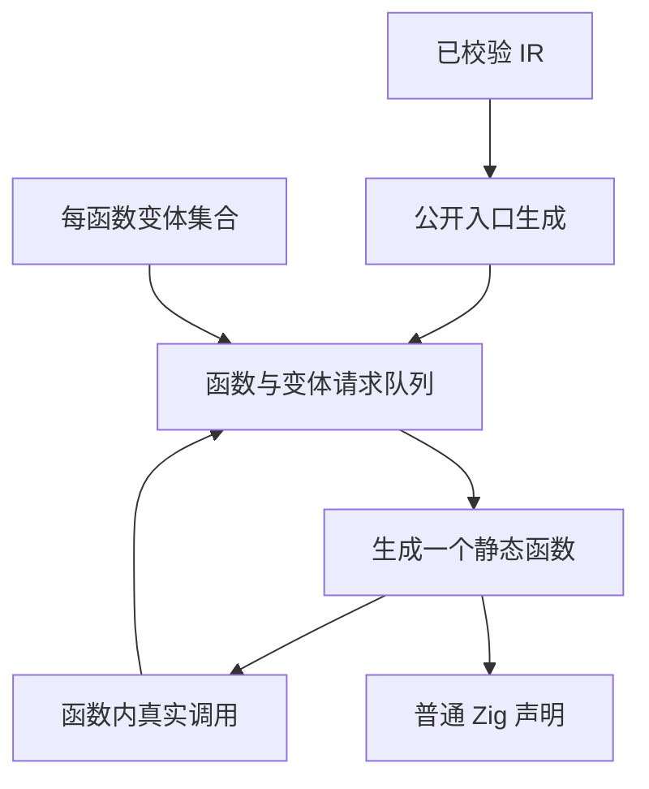

# 编译性能修复计划与记录

## Intent：最终目标

降低当前自举构建的生成时间、生成源码规模与后端编译峰值。优先消除重复工作，保留 zero runtime、静态调用、所有权与无环检查。字段路径收窄工作已保存，待性能问题处理后继续。

## Data：可用证据

基线来自原生缓存恢复功能验收：生成阶段约 16 分钟，后续 zxc Debug 编译约 1 分钟、MaxRSS 约 7 GB。不是严格冷构建数据，也不是整个进程树的同时峰值。

基线代码为 `85b1cc236`；随后合并的文档与回归记录没有改变 compiler、core、genz 的生产源码。旧生成目录为 `packages/test/.zig-cache/o/afa95d92808cbecbe38545d7f37a5362`。

| 生成文件                | 基线字节数 |
| ----------------------- | ---------: |
| analyzer.zig            | 52,988,913 |
| expression_analysis.zig | 48,452,793 |
| native_restore.zig      | 20,845,625 |

`genz/src/zx/lower.zig` 原来无条件遍历全部 IR 函数，生成普通版本和所有可用的 value、buffered、buffered_pointer 版本。实际调用只会使用其中一部分。

此外，函数级 SHA-256 缓存已经存在，但计算每个指纹会重复执行全图分析。该路径用于函数模块产物；当前批量自举使用整块 emit/emitBundle，不经过它。两类重复工作须分别测量，不能混淆根因。

## Edges：边界与限制

- 不新增测试用例、不运行全量测试，不改主工作目录或创建新分支。
- 保留每个公开入口和独立模块的公开变体契约。
- 按真实 FunctionId 与变体登记依赖，不通过正则删除产物或针对入口硬编码。
- 临时队列属于编译器生成阶段，不进入应用产物；函数仍是普通静态 Zig 调用。
- 本轮修复仍位于待自举的 Zig 生成器，不据此宣称 RX/ZX 自举完成。
- 测量时已有另一会话运行编译任务，墙钟时间受资源竞争影响；输出字节数与行为结果可独立核对。

## Answer：执行计划与成功标准

1. 按实际调用登记函数变体，从公开入口向下展开到依赖闭包。
2. 独立初始化每个辅助函数的临时状态，避免先生成入口后带入缓存、缓冲区或捕获状态。
3. 运行既有 `test-native-generation`、`test-semantic-cache`、`test-module-generation` 专项，检查生成产物能被 Zig 编译。
4. 对照生成文件字节数、生成步骤时间和后端 MaxRSS；区分输出缩减与整体构建收益。
5. 再处理可验证的缓冲区参数冗余及重复分析，逐项保留测量边界。

### 生成架构

### 数据与生命周期

### 当前执行记录

- 已将三个函数调用构造点接入统一请求登记。
- 新增 `functions/requests.zig` 管理去重队列，`functions/emit.zig` 负责单函数变体生成。
- 第一次专项编译发现 Zig 0.17 EnumSet API 名称差异，已按本机标准库修复为 `.empty`。
- 当前复验命令：`zig build test-native-generation test-semantic-cache test-module-generation -j1 --summary all`。日志保存在本地忽略文件中，未得到终态前不记为通过。
- 内容寻址评估与 comptime 边界见 [The Zero Way](../the_zero_way.md)，其中保留用户指定的完整参考原文。
- 对运行中的生成器进行 2 秒、10ms 间隔采样，172 个主线程样本均位于缓冲区 lane 分析的 `audit.count -> may.contains` 路径。这是局部热点证据，不代表完整构建的比例。根 Trace 的 query 缓存每 lane 清空有语义必要，callee Trace 已跨调用者共享，不能盲目移除清空或再造同类缓存。
- 第二组局部改动已写入、尚待验证：已知纯 reader 的调用先执行原有可跳过条件；每个 lane 内缓存表达式的无来源、唯一来源、多来源分类与类型叶路径，下一 lane 重新创建缓存；缓冲区参数保存原 optional slot，一次解包后转发两个指针字段，避免重复取地址和解引用。仍执行最后的版本检查。
- 当前正在运行的生成器二进制只包含第一组按需函数变体改动，第二组改动将在下一轮生成中测量。已产出的 parser.zig 从 9,404,341 字节降至 2,699,373 字节，ownership.zig 从 14,652,922 字节降至 3,876,105 字节；这是中间产物体积，尚非整次构建验收。

### 自我批判

生成源码缩小不会自动消除前端重复解析、语义分析或后端实例化开销。按需生成还可能暴露原有的隐式状态依赖，必须检查任务、契约、外部函数和公开入口的调用闭包。当前不能把预计收益当成实测结果，也不能以专项通过代替性能合格。

### 第二组改动的语义复核

- audit 的所有来源计数使用点只判断零、唯一、重复；以枚举准确表达这三类，在确认第二个来源后停止扫描，未引入任意阈值或跳过版本校验。
- query 缓存的清空保持在 lane 起点。新增缓存只在该 lane 存活，嵌套 callee 使用自身 Trace；不能把每 lane 的分类结果跨 selected_loops 环境复用。
- 审查发现直接传递 optional slot 可能遇到 Zig 不同 struct 声明的名义类型差异。已调整为 optional capture 加匿名结构字面量，让目标参数推导类型；未使用位转换，也未改公开 ABI。

- 后段 1 秒采样显示生成器物理 footprint 峰值约 10.9 GB，当前采样时约 338.1 MB；该峰值属于只含按需生成修改的生成器，不能与先前 Zig 后端 MaxRSS 约 7 GB 混为同一阶段。后段栈落在项目推导、IR 校验与所有权分析；这也说明整次生成包含多个热点。

### 第一轮终态

- `test-native-generation test-semantic-cache test-module-generation`：52/52 步骤、30/30 Zig 用例通过；Node 原生 ABI 1/1 通过，进程退出码 0。
- 共同生成步骤：约 15 分钟；生成器编译约 6 秒、MaxRSS 752 MB；后续 zxc Debug 编译约 1 分钟、MaxRSS 8 GB（构建系统的四舍五入报告）。
- 94 个对应 Zig 文件合计 226,847,720 → 74,801,743 字节。analyzer：52,988,913 → 16,361,444；expression_analysis：48,452,793 → 15,024,798；native_restore：20,845,625 → 7,046,353。
- `/usr/bin/time -l` 对整条专项命令报告 1599.13 秒、maximum resident set size 11,762,855,936 字节。它是命令及其子进程统计口径，不是进程树同时占用峰值；不与下一轮不同数量专项的整条命令耗时直接比较。
- 结论：源码膨胀已减少；生成时间与后端峰值仍不合格。不能称为已解决编译性能。
- 第一轮后半段的模块生成测试已编译当前 genz 改动。第二轮限定 `test-native-generation test-semantic-cache`，重新生成全部自举产物并验证实际 ABI，避免重复第一轮已覆盖的模块生成用例。阶段指标按共同生成步骤对照。

### 第三组：共享被调用函数的输出依赖

第二轮主分析器阶段采样再次全部落在 `reads.classify -> may.contains`；RSS 再次超过 7 GB，证明第一层局部缓存没有处理主要重复来源。现有 callee Trace 已共享细粒度查询，但 `may.call` 仍为每个调用方来源遍历 callee 的全部输入路径与返回表达式。

新增 `analysis/dependencies.zig`，在每个 callee Trace 内按输出路径保存稳定 Entry：已扫描输入前缀和已确认的正依赖列表。惰性迭代器先返回已知正依赖，再继续扫描尚未分析的输入，保留调用方短路。全部输入扫描完成后清空该 callee 的细粒度 queries，复用其容量。

审查边界：

- 计算 callee 内部查询时只进入更小 FunctionId，当前 callee 的查询不会活跃重入。
- 迭代器返回一个输入后，调用方参数可能包含同 callee 的调用，因此可重入依赖表。Entry 单独分配，迭代器按索引读取最新列表，不持有 map entry 指针或 ArrayList slice。
- 输出键复制到 Trace allocator；输入路径和正依赖数组也由该 allocator 持有，均不借用可清空的 query arena。
- 仅在完整 contains 返回、全部输入扫描完成后 clear。根 lane 的 Reads 不在 callee Trace 中，不会被清空。
- OOM 一路终止生成，不在已失败的查询器上尝试恢复。新依赖结果仅在完整计算后推进游标。

第三组已单独编译生成器成功；尚未运行完整生成与专项验证。第二轮运行中的生成器不包含第三组改动，便于分别保留证据。

### 宿主生成器的优化模式

`build/parser.zig` 原先将最终目标的优化模式直接传给宿主 generate-parser 及其 seed 依赖，默认 Debug 构建因此运行未经优化的生成工具。调整为：目标为 debug 时，生成器和它的宿主依赖使用 safe；其他目标模式沿用既有选择。最终 zxc 与测试目标的模式不变。

已核对本机 Zig 0.17 标准库 `lang.Optimize`：debug 与 safe 都启用语言安全检查；safe 侧重执行性能。这不是关闭语义、所有权、无环或运行安全检查。下一轮须同时记录工具编译时间与生成执行时间，并与第二轮产物逐字节比较；若只报告工具执行加速而忽略工具编译成本，则结论不完整。

第三轮同时包含依赖摘要复用和宿主 safe 构建，最终测量只能直接证明组合后的效果，不能将全部时间变化归因于单一算法修改。后续若需分离归因，已有单独编译成功的 Debug 生成器可作为同源码对照。

### 第二轮生成产物核对

94/94 文件经已知 optional capture 转发形式还原后，与第一轮逐字节一致，共 141,898 处表达式替换；没有发现函数变体、缓冲区资格或其他生成内容变化。该比较仅用于核对产物，不通过正则改写或删除正式生成源码。

总字节数 74,801,743 → 68,081,921。按串行输出文件写入时间差估算，analyzer 330.535 → 315.576 秒、expression_analysis 196.976 → 188.332 秒、compiled_library 105.985 → 100.037 秒、native_restore 95.513 → 88.366 秒、ir_validation 80.262 → 75.013 秒。这些间隔包含入口内的分析与生成，不是其中某一子阶段耗时；资源竞争也会影响墙钟时间。收益有限，未达到解决慢编译的目标。

### 第二轮终态

`test-native-generation test-semantic-cache`：37/37 步骤、7/7 Zig 用例、1/1 Node 原生 ABI 通过，退出码 0。生成约 14 分钟，生成器编译约 6 秒、MaxRSS 745 MB；后端 zxc Debug 编译约 1 分钟、MaxRSS 7 GB。

整条命令 time-l 为 1080.74 秒、maximum resident set size 9,944,924,160 字节。由于比第一轮少了模块生成测试，不用整条命令的耗时差宣称优化比例。生成阶段及后端峰值仍需继续改善。

### 第四组：按元素类型共享缓冲区槽

第三轮 94 个产物与第二轮逐字节一致，但仍有 89,187 处独立的缓冲区槽 struct 定义，结构定义文本约 7,237,096 字节。analyzer 有 30,335 处、66 种元素类型写法；expression_analysis 有 26,442 处、60 种写法；native_restore 有 6,495 处、24 种写法。相同元素类型的槽反复成为不同 Zig struct 声明，增加类型处理工作。

改用生成的 `zxBufferSlot(comptime zx_element: type) type`，只返回 buffer 与 started 两个指针字段的普通 struct。同一工厂和相同元素类型复用同一类型；共享类型模式将工厂放在 ABI 类型模块中，独立模式在当前文件声明。类型表不含 list 时不生成该辅助声明。

该构造只进行有界类型计算，不引入运行时函数调用、动态调度、数据复制或独立运行库。统一槽类型后可以直接传递原 optional slot，移除第二组用于适配不同 struct 身份的匿名结构重建。实际内存改善与公开调用兼容性仍需第四轮验证，不能仅凭声明数量推定后端收益。

### 第三轮独立生成测量

第三轮使用同一已编译的 safe 生成器、相同源码和参数，将输出写到新的临时目录，单独用 `/usr/bin/time -l` 测量：156.64 秒，maximum resident set size 3,921,473,536 字节，peak memory footprint 3,919,331,328 字节。94 个输出与第三轮正式构建产物逐字节一致。

该结果单独覆盖生成执行，未包含生成器自身编译、后端编译或其他专项时间。第三轮正式专项仍需等待完整终态；后端内存问题仍存在，不能用工具执行的收益代替最终编译器性能结论。

第四组只读审查确认：单文件使用本地唯一工厂；共享函数模块引用 canonical ABI 的唯一工厂；list 元素在 state 分析中始终保留 boxed 表示，直接传递槽时元素类型身份一致。原生 ABI view 当前仅给显式原生模块，生成函数并不引用它，因此不为本次修改扩大导出范围。尚待实际生成与 Zig 编译验证。

第四组同步将生成缓存格式标识从 v41 升至 v42：槽类型工厂改变了函数文件与 ABI 文件的配套输出，必须防止既有持久化缓存将旧 ABI 与新函数混用。其他语义缓存格式不变。

第三轮专项终态：52/52 步骤、30/30 Zig 用例及 1/1 Node ABI 通过；生成器 safe 编译 45 秒、MaxRSS 1 GB，生成执行约 2 分钟，后端 zxc Debug 编译约 1 分钟、MaxRSS 7 GB。整条专项命令 801.71 秒、maximum resident set size 7,234,465,792 字节。相同专项组合第一轮为 1599.13 秒；本机另有测试并发，墙钟时间只能作为本次实测，不能作为稳定基准承诺。

### 第四轮产物核对

94/94 文件在仅归一化槽类型声明、去除对应类型工厂声明并还原直接转发形式后，与第三轮逐字节一致。对应替换为 89,187 处槽结构和 141,898 处转发，生成 51 个文件内/ABI 内唯一工厂；没有通过正则改写正式产物。

总生成字节数 68,081,921 → 52,020,815；相对原始 226,847,720 字节减少约 77.1%。该统计包含函数与 ABI 文件，不等于机器码或内存下降比例。第四轮后端与专项仍在进行。

### 本轮自我审查

- 按需队列从真实调用展开，外部函数只接受普通调用，独立函数模块保持其公开变体；没有按入口名称或用例删代码。
- 依赖摘要遵守原 callee 拓扑边界、查询 SCC 完成与重入规则；分配失败继续终止，不重试半成品状态。
- 槽工厂只计算普通类型，转发两个已有指针，不复制应用集合；缓存格式版本同步更新。
- 最终 diff 的 Zig 格式检查通过。Markdown 的两处尾空格来自必须原样保留的附件；已核对 182,012 字节原文完整包含，不为消除格式提示修改原文。
- 后续方案分别保存在函数产物分析复用和自举入口共享生成计划中，尚未实施。当前改动不等于全图分析复用或跨入口共享，也不等于完整自举完成。

### 第四轮终态

`test-native-generation test-semantic-cache test-module-generation` 全部通过：52/52 步骤、30/30 Zig 用例、1/1 Node 原生 ABI，退出码 0。未新增测试用例、未执行全量测试。

- 生成器 safe 编译 46 秒、MaxRSS 约 1 GB；生成执行约 2 分钟。
- 后端 zxc Debug 编译约 1 分钟、MaxRSS 约 5 GB；第三轮同一步约 7 GB。
- 各专项 Zig 编译约 39–41 秒、MaxRSS 约 3 GB；第三轮约 50–53 秒、约 4 GB。
- 整条专项命令 687.45 秒、maximum resident set size 5,524,258,816 字节。第三轮相同专项为 801.71 秒、7,234,465,792 字节；首轮相同专项为 1599.13 秒、11,762,855,936 字节。仍是一次本机测量，有其他会话并发，不能当严格基准或同时进程树峰值。

共享槽类型已获得后端内存下降的实测支持；按需生成、依赖摘要和 safe 宿主构建的组合也明显改善生成阶段。后端约 5 GB 仍偏高，本次不宣称编译性能已彻底解决。下一步按计划处理同批函数分析重复和跨入口共享。
