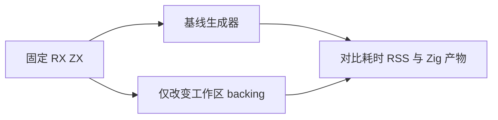

# 生成分析工作区释放对照

## Intent：最终目标

区分整表快照复制本身与 arena 嵌套保留的成本。仅改变两个已由分配栈定位的短期 arena 的 backing，使 deinit 实际归还其内存；不改变分析、快照或固定点算法。

## Data：可用证据

此前 expression_analysis 单入口累计复制 36.09 GiB，最大扩容来自 iteration_buffer/analysis 与 buffer_call/analysis/versions。基线生产来自 d547ddb36，当前整合提交 8fc8c3db8 没有改变生产源码。

两个临时变更分别位于 analyzeWithCalls 与 versions.check。前者仅向调用方复制 ExprId 和无切片的 Call 记录；后者只返回 bool。局部 arena 之外无这两处工作区结果借用的设计契约。

## Edges：边界与限制

本轮只在临时副本把这两个 arena 的 backing 改为 page_allocator，生产代码不改。这是隔离生命周期影响的诊断，不是最终 allocator API 设计；正式实现需要显式传入可释放的工作区 allocator，并保留调用方分配控制和错误语义。不能将这两行修改直接当成可发布方案。

同一驱动、工具链、输入与 safe 优化级别，分别编译基线及变体生成器；生成器构建成本不计入运行。独立执行两者，以 time -l 记录编译墙钟和 RSS，并与已有输出逐字节比较。机器仍可能有并行干扰，不将小幅时间差作为收益。

## Answer：交付与成功标准

交付原始命令、两轮资源数据、产物比较、临时源码归档及结论。若仅释放边界就降低峰值，说明需要先明确工作区生命周期；即使结果一致，也不替代非法输入、分配失败等行为验收。本轮不新增或运行功能测试。

## 对照结果

两个生成器均成功构建，随后分别执行同一入口；两次运行均退出 0。每次生成的两个 Zig 文件与最初基线逐字节一致。

| 指标                |                 原始嵌套 arena | 两个工作区直接使用 page_allocator |
| ------------------- | -----------------------------: | --------------------------------: |
| 总墙钟（time -l）   |                       32.15 秒 |                          40.96 秒 |
| user / system       |                31.29 / 0.76 秒 |                   35.32 / 5.53 秒 |
| infer               |                      15.384 秒 |                         15.323 秒 |
| emit                |                      16.718 秒 |                         25.591 秒 |
| 最大 RSS            | 3,889,692,672 字节（3.62 GiB） |    1,455,951,872 字节（1.36 GiB） |
| page reclaims       |                        971,596 |                        10,705,993 |
| page faults / swaps |                          0 / 0 |                             0 / 0 |

峰值 RSS 降低 **62.6%**，但 emit 耗时增加 **53.1%**。infer 基本保持原有量级，变化集中在本次修改的生成阶段。system 时间和 page reclaims 明显增加，与反复申请、归还工作区页面的成本一致；仍保留机器并行干扰的限制，不把一次对照当作稳定吞吐统计。环境快照有其他会话的 Zig 进程，约占 7.04 GiB RSS，未终止该进程。

此结果支持两个判断：

1. 工作区生命周期确实是生成峰值的重要原因；两个局部释放边界的改变就显著降低了 RSS。
2. 直接替换为 page_allocator 不是合适的生产方案。下一步应验证显式工作区复用，在保留调用方 allocator 控制的同时减少系统分配；若要进一步降低复制成本，还需要单独优化状态保存粒度。

本轮没有减少 snapshot/object cache 的算法执行次数；因此不能将峰值下降说成整表复制问题已经解决。也不能把 1.36 GiB 视为理论最低内存，它仍包含当前分析及其他存活数据。

证据包括 `释放对照统计.json`、两组构建/运行命令与日志、`释放对照环境.json` 和 `释放对照源码.tar.gz`，均按仓库规则本地忽略。统计记录两份生成器 SHA256、退出状态及输出 SHA256。生产代码与原基线相同。

## 自我批判

产物一致只证明固定成功路径；对照也无法消除实际复制成本。若内存降低但耗时增加，应分别报告，并继续评估可复用工作区而非把反复页分配作为最终方案。
