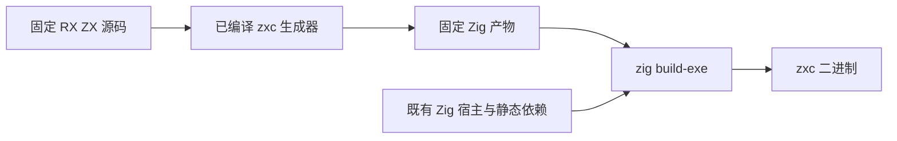
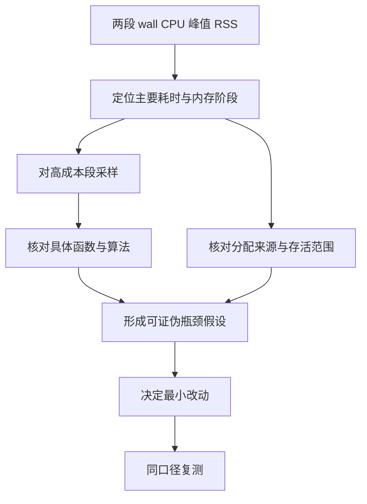

# 编译性能分阶段测量报告

## Intent：最终目标

先定位编译慢和内存高分别发生在哪里，再逐渐深入到具体处理阶段、函数和分配生命周期。暂不运行功能测试，不以优化草稿替代基线证据。

只测两个核心阶段：`zxc → Zig` 和 `Zig → 二进制`。最终据此区分 zxc 前端与生成开销、生成源码造成的后端负担，以及 Zig 自身的分析和代码生成开销。

## Data：可用证据

- 基线提交：`905106ad5`，其中生产实现来自 `d547ddb36`；共享入口草稿已移出活动源码。
- 第一段使用现有已编译生成器，真实读取编译器、core 与 lint 的 RX/ZX 源码，生成现有 94 个 Zig 文件；另单独补测词法生成器的 1 个文件；不编译生成器本身。
- 第二段使用真实 CLI 的完整 Zig 编译参数，固定第一段产物，直接执行 `zig build-exe`；不调用测试目标，不混入构建脚本或重新生成。
- 输入收集为 1,150 个 ZX 与 138 个 RX 文件，共 1,505,717 字节；实际逐入口处理可达子集。输出体积放大不等同于可消除的成本，需要结合后端计时判断。
- 工具链：本机 Zig 0.17.0，x86_64 macOS。生成器为 safe，CLI 后端为默认 debug。物理内存 32 GiB。
- `/usr/bin/time -l` 记录 wall、user、system 与最大 RSS；macOS 的 maximum resident set size 单位为字节。另记录产物规模与散列。
- 原始命令、日志、采样和本地中间产物不提交。95 个生成产物已收进本地忽略的 `基线生成产物.tar.gz`；恢复后可重放固定源码的后端命令。临时诊断源码改动保存在 `诊断源码副本.tar.gz`，证据散列见本地 `本地证据索引.json`。生成器 SHA256 与 argv 已保存到 `第一段命令.json`。

## Edges：边界与限制

1. 第一段是编译器自举的多入口构建负载，不能外推为普通小型应用的编译时间。
2. 第二段是实际 zxc CLI 二进制，包含生成的自举模块和仍存在的手写宿主；不是纯生成文件的独立微基准。
3. 时间包含当前进程的读盘、分析、输出或链接；两个阶段各自峰值，不把它们相加为一个同时峰值。
4. 当前机器有其他会话的 Zig 编译进程，占用约 8–9 GiB；不会停止其他会话。计时属于有并行干扰的观测，必须保留 user/system 与内存压力证据。不能宣称稳定性能上限或小幅收益。
5. 只用空的后端本地编译缓存测第二段，不清除用户共享缓存。工具链、系统库和文件系统缓存状态另记，不能称整台机器完全冷启动。
6. CPU 采样只能估计采样窗口内的热点；RSS 是驻留内存，不能直接归因到某个容器或断言泄漏。需要调用栈、分配来源和生命周期共同支持。
7. 本轮不新增功能测试、不运行既有测试；成功退出只说明该编译路径完成。

## Answer：交付格式与成功标准

先填满同一输入、同一版本的两段测量表，再细分高成本阶段。每个结论区分“测量事实”“源码证据”“待证假设”。优化须在瓶颈和成功标准明确之后开始。

| 阶段         | 墙钟耗时                  | user / system    | 峰值 RSS | 产物                     | 状态             |
| ------------ | ------------------------- | ---------------- | -------- | ------------------------ | ---------------- |
| zxc → Zig    | 153.71 秒（两子步骤相加） | 149.44 / 3.54 秒 | 3.62 GiB | 95 个源码文件、49.91 MiB | 两子步骤均退出 0 |
| Zig → 二进制 | 60.26 秒                  | 58.43 / 4.37 秒  | 5.27 GiB | 实际 CLI、143.96 MiB     | 退出 0           |

### 第一轮测量事实

- 主生成器：152.87 秒，峰值 RSS 3,890,114,560 字节，94 个文件共 52,020,815 字节。94/94 与此前已验证产物逐字节一致。
- 独立词法生成：0.84 秒，峰值 RSS 36,982,784 字节，315,297 字节源码，与已有词法产物逐字节一致。第一段时间为两个独立子步骤的顺序成本之和；峰值取最大值，不相加。
- 后端：60.26 秒，峰值 RSS 5,659,619,328 字节；输出 CLI 150,950,633 字节。采用空的本地编译缓存、既有全局工具链缓存；依赖资源和静态 C 库已经准备好。命令来自此前成功构建，94 个自举文件已指向本轮输出；词法文件使用逐字节相同的既有副本。
- 两段都没有运行测试。第一段零 swaps，第二段零 swaps、2 次 page faults；这些进程计数不能代表系统完全无内存压力。
- 第一段约占两段相加耗时的 71.8%，第二段约 28.2%；第一段是当前主要时间成本。第二段最大 RSS 比第一段高约 45.5%，但第一段本身 3.62 GiB 也不能忽略。
- 第一段 user 时间接近 wall，当前证据支持 CPU 计算主导；具体是推导还是生成，仍待下一层拆分。

第一段输出最大的五个文件：analyzer 9,674,705 字节、expression_analysis 9,068,494 字节、compiled_library 5,670,899 字节、native_restore 5,411,984 字节、ir_validation 5,025,469 字节。不能仅凭这些大小认定它们对应的 Zig 编译成本占比。

### 当前已知与待证内容

源码显示自举驱动对公开入口逐个推导并生成，每个入口含自己的依赖闭包；这是重复工作的候选来源，还不能单凭源码结构量化当前耗时和内存占比。共享入口草稿的短采样不能当作已提交基线的热点证据。

此前专项命令的总时长和 MaxRSS 包含生成器构建、后端和测试相关工作，不进入本报告两段指标表。

## 第二轮：第一段内部拆分

诊断生成器仅在临时目录加入阶段计时和阶段名称输出，生产源码没有改动。使用 50 ms 间隔的 macOS `proc_pidinfo` 采样 RSS，在 analyzer 的 infer/emit 各取一次 1 秒调用栈，并对高内存时刻执行一次 vmmap。此轮总墙钟 154.19 秒；存在观测开销，不替换第一轮基线。94/94 产物仍逐字节一致。

| 第一段内的工作     |  累计耗时 | 解释                                                      |
| ------------------ | --------: | --------------------------------------------------------- |
| 依赖筛选 reachable |  0.143 秒 | 55 个入口累计                                             |
| 项目推导 infer     | 77.539 秒 | 包括语义处理和内部校验                                    |
| emit/emitBundle    | 76.379 秒 | 包括生成前 IR 校验、prepare、函数分析、Zig AST 与文本生成 |
| 写出文件           |  0.026 秒 | 不含输入收集                                              |

当前速度定位：推导和 emit 各约占一半，依赖筛选和写文件不是这轮主要时间成本。不能只优化输出字符串或磁盘缓存。

| 入口                |    infer |     emit | 观测到的主要内存阶段 |
| ------------------- | -------: | -------: | -------------------- |
| analyzer            | 18.09 秒 | 25.40 秒 | emit：约 3.43 GiB    |
| expression_analysis | 15.29 秒 | 16.69 秒 | emit：约 3.61 GiB    |
| compiled_library    | 14.39 秒 |  8.21 秒 | emit：约 2.12 GiB    |
| native_restore      | 11.84 秒 |  8.66 秒 | emit：约 2.46 GiB    |
| ir_validation       |  8.83 秒 |  8.30 秒 | emit：约 2.48 GiB    |
| ownership           |  1.21 秒 |  7.56 秒 | emit：约 1.93 GiB    |

第一段的 50 ms RSS 峰值落在 expression_analysis 的 emit，约 3.61 GiB；最高 infer 采样约 0.49 GiB。跨入口释放后驻留明显回落，因此当前证据首先指向单次生成阶段的临时存储峰值，不能称为跨入口持续泄漏。vmmap 的高内存快照约 3.1 GiB 属于 VM_ALLOCATE 可写脏页，传统 malloc 区很小；尚不能凭区域名精确断定某个 Zig 容器负责。

### 调用栈与源码交叉核对

analyzer 的 infer 短采样进入 mixed.compile、analyzeInputIn、IR validate、seed_validate.function 和 ownership。源码存在重复完整前缀验证：RX 每个 Call 的 callee view 都携带共享函数前缀；Call 校验、模块校验与 appendBody 会再次进入 validator。validator 再对前缀中的每个函数执行局部 ownership。ownership 本身只处理当前单元，不能错误地把它描述成独立递归全图算法。

analyzer 的 emit 短采样中，844 个主线程样本有 811 个处于 render.initialize 的子树；其中 539 个处于 buffer analysis 的 analyzeLanes，514 个进一步进入 reads.classify，递归 may.contains 明显。该比例只适用于这 1 秒窗口，不代表完整 76.38 秒 emit 的占比。

下一层将测量 genz arena 在 initialize、类型生成、declarations 三个边界的实际保留容量，以区分分析工作区与输出 AST。Zig 后端另用本机内置 time-report 和调用栈采样拆分，不依赖猜测。

## 第三轮：生成器内存与后端成本继续细化

### 生成器内存：扩容进入循环缓冲区分析

对 `expression_program/compile.rx` 单独运行临时诊断生成器；其 439 个 IR 函数、943 个类型及产物与基线一致。记录最外层 genz arena 容量：

| 边界                                                      |                 arena 保留容量 |
| --------------------------------------------------------- | -----------------------------: |
| initialize 完成                                           |   755,473,930 字节（0.70 GiB） |
| ABI 类型声明完成                                          |                           同上 |
| 入口 execute / entry_values 完成                          |                           同上 |
| `ownership/runtime/execute.zx` 的 value helper 函数体完成 | 4,908,983,970 字节（4.57 GiB） |
| declarations 完成                                         |                           同上 |

函数的 state 进入、error_effects、contracts 都没有触发这次大幅扩容，扩容位于 `function_434_value` 的 body 生成区间。该函数也是后端 time-report 中的重成本声明之一。容量是 arena 预留总量，不是 RSS，也不能把容量增量直接当成某个对象的大小。

在 arena backing allocator 的大块申请处抓栈，观察到 155,619,388、322,196,658、874,423,234 和 3,279,086,854 字节的分配请求。增长链进入：

- `iteration_buffer/analysis.zig:149`：为 object evaluation 复制整张 cached 数组。
- `iteration_buffer/analysis.zig:179`：条件分支的 yes_state snapshot。
- `iteration_buffer/analysis.zig:434`：snapshot 同时复制整个 symbols 与 cached。
- `iteration_buffer/borrowing/iteration.zig:13` 起的固定点循环反复 restore、求值、merge；restore 只恢复内容，不释放先前快照。

这确认了大块保留与**循环/分支分析中的整表快照复制**有关，不能笼统归因于输出文本或最终 Zig AST。分析使用嵌套 arena，而 backing 又是 emit arena；内部 deinit 或 restore 不代表最外层内存已归还。继续对同一入口计数后得到如下结果；不声称全部峰值都由某一个结构占用。

### 整表复制计数

在临时源码副本的三处 dupe 前计数，生产实现不变，诊断退出 0，两个输出文件与基线逐字节一致。计数只覆盖这三类数组复制，不包含所有分配。

| 复制类别                    |      次数 |        累计申请并复制的数组字节 |
| --------------------------- | --------: | ------------------------------: |
| snapshot：symbols 与 cached |   966,528 |                  15,408,785,080 |
| object evaluation：cached   | 1,476,140 |                  22,868,460,352 |
| scope：symbols              |   501,353 |                     472,548,888 |
| 三类合计                    | 2,944,021 | **38,749,794,320（36.09 GiB）** |

initialize 结束时上述累计量已达 22,735,519,752 字节（21.17 GiB）；declarations 期间再增加 16,014,274,568 字节（14.91 GiB）。因此，重复分析状态复制同时发生在初始化分析与后续函数体生成路径。

这不是 36 GiB 的同时驻留，也不等于输出程序发生了这些复制；它是**编译期间**的累计数组复制负载。与每个入口的实际输出约 9.40 MB 对照，已经能明确定位“整张分析状态被反复快照/恢复”的代价。arena 的生命周期解释了为何逻辑 restore/deinit 后仍可能保留大量临时存储；仍需分别验证降低复制量和缩短保留期的效果，不能把两者混成同一个优化。

### Zig 后端：LLVM 发射占主导，生成文件确实形成主要负载

使用 Zig 自带 `--time-report` 单独诊断固定源码。此选项增加测量开销，诊断时间不能替换 60.26 秒无探针基线，也不能与第一轮相减计算收益。

| 诊断字段           |      观测 |
| ------------------ | --------: |
| 解析 CPU           |  0.417 秒 |
| AstGen CPU         |  2.279 秒 |
| Sema CPU           | 12.336 秒 |
| Zig 侧 codegen CPU |  7.981 秒 |
| 文件处理 wall      |  0.590 秒 |
| 声明处理 wall      | 12.609 秒 |
| LLVM emit wall     | 85.298 秒 |
| link flush wall    |  0.537 秒 |

CPU 子项存在包含关系、并发与边界差异，不把它们与 wall 相加。诊断数据确认使用 LLVM；主导阶段是 LLVM emit，最终链接很短。LLVM pass 报告与采样进一步进入 X86 指令选择、指令调度、汇编输出和 DEBUG_VALUE 分析；20 秒附近的采样也进入 LLVM bitcode 读取/验证。它们说明后端在处理真实的 IR/机器码工作，不是文件写出等待。

23,750 条声明计时中，本轮生成的自举源码合计 Sema 8.640 秒、Zig 侧 codegen 6.513 秒，占两项合计约 74.6%。最重的文件是 analyzer、expression_analysis、compiled_library、native_restore、ir_validation、ownership。因此“生成代码负载很大”已不仅是源码体积猜测；但还不能据此断言 LLVM 实现有缺陷，或跨入口共享一定能达到某个比例。

后端高内存 vmmap 快照在 LLVM 处理期间显示主要为 malloc 类区域，其中 TINY 约 1.5 GiB、MEDIUM 约 0.85 GiB、LARGE 约 0.73 GiB；这不是完整峰值快照，也没有 allocation stack，不能把这些区域逐一归给 LLVM 类型、指令或调试信息。基线最大 RSS 5.27 GiB 与 peak memory footprint 约 3.86 GiB 口径不同，报告不把 RSS 等同于活跃业务堆。

工具记录：time-report 的 ABI 注释遗漏每条声明的 sema_count 字段，采集器首次解码失败；原始消息完整保留。按同一工具链 `lib/build-web/time_report.zig` 的实际读取格式恢复，严格检查 23,750 条声明及消息末尾，得到上述数据。后端已产出完整 CLI；失败发生在本地报告解码阶段。首次包含显式输出路径的诊断命令也被 Zig 拒绝，已记录并改为其要求的缓存输出，不进入基线指标。

## 第四轮：推导中的重复校验已量化

在临时 compiler 源码副本中，为 IR 校验入口标记调用来源、记录调用内墙钟时间和传入函数表大小；使用未插入内存探针的基线 genz。单独编译同一个 expression_analysis 入口，退出 0，两个生成文件与基线逐字节一致。此轮总墙钟 32.23 秒，infer 15.522 秒、emit 16.651 秒。探针在计时结束后逐条写日志；调用计时不含该条日志写出，但总 infer 包含日志开销。

| infer 中的调用来源            |  调用次数 |  校验累计耗时 | 传入函数表累计行数 |
| ----------------------------- | --------: | ------------: | -----------------: |
| ZX 解析完成 `zx.resolved`     |       484 |      6.741 秒 |            103,051 |
| 加入共享表 `link.append_body` |       501 |      7.030 秒 |            107,085 |
| RX 调用目标 `rx.callee`       |        56 |      1.150 秒 |             15,006 |
| RX 降级完成 `rx.lowered`      |        17 |      0.299 秒 |              4,034 |
| 合计                          | **1,058** | **15.220 秒** |        **229,176** |

这些校验合计占本轮 infer 的 **98.1%**。最终 Program 只有 439 个函数；累计行数表示每次验证传入的函数表长度之和，不表示 229,176 个不同函数，也不能直接等同于 ownership 调用次数：原生函数有独立验证分支，根函数另外验证，结构检查也会遍历函数表。emit 前的另一笔全 Program 校验为 0.061 秒，没有混入 infer 合计。

源码进一步解释了放大机制：

- `zx/analysis/analyze.zig` 在 resolved 分析成功后验证 Program；混合编译的 ZX 路径随后把同一个 Program 交给 `link/source.zig` 的 appendBody，再执行完整校验。Store setter 路径会先调整 stores，不能一概当成完全相同输入。
- `rx/analysis/module_compile.zig` 遍历 calls，分别验证每个 callee；callee view 包含共享函数前缀。模块 lower 后又验证完整 Program，随后 appendBody 也验证。
- `zx/ir/seed_validate.zig` 每次验证既检查根，又遍历函数表检查结构和每个函数；不会因先前校验过同一前缀而跳过。

因此，对这个入口而言，“推导慢”主要已经收窄为**构造过程反复全量验证累计 Program**。链式逐步加入函数时，重复遍历不断增长的前缀可以产生平方级工作量；实际项目还取决于图形、函数大小和 Call 数，单入口观测不证明所有项目都遵循同一增长曲线。

下一层最小实验应在临时副本中区分新根/新增函数的局部校验与必须重新检查的跨函数不变量，明确共享类型表、函数表、原生模块和 Store 修改会使哪些已验证事实失效，再比较相同输入下的编译耗时与产物。不能只按路径缓存一个“已验证”布尔值，也不能直接删除全部内部校验。此次仍未修改生产算法或宣称取得优化收益。

原始证据：`校验来源诊断命令.json`、`校验来源诊断.log`、`校验来源统计.json`；临时探针及驱动归档为 `校验来源诊断源码.tar.gz`，均为本地忽略文件。

## 第五轮：ownership 只占校验内部约一半

沿用第四轮的临时 compiler 副本，进一步记录 seed 校验器中局部 function 检查次数、ownership 成功返回次数及其耗时。生成器选项确认为 `generated_parser = false`；结果描述初始引导生成器的 seed 路径，不代表正式自举 RX/ZX 校验路径已完成同样测量。

同一 expression_analysis 入口本轮退出 0，总墙钟 32.19 秒，infer 15.554 秒、emit 16.584 秒；两个输出文件仍与基线逐字节一致。

| infer 校验来源   |    校验总耗时 | 其中 ownership | ownership 次数 |
| ---------------- | ------------: | -------------: | -------------: |
| zx.resolved      |      6.708 秒 |       3.178 秒 |         96,199 |
| link.append_body |      7.108 秒 |       3.434 秒 |         99,995 |
| rx.callee        |      1.148 秒 |       0.592 秒 |         14,222 |
| rx.lowered       |      0.298 秒 |       0.151 秒 |          3,796 |
| 合计             | **15.262 秒** |   **7.355 秒** |    **214,212** |

ownership 占校验总时间 **48.2%**，其余约 **7.907 秒（51.8%）**包括结构、表达式规则、scope、task、契约等检查和校验调度。此差值也包含探针读时钟与计数开销，不是任一具体检查的独占时间。局部 function 共进入 214,364 次，其中 152 次在到达 ownership 前因 type_only 路径正常返回；原生函数另有校验路径。ownership 次数只统计这轮成功路径，不包含推导器在 validator 外直接执行的 ownership。

这纠正了“校验热点就等于 ownership 算法热点”的过度推断。只加速 ownership 无法消除其余一半的校验工作；减少构造期间重复完整检查，才是当前更应优先验证的方向。不能把两个诊断轮的小幅耗时差异当作收益。

已核对校验读取的跨函数依赖，详见 [校验复用边界](校验复用边界.md)。特别是调用目标的所有权、Store 权限、类型及错误效果，必须纳入有效性条件。正式实现需要同时覆盖 seed 与 RX/ZX 自举路径；本轮没有修改生产算法。

本地忽略证据为 `校验内部诊断命令.json`、`校验内部诊断.log`、`校验内部统计.json` 与 `校验内部诊断源码.tar.gz`。

## 当前结论与下一步顺序

1. **时间瓶颈一：zxc 推导。** 第一段 infer 共 77.54 秒；IR/ownership 重复校验已有源码与短采样证据。第四轮已在 expression_analysis 入口量得这四类校验占 infer 98.1%；下一层应研究校验事实的有效边界与新增内容校验，不能直接删安全校验。
2. **时间与内存瓶颈二：生成期分析状态复制。** emit 共 76.38 秒；单入口已计得 36.09 GiB 整表复制，最大的 arena 扩容落入 iteration_buffer 的 snapshot/object cache 复制。后续最小实验应分别针对工作区真实释放边界与快照复制粒度，并保持分支合并及固定点语义。
3. **后端瓶颈：LLVM 处理大量生成负载。** 无探针基线 60.26 秒、5.27 GiB RSS；诊断确认 LLVM emit 主导、生成文件占 Sema＋Zig 侧 codegen 约 74.6%。下一层应核对最重声明的跨入口重复、IR/指令与调试信息规模，再决定共享函数产物、减少展开或其他方案，不能直接归咎 Zig 编译器。

目前停止在定位和报告，不继续提交未验证的架构优化。所有探针在临时源码副本中，活动生产源码与已提交基线一致；没有新增或运行功能测试。共享入口方案保留为本地草稿，尚无收益结论。

## 自我批判

此前把多项优化和行为专项推进在严格性能归因之前，导致整体耗时难以解释，不能清楚回答“哪一段最慢、哪一段内存最大”。本轮先冻结生产实现、固定输入、记录分阶段基线。生成源码偏大与 Zig 后端峰值同时存在，也不足以证明因果；需继续检查哪些源码形态实际进入 Zig 语义分析和代码生成。
