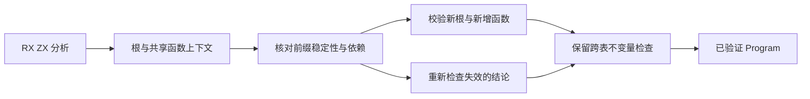
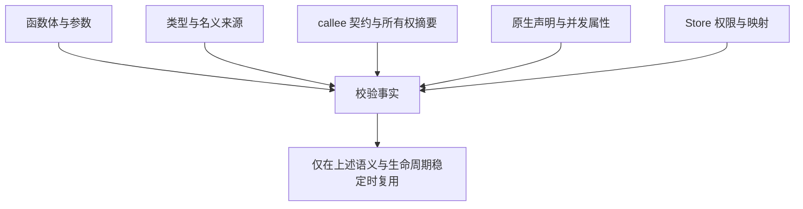

# 编译期校验复用边界

## Intent：最终目标

在不削弱 IR 安全检查、RX/ZX 自举和静态编译约束的前提下，消除构造共享 Program 期间的重复完整前缀校验。本文件记录源码核对结果及后续实验边界，不代表已实现缓存或增量校验。

## Data：可用证据

[性能测量报告](性能测量报告.md)第四轮显示，同一个 expression_analysis 入口的 1,058 次 IR 校验占 infer 时间 98.1%。源码基线为 905106ad5，生产实现未改。

本轮生成器选项明确为 `generated_parser = false`，因此测到 seed_validate 和 ownership_seed 的实际执行成本。正式自举路径由 `zx/ir/canonical/validation/validate.rx` 及其传递 RX/ZX 模块实现，host.zig 负责输入适配。两个路径都必须纳入未来改动，不能把 seed 专用优化当作自举最终实现。

| 已核对的职责                  | 实际读取的上下文                                | 对复用边界的影响                            |
| ----------------------------- | ----------------------------------------------- | ------------------------------------------- |
| expression_rules 的 Call 校验 | callee 输入/输出类型、Store 契约和调用参数      | 函数文本相同，不代表调用上下文相同          |
| ownership 的 Call 处理        | callee.output_ownership、callee.stores.writable | callee 摘要改变时，调用者的既有检查可能失效 |
| scope / task / parallel 检查  | 可见函数图、Store 使用、原生 concurrent 属性    | 不得仅以局部 body 身份代表全部依赖          |
| error_contracts               | 当前表达式及被调用函数的错误效果                | 调用效果依赖属于有效性条件                  |
| link/source.appendBody        | base 与目标共享表身份、函数前缀、类型映射       | 前缀检查是必要证据之一，不是完整验证证书    |
| 类型联结                      | 类型表、名义来源与映射                          | 映射后的 ID 和前缀稳定性必须核对            |

源码定位：`zx/analysis/analyze.zig`、`rx/analysis/module_compile.zig`、`zx/modules/link/source.zig`、`zx/modules/link/function_table.zig`、`zx/modules/link/seed_types.zig`、`zx/ir/seed_validate.zig`、`zx/ir/seed_expression_rules.zig`、`zx/ir/seed_scopes.zig`、`zx/ir/seed_tasks.zig`、`zx/ir/error_contracts.zig`、`bootstrap/ownership/check.zig`。相对路径均以 packages/compiler 为根，src 路径前缀除 bootstrap 外省略。

## Edges：边界与限制

- 文件路径、函数数量、地址或源码散列单独都不足以证明已验证上下文仍然有效；地址还受 arena 生命周期及存储扩容影响。
- 仅追加、保持已有语义不变的上下文是候选复用边界。必须证明类型、名义来源、函数摘要、原生声明等既有内容稳定，不能只假定“append”命名意味着全部语义不变。
- root 本身与函数表分开处理；类型专用根、Store setter 重写、RX callee view 和最终入口视图不能自动共享同一个根校验结果。
- 外部库装载、反序列化及缓存恢复是独立信任边界；本次推导热点不能成为跳过这些入口完整检查的理由。
- 保持原来的失败诊断边界与错误顺序。编译产物一致只能证明本次成功路径，不能单独证明非法 IR 的拒绝行为等价。
- 目前不新增或执行功能测试。正式修改前仍需为未来行为验收列出影响范围，由已授权的相应验证阶段完成；本次不声称通过该验收。
- 不引入持久化校验状态、运行期调度、专用运行库或整图复制；复用状态若需要，应归属于一次编译上下文的明确生命周期。

## Answer：后续实验及成功标准

先在临时副本中验证“已验证的不可变前缀 + 新根/新增函数”的边界。保留跨表结构、类型映射、原生声明、导出及错误效果的必要检查。是否能复用任何一项结论，取决于它读取的上下文是否保持语义稳定，不能用固定函数数或本次入口路径作特殊处理。

实验交付须包含完整调用计数、根与前缀的检查次数、分阶段编译耗时、峰值内存及生成产物一致性。先证明工作量下降与原因，再决定生产实现；只减少重复调用数量而没有保存全部依赖条件，不能算完成。

## 自我批判

98.1% 的测量证明校验是这个入口的热点，不证明 98.1% 都能删除。先前源码分析也不能替代对错误路径、上下文变化和正式自举路径的核对。本文件明确这些边界，避免为了缩短 seed 构建而积累另一套不一致的编译器规则。
