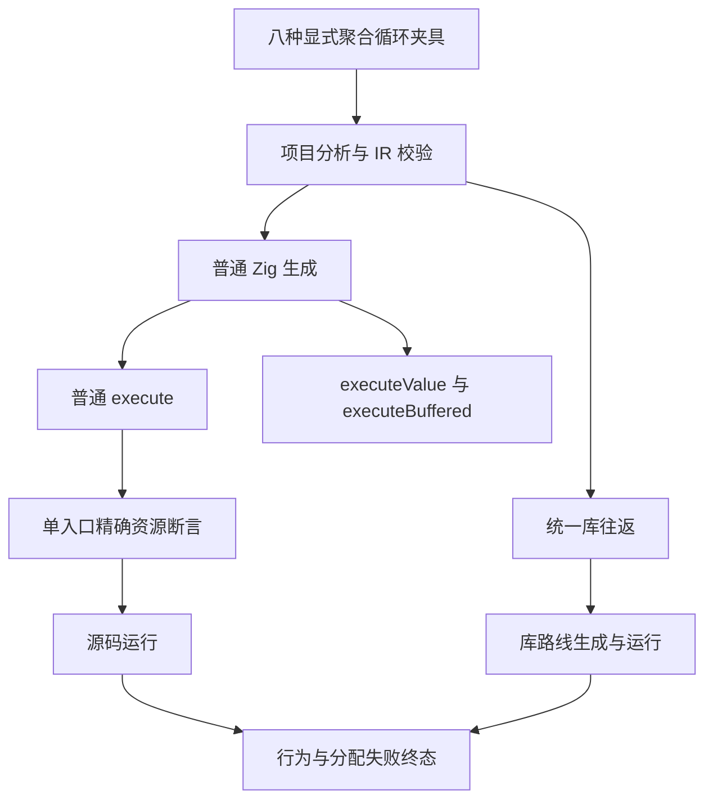
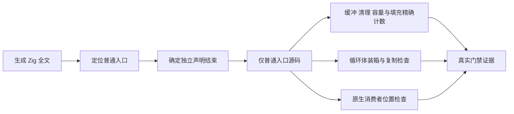

# 聚合循环普通入口范围门禁

## Intent：最终目标

让聚合循环的精确缓冲区断言只检查普通公开入口，恢复既有 source/library 路线的真实资源与行为门禁。保留缓冲数量、清理数量与循环内分配限制，不删除性能和生命周期契约。

## Data：可用证据

固定 `bbd92b5c5` 的原根 Debug 在六个生成步骤失败：stack、call、bounds、nested、two_lanes 报 InvalidValueBufferCount，escaping 报 InvalidBufferCleanupCount。检查使用 `source[start..]`，将普通 execute 后新增的 executeValue/executeBuffered 一起计数。其夹具本身使用显式 loop，不应机械归因于集合回调降级。

生成器先生成 execute，再追加内部值与缓冲入口。纯入口可能重复循环实现，缓冲入口可能有合法的条件回退清理。consumer 原生路径未增加值入口，已有落盘普通入口恰含一个值缓冲及一个对应清理，并越过原检查。六个失败 bundle 因检查发生在落盘前而没有保存，尚不能逐字节证明它们的普通入口符合期望。

## Edges：边界与限制

- 正式源码修改范围限 `packages/test/tests/collections/aggregate_loop/shape.zig`。
- 提取普通 execute 的独立声明范围，排除后续公开入口；采用固定 genz printer 的顶层函数结束行 \n}，内部语句按四空格缩进，字符串换行转义；无结束行明确失败，不引入通用 Zig 解析层。
- 保留 two_lanes 精确两个缓冲，其余合格模式一个缓冲，逃逸/旧列表模式零个内部值缓冲的约束；保留精确清理次数、初始容量转换与填充、禁止 toOwnedSlice、循环内产品装箱和列表复制、consumer 原生调用位置检查。
- 收窄后仍失败的断言继续定位，不能预先宣称所有失败无害；escaping 的普通入口需新产物证实。
- 不修改生产源码、不新增测试用例、不修改冻结执行输入、不复用其他版本的测试结果。
- 八种既有夹具、两路线、Debug/ReleaseSafe 按真实终态验收。专项不等同完整根回归或 Test262 完成。

## Answer：交付与成功标准

保存修改前后源码身份、实际生成程序与 ABI、执行命令、日志、二进制身份和终态。以生成阶段通过后真正运行的既有测试证明行为与资源约束，确认问题才发送实现缺陷报告。完整专项完成后独立提交并推送，标题和正文均为英文 Conventional Commits。

## 架构图

## 数据流图

## 自我批判

错误的统计范围已经明确，但这不自动证明缓冲实现正确。必须保留原精确断言并让失败夹具生成新产物，再检查可能残留的分配或清理问题。入口截取应服务现有确定的生成格式，不以名称特判某个用例，也不为一次维护引入复杂解析抽象。
