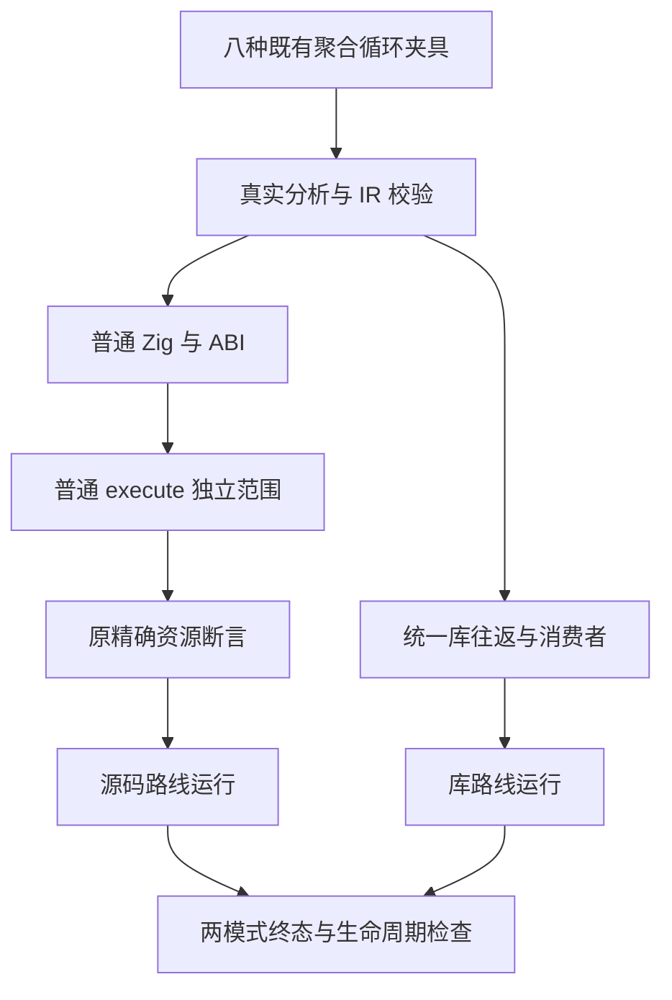

# 聚合循环普通入口范围门禁执行详情

## Intent：最终目标

修正既有聚合循环资源形态检查的统计范围，让普通 execute 的资源契约与新增值入口分别核对，恢复真实行为、生命周期与分配失败门禁。本次仅维护既有测试，不新增逻辑用例，也不修改生产实现。

## Data：可用证据

固定源码为 460caf3776b07a47c80561966c19b3bdd679faf1，仅覆盖测试形态文件。修改前 SHA 为 d71dbb7f6c4f92e3510591fb198cf03bc044f09ae149de369c2b3ec2949cd4e0，修改后为 59a03f7ba9e0d521ceafd5b05b7b94826d59cf220e650841bebcf4789374c85a。

原检查从 execute 开始一直扫描到全文结束，将后续 executeValue/executeBuffered 的缓冲和清理纳入同一次计数。现按既有生成器的顶层结束行界定普通函数范围，缺少结束行明确失败；其余精确断言逐字保持。

| 模式        | 实际起点（UTC）            | 实际终点（UTC）            | 构建步骤 | 命名测试 |
| ----------- | -------------------------- | -------------------------- | -------- | -------- |
| Debug       | 2026-10-09 22:12:57.536464 | 2026-10-09 22:28:29.590675 | 79/79    | 102/102  |
| ReleaseSafe | 2026-10-09 22:41:56.626865 | 2026-10-09 22:59:03.283490 | 79/79    | 102/102  |

两次真实退出均为 0，changed_inputs 均为空。每模式八种夹具各执行 source/library 两路线，共 16 个运行节点；两模式合计 32 个节点、204 次命名测试执行。模式与路线重复不计作新增独立用例，分配失败遍历也不另行扩充用例数量。

八种夹具为 stack、call、bounds、nested、two_lanes、escaping、old_list、consumer。实际新产物通过了原精确检查：two_lanes 两个缓冲；其余合格模式一个；escaping/old_list 零个内部值缓冲。清理次数、初始容量转换及填充次数保持精确，循环体禁止产品装箱和列表复制，consumer 原生调用位置检查保留。escaping 普通入口已由实际生成与执行证实，不再仅依据相邻夹具推测。

完整源/库 Zig 与 ABI 按夹具归档；91 份实际生成的编译器模块在两模式中哈希一致，共 90 份 parser 输出和一份 lexer 输出。二进制清单对应实际 verbose 运行命令，并记录文件长度与 SHA。日志及较大元数据无损 gzip 保存，归档清单同时核验原始与保存字节。

## Edges：边界与限制

普通函数范围提取依赖当前 genz printer：顶层结束行不缩进，内部块缩进，字符串中的换行转义。它仅服务本测试的确定生成格式，不作为通用 Zig 解析器。没有改变任何缓冲数量或清理期望，也没有恢复旧集合 transform。

运行目录为 `/Users/xiewendao/.codex/conformance/aggregate-entry-460caf377/r1`，固定工作树为 `/Users/xiewendao/.codex/worktrees/aggregate-entry-range-conformance/zxc`。两模式使用独立新本地及全局缓存，统一 signed Zig、Zig SDK、归档、Node 依赖与 solver 身份均保存在起点和终态记录。

发布父提交可以比测试基线更新。本结果只覆盖固定 460caf377 加单文件修正，不冒充后来编译库装载迁移或 SIMD 修复后的完整根回归；这些版本另有独立执行。尚在运行的根回归输入及其他未完成测试草稿保持原样。

## Answer：交付与成功标准

正式改动只包含 `packages/test/tests/collections/aggregate_loop/shape.zig`，以及本目录中文 IDEA 执行记录、无损证据与核验工具。阶段核验验证真实终态、输入身份、完整夹具产物、32 个二进制和生成器一致性；发布核验保护其他工作区文件，限制提交范围，并检查英文 Conventional Commits 标题与正文。

## 架构图

## 数据流图

## 自我批判

首轮归因只证明全文统计不准确，不能提前断言全部资源实现正确。本次通过新生成的 escaping 等全部夹具和严格旧断言补足了这一证据。204 次执行来自既有测试在两模式的重复，不报告为 204 条新增用例；固定旧根通过也不能替代当前生产版本的完整验证。
