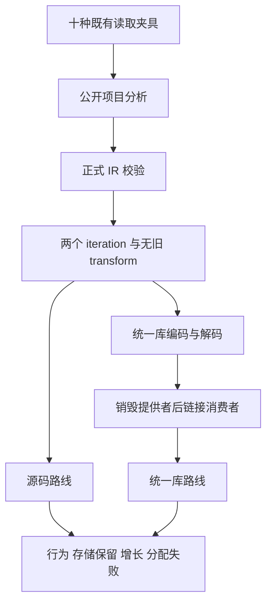
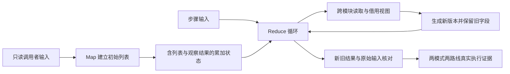

# 脱离生命周期读取与循环 IR 门禁

## Intent：最终目标

修正 detached-reader 专项对旧生成 Zig 文本形态的依赖，恢复十种读取夹具在源码与统一库路线上的真实执行。测试继续覆盖调用者存储不变、旧结果保留、增长、借用视图、索引边界与分配失败释放，不修改语言实现。

## Data：可用证据

- 固定在 `bbd92b5c5` 的根 Debug 回归仍在运行，会话为 `81471`、根 PID 为 `64064`；本轮继续观察该执行，不重启。
- 原始根日志已记录十个 `MissingReduce` 生成步骤失败，触发点是 `shape.zig` 要求源码包含至少两个 `for (`，尚未进入该专项的库往返和行为测试。
- 已生成的 object 源码包含 Map 与 Reduce 的普通 `while` 循环；`execute` 和 `executeValue` 的重复实现也说明全文字符串计数不能可靠代表语义循环数量。
- `packages/core/IR契约.md` 规定集合源码降级为普通 iteration，旧 transform 不再由这些源码生成。
- 同职责成熟实现 `predicates/analysis/lowering_test.zig` 直接检查表达式表中的 iteration 和 transform，不依赖 Zig 循环拼写。
- 十种夹具的主函数各含一次 Map 和一次 Reduce；其 step/read 模块没有额外集合回调。

## Edges：边界与限制

- 本轮正式代码修改仅限 `packages/test/tests/collections/detached_reader/shape.zig`，既有行为、资源和调用保留检查继续执行。
- 新工作树固定在 `fe7bfd6b7`，覆盖该提交之前的 Indexed 表达式编译与完整 IR 校验迁移；执行后出现的新提交另行验证。
- 不修改已运行的原始根工作树，也不复用其编译结果代替本轮新源码的生成。
- 检查入口及所有非原生函数体中合计两个普通 iteration，并拒绝旧 transform；保留 execute 导出与真实 reader 调用检查。统一库消费者的循环位于导入函数自己的表达式表，不能只检查顶层。不能仅将 `for` 字符串替换为 `while` 来得到绿色结果。
- 两模式顺序运行，保留真实终态；超时或无终态不算通过，不使用 test-no-exec。
- 专项成功不等于根回归成功、完整 Test262 对齐或最终自举完成。reference/reverse 夹具原有有界分配检查会提前返回，不把它们计为已证明缓冲复用。
- 仅对确认的实现缺陷向已授权实现会话发送消息，过时驱动和旧断言单独归因。

## Answer：交付格式与成功标准

在 Debug 和 ReleaseSafe 下各完成十种夹具、source/library 两路线，共四十个真实运行节点。现有命名测试预期每模式 156 项，两模式 312 项；最终以实际 Build Summary 和运行节点为准，不把内部输入组合或分配失败扫描次数算成新增唯一测试。

保留固定源码、工具链、依赖、精确命令、日志、生成产物身份及终态。文档采用 IDEA 框架，包含架构和数据流图、自我批判；每完成一部分用英文 Conventional Commits 标题和正文提交并推送，核对远端提交。

## 架构图

## 数据流图

## 自我批判

旧形态检查把代码拼写当作语义证明，既误拒绝普通 iteration，也可能因 execute 双版本计数误通过。改用 IR 只修正这一层证据，不能替代生成后执行、统一库脱离提供者寿命或分配失败检查；这些既有门禁必须全部完成。测试验证的是静态 Zig 产物与现有语言能力，不新增运行库、动态调度或数据复制。

第一版修正只遍历 Program.expressions，忽略统一库消费者的 Function.expressions，仍会误拒绝库路线。独立复核在该运行期间发现这一遗漏；首轮冻结输入不修改，后续用包含全部 owner 的检查建立新基线。两份草稿与真实终态分别保存，不把未执行的推断当作通过。
