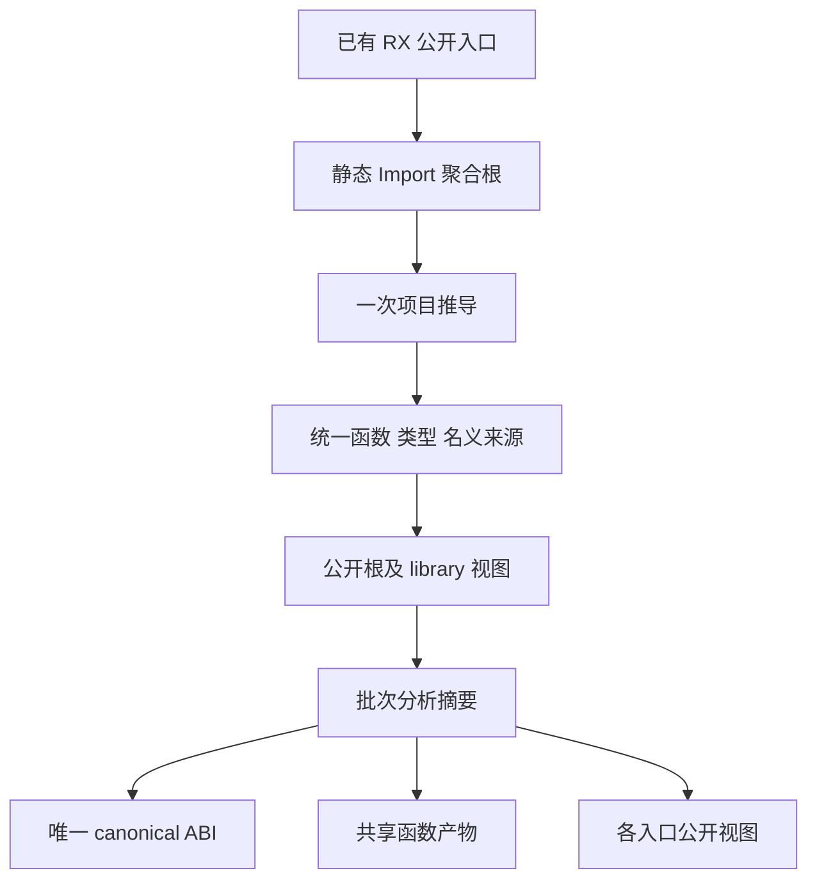
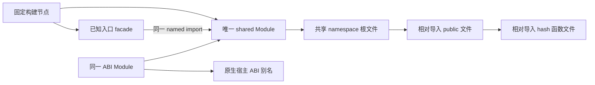

# 自举入口共享生成计划

## Intent：最终目标

将当前多个自举入口分别推导、分别生成完整函数闭包的路径，连接到统一语义图和共享函数产物。使同一个真实函数及其类型在后端只处理必要的实例，保持各入口公开契约和统一 RX/ZX 模块边界。

[函数产物分析复用](函数产物分析复用计划.md)已完成。共享生成曾开始接入，用户随后要求先定位并编写分阶段报告。本项已暂停，未验证草稿仅保存在本地忽略归档，生产源码已恢复到已提交基线。

## Data：可用证据

只读调用链核对：

- source_graph 的 RX Import 边进入 scan 队列；mixed.compile 遍历 dependencies.order 编译所有 RX。未被 Call 使用的 Import 仍参与编译；prepare.Loader.steps 只把 Import 排除出运行步骤。
- 只含 Import 的聚合根具有 void 输入输出；mixed 返回 functions.prefix(entryId)，保留其依赖并排除聚合根本身。因此无需伪造 Call 或统一输入大对象。
- infer Contract 同时带 program 与 nominal_types；后者来自 state.types.origins，能够保留真实名义身份。
- 每个 RX 按依赖序编译一次；Parallel 提取函数带 `#parallel-task-` 后缀。公开根须按完整 file_name 唯一匹配，不能按前缀匹配。
- library Result.module 已能从统一 Program 中投影选定 FunctionId 的公开视图。尚缺从一次 infer Contract 选择多个公开根并构造规范 type_only library 头及 exports 的小范围适配。
- parser 构建脚本当前逐 ABI 创建 Module。共享 ABI 必须复用同一个 Module 指针，不能仅将多个 Module 指向同一源码文件。

## Edges：边界与限制

1. 聚合根是构建工具收集公开入口的静态依赖声明，不替代实际模块的 RX 编排。原模块及其 ZX 原子逻辑保持真实调用关系。
2. 所有名义来源来自推导结果；不按结构相同强行合并，不用本入口的数字 TypeId 或 FunctionId 跨图缓存。
3. 宿主所用 Input、Output、execute 及实际存在的 executeValue、executeBuffered、buffer_lanes 等公开契约须保留。facade 应来自实际导出信息，不能给所有入口虚构一套公开符号。
4. 构建配置阶段不知道运行后才产生的函数 hash 集合。不能依赖读取尚未生成的清单动态添加 Build 节点。
5. 建立一个固定的 shared root Module。它内部以相对路径导入 public/hash 文件；各已知入口 facade 通过 named import 引用同一 shared Module。不给 public/hash 子文件另建 Module，避免同文件进入多个 Zig module owner。
6. 当前 genz Names.functions 同时用于身份和 import 字符串。相对导入需要独立映射或明确输出模式；身份保持原 hash。若复用持久化缓存，导入模式必须纳入指纹，不能与 named-import 模式共用旧 key。
7. 不新增运行库、解释器、动态加载或运行时模块分派。所有产物为普通 Zig 静态模块。

## Answer：交付格式与成功标准

最小实施顺序：一次聚合 infer；适配统一 library 数据；批次分析复用；生成 canonical ABI、共享函数文件和 public 文件；生成固定 shared namespace；入口 facade 接入同一 Build.Module。优先复用既有验证与生成，不重新联结多个已独立推导的完整 Program。

验收需同时核对所有旧入口契约、名义类型来源、静态导入闭包、实际生成时间、后端 MaxRSS、总源码量与真实共享定义数量。先看完整冷路径，再测同输入缓存命中；不将文件名 hash 化本身当作优化完成。

## 自我批判

一次大图推导可能提高推导阶段峰值，必须和旧最大入口比较；源码减少不自动保证后端内存下降。共享 canonical 类型可能影响状态布局，现有多个 entry view 的 state plan 不能未经证明共用。静态 Import 不新增调用约束，但将此前分开求解的真实调用图纳入同一次推导，可能改变共享子模块的输入约束；必须核对各公开契约，遇到差异先查语义，不能强制统一。当前仅源码关系支持可行性，尚无运行结果。

## 公开函数投影的摘要复用条件

2026-10-10 对真实算法作了补充核对：当 canonical 顶层没有额外 expressions、contracts、stores 且输出为 void，公开入口是完整函数表中一个非 external 函数的精确投影时，全图摘要可以共享。

state 分析的 list/task 预置标记只依赖类型表；投影加入的 comparisons/contracts/stores 已由函数循环处理。每个 output 的 duplicates 清空 seen 独立开始，mark 递归闭包覆盖所有后代；对 boxed 类型的剪枝不会跳过未标记的后代，因此将某函数 output 提前再处理一次不改变最终 boxed 集合。selected 和布局 keys 因而相同。仅仅 type_only 或 void 输出不足以保证该条件。

pure/local、io/process、allocation 都按函数计算；values 依赖 state，buffer/transfer 又依赖这些摘要。fresh 将查询切换为对应函数的 symbols/expressions/body，亦可共享。entry 本身的 eligibility、buffer lanes、tasks requirement 仍按投影视图计算。

实施时只 prepare canonical 一次，再投影 prepared 函数，避免依赖 prepare 的幂等性。API 应接受已知 FunctionId 和公开导出信息并在内部构造精确视图，不接收任意 Program 来复用摘要，不复制 Owned Batch 后对副本释放。公开入口指纹使用其 view 的 file_name、exports、contracts 等数据，不能复用 canonical 的入口 key。

这是源码层面的可行条件，尚未接入或通过运行验证；第五组仍分别分析公开视图，不将此证明计作已实现收益。

生成端适配拟从真实声明树收集 exported 符号，供 facade 精确导出 Input、Output、execute 及实际存在的其他成员。不得用懒求值的缺失成员别名伪造 @hasDecl 结果。相对函数导入需与函数身份分开，保留当前默认 named-import 行为；新导入映射应按实际依赖进入指纹，不将全部映射加入每个单元。

构建接入还需覆盖 `compiler/build.zig` 直接创建的 RX 路径/图/规则模块，它们不经 `parser.modules`。lint 的 generated_name 由独立包构建，CLI 的缓存身份也读取该约定；若强行把命名入口 facade 接入 shared，需要额外跨包注入同一 Module 并处理 host/target 所有权。下一步优先保留小型 lint naming 独立生成，将共享集中在编译器和 RX 入口，避免为极小重复制造包构建耦合。bootstrap-parser 的安装产物及共享依赖也要同步核对，不能只让常规 build 能运行。

统一 library 适配可在构建工具内消费 infer Result：先在其 arena 中完成公开 Export 数组，按完整规范 file_name 唯一定位非 external 根，保留 nominal_types；将顶层规范为无 expressions/contracts/stores 的 type_only void Program，最后把同一 arena 移入 library.Result。成功转移后原 Result 不再析构，错误路径仍回收原 arena。这样不复制整图，也不构造带未初始化所有者的借用 Result。公开 Input/Output 来自对应函数签名，不能从旧图数字 ID 搬运。

## 2026-10-10 实施与计量边界

用户最新要求：只考虑编译过程的耗时与内存，暂不运行测试。后续只执行生成器构建、源码生成和真实消费入口的 Zig 编译，单独报告各阶段；之前包含测试执行的专项总耗时不作为纯编译指标。

已接入草稿：54 个公开根统一 Import 推导，保留名义来源及 Store 初始化器；唯一 canonical ABI；函数身份与相对导入路径分离；真实 Declaration 导出信息生成 facade；同一目标下共享一个 Zig Module。bootstrap-parser 安装整个静态依赖目录。命名检查仍独立生成。

当时计划先编译 bootstrap-parser 确认生成链路，再编译实际 CLI 入口；该优化计划现已暂停，改为基线分阶段定位。编译通过只能说明本次编译覆盖路径成立，不代替完整行为验收。没有运行测试，也不报告测试通过。

### 两阶段性能口径

1. `zxc → Zig`：已编译的生成器处理真实 RX/ZX 输入并输出 Zig，单独以 `/usr/bin/time -l` 记录 wall time、user/system 和最大 RSS。生成器本身的 Zig 构建不计入。
2. `Zig → 二进制`：固定上一阶段产物，直接测量真实 CLI 的 `zig build-exe` 调用，不混入 RX/ZX 生成、构建脚本配置和测试。必须说明优化级别、缓存状态与并行干扰。

源码大小、函数和类型数量用于解释第二段成本；第二段慢并不能单凭时间证明是 Zig 本身的问题，也可能是生成代码的重复或展开所致。当前机器有其他会话的编译进程；不终止其他工作，测量时记录限制。

### 暂停优化，先测量定位

用户要求先定位、编写报告、逐渐深入。共享生成仅完成生成器构建，运行中的试验已停止；没有得到完整产物或性能结论。12 个草稿文件保存到本地忽略的 `编译性能分阶段定位/共享入口未验证草稿.tar.gz`。9 个已跟踪生产文件精确恢复到 HEAD，3 个新增草稿已从构建目录移出；没有改动其他历史未跟踪文件或 stash。

后续以 [性能测量报告](编译性能分阶段定位/性能测量报告.md)为主，先区分两段成本，再决定是否恢复本方案。不能把本草稿写成已实现或已验证的优化。
