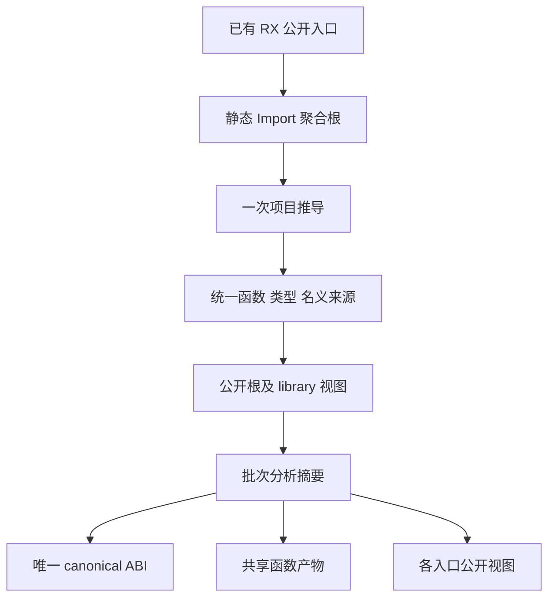
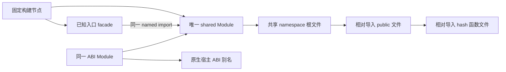

# 自举入口共享生成计划

## Intent：最终目标

将当前多个自举入口分别推导、分别生成完整函数闭包的路径，连接到统一语义图和共享函数产物。使同一个真实函数及其类型在后端只处理必要的实例，保持各入口公开契约和统一 RX/ZX 模块边界。

本项尚未实施。先完成[函数产物分析复用](函数产物分析复用计划.md)，否则大图中逐函数重复全图分析会放大成本。

## Data：可用证据

只读调用链核对：

- source_graph 的 RX Import 边进入 scan 队列；mixed.compile 遍历 dependencies.order 编译所有 RX。未被 Call 使用的 Import 仍参与编译；prepare.Loader.steps 只把 Import 排除出运行步骤。
- 只含 Import 的聚合根具有 void 输入输出；mixed 返回 functions.prefix(entryId)，保留其依赖并排除聚合根本身。因此无需伪造 Call 或统一输入大对象。
- infer Contract 同时带 program 与 nominal_types；后者来自 state.types.origins，能够保留真实名义身份。
- 每个 RX 按依赖序编译一次；Parallel 提取函数带 `#parallel-task-` 后缀。公开根须按完整 file_name 唯一匹配，不能按前缀匹配。
- library Result.module 已能从统一 Program 中投影选定 FunctionId 的公开视图。尚缺从一次 infer Contract 选择多个公开根并构造规范 type_only library 头及 exports 的小范围适配。
- parser 构建脚本当前逐 ABI 创建 Module。共享 ABI 必须复用同一个 Module 指针，不能仅将多个 Module 指向同一源码文件。

## Edges：边界与限制

1. 聚合根是构建工具收集公开入口的静态依赖声明，不替代实际模块的 RX 编排。原模块及其 ZX 原子逻辑保持真实调用关系。
2. 所有名义来源来自推导结果；不按结构相同强行合并，不用本入口的数字 TypeId 或 FunctionId 跨图缓存。
3. 宿主所用 Input、Output、execute 及实际存在的 executeValue、executeBuffered、buffer_lanes 等公开契约须保留。facade 应来自实际导出信息，不能给所有入口虚构一套公开符号。
4. 构建配置阶段不知道运行后才产生的函数 hash 集合。不能依赖读取尚未生成的清单动态添加 Build 节点。
5. 建立一个固定的 shared root Module。它内部以相对路径导入 public/hash 文件；各已知入口 facade 通过 named import 引用同一 shared Module。不给 public/hash 子文件另建 Module，避免同文件进入多个 Zig module owner。
6. 当前 genz Names.functions 同时用于身份和 import 字符串。相对导入需要独立映射或明确输出模式；身份保持原 hash。若复用持久化缓存，导入模式必须纳入指纹，不能与 named-import 模式共用旧 key。
7. 不新增运行库、解释器、动态加载或运行时模块分派。所有产物为普通 Zig 静态模块。

## Answer：交付格式与成功标准

最小实施顺序：一次聚合 infer；适配统一 library 数据；批次分析复用；生成 canonical ABI、共享函数文件和 public 文件；生成固定 shared namespace；入口 facade 接入同一 Build.Module。优先复用既有验证与生成，不重新联结多个已独立推导的完整 Program。

验收需同时核对所有旧入口契约、名义类型来源、静态导入闭包、现有三个专项，以及实际生成时间、后端 MaxRSS、总源码量与真实共享定义数量。先看完整冷路径，再测同输入缓存命中；不将文件名 hash 化本身当作优化完成。

## 自我批判

一次大图推导可能提高推导阶段峰值，必须和旧最大入口比较；源码减少不自动保证后端内存下降。共享 canonical 类型可能影响状态布局，现有多个 entry view 的 state plan 不能未经证明共用。静态 Import 不新增调用约束，但将此前分开求解的真实调用图纳入同一次推导，可能改变共享子模块的输入约束；必须核对各公开契约，遇到差异先查语义，不能强制统一。当前仅源码关系支持可行性，尚无运行结果。
