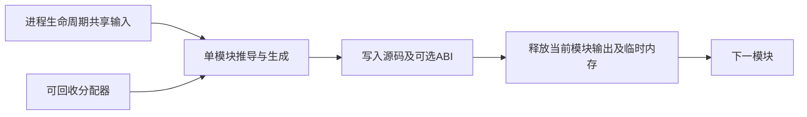
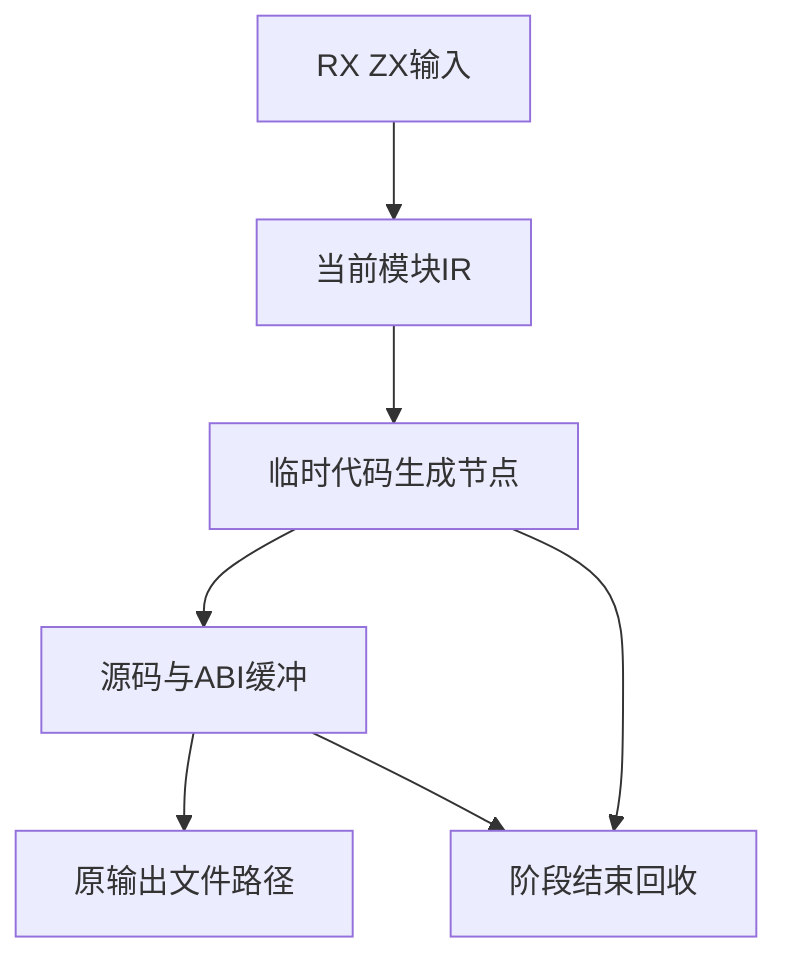

# 自举生成器内存释放修复

## Intent：最终目标

修复自举生成器长期保留阶段临时内存的问题，让模块生成完成后及时释放内存，并核实用户反馈的构建停滞。

## Data：可用证据

运行中的 generate-parser（PID 52538）在约 12 分钟时仍消耗 CPU。两次采样从 generate_parser.zig:244 的 analyzer 源码打印推进到 :259 的 IR 校验模块推导。产物目录已生成 87 个文件、246800465 字节，06:54:57 写入 analyzer.zig，06:58:38 写入 expression_analysis.zig，表明没有停在同一阶段。

但第一次采样记录物理占用 23.2 GB；机器内存 32 GiB，当前系统交换使用约 5.8 GB。generate_parser 将 init.arena.allocator() 传给 genz，genz 内部临时 arena 的 deinit 不能使父 arena 回收其全部阶段分配，导致模块间累计保留。

## Edges：边界与限制

只调整 build/generate_parser.zig 的宿主资源生命周期，不修改 RX/ZX 编译语义、生成输出接口、优化模式或验收断言。不停止其他会话进程。进程活跃不能单独证明构建健康；输出文件和调用栈提供阶段推进证据，内存问题仍需修复。

## Answer：交付与成功标准

将单模块推导、生成、写盘收束到既有 generate helper，使用可回收的 init.gpa 作为临时分配器和输出分配器，写盘后以 defer 释放 bundle。共享输入继续由进程 arena 持有，不复制生成结果。核对所有原输出路径和 shared ABI 选择保持一致，执行正式生成并比较输出，记录峰值与退出结果。

## 自我批判

本次证据不能把全部耗时归因于交换；Debug 生成器的大型图分析和源码打印本身也有成本。修复必须以资源生命周期和输出一致性证明，不能以进程重启或换优化模式冒充解决。后续以正式生成步骤、产物哈希和跨模块内存回落验证这一修复，不能把早期瞬时内存当作最终峰值。

## 实施与当前验证

已调整唯一宿主生成文件，43 处生成调用统一传递源码及可选 ABI 输出路径。逐项程序比较确认全部路径、顺序和 ABI 模式与原实现一致。generate 内使用 init.gpa，bundle 在写盘成功或出错后均由 defer 释放；共享输入仍在进程 arena 中，不增加生成结果复制。

旧进程退出前保存 89 个生成文件的大小与 SHA-256。已主动终止 PID 52538，并启动相同 test-loop-initial-ownership Debug 构建，等待新产物的内容比对及专项结果。Zig 格式检查通过。未添加测试用例，未运行全量测试。

修复后的生成器已编译成功并开始运行。首轮检查中，已有 32 个完成的输出文件与旧产物 SHA-256 相同，未发现差异；其余仍待生成。早期瞬时 RSS 约 53 MB 不代表最终峰值，完整峰值及专项结果仍待确认。

后续完成输出增至 81 个，与旧产物均一致。大型 analyzer 的 genz 阶段采样物理占用及截至采样峰值约 7.1 GB，表明单模块本身仍有显著开销；该值不是最终峰值，也不能据此宣称整个构建内存问题已经验收。

大型 analyzer 生成及写盘后，物理占用从该阶段峰值约 16.3 GB 降至约 247.8 MB，采样调用栈已进入下一个 expression_program 模块的推导。至此 85 个旧产物哈希相同，包括 analyzer 及 source_signature 的源码和 ABI。该证据确认模块间内存确实释放；单模块峰值仍然较高，且完整构建和剩余产物比较仍未完成。

## 生成验收结果

修复后的正式 generate-parser 步骤成功结束，构建报告耗时 14 分钟；共生成 92 个文件。旧进程已完成的 89 个文件逐一 SHA-256 比对全部相同，另外 3 个文件为旧进程中止前尚未生成的输出。43 处调用的入口、输出路径、顺序和 ABI 选择均保持一致。

单模块结束后的物理内存从阶段峰值约 16.3 GB 回落至约 247.8 MB，确认临时资源不再跨模块累计。最终全程物理峰值未持续采样，不能将阶段峰值冒充全程峰值。Debug 耗时仍长；本次修复资源生命周期，不宣称解决所有构建性能问题。

整个所有权专项随后在检查工具编译时遇到 Zig 0.17 的 API 名称错误 dupeZ，和生成器资源生命周期无关。该处已改为 dupeSentinel 并续跑，不影响本次正式生成成功的证据。未执行全量测试。生成成功行见生成完成证据.txt，全部产物哈希见验证输入.json。
