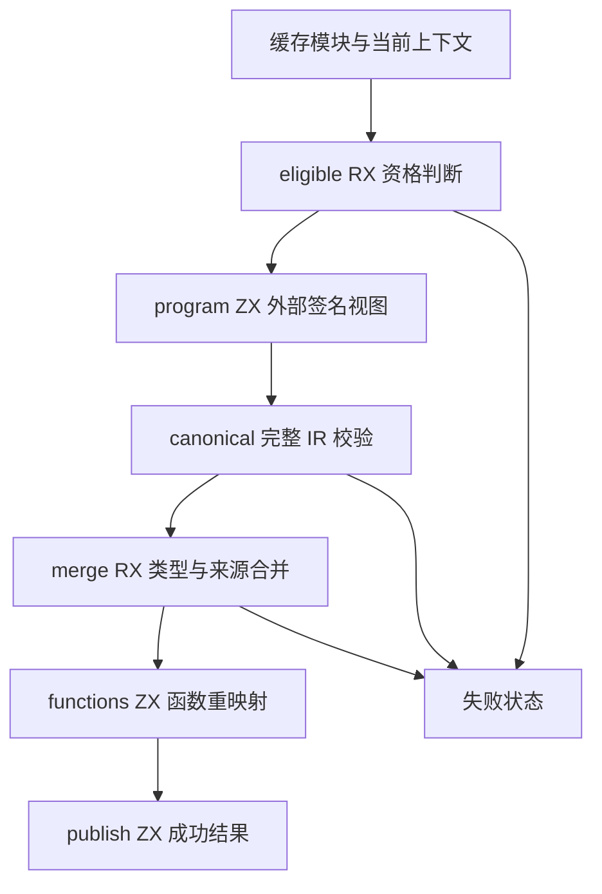
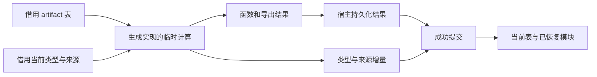

# 原生缓存恢复阶段验收

## Intent：最终目标

将原生语义缓存恢复的资格判断、完整 IR 校验、类型与名义来源合并、函数与导出重映射迁入 RX/ZX。RX 显式连接阶段，ZX 保持原子职责；正式宿主只负责数据表示、生命周期与成功提交。

## Data：可用证据

正式构建命令在 packages/test 执行：

```sh
zig build test-semantic-cache test-native-generation -j1 --summary all
```

进程退出码为 0，构建汇总为 37/37 steps succeeded、7/7 tests passed；额外 Node 原生对象 ABI 专项为 1 passed、0 failed。完整日志见原生恢复正式验证.txt，输入源码与生成物散列见原生恢复正式输入与生成记录.json。

依据更新后的仓库规则，上述 TXT、JSON 证据仅保留在执行工作树本地并由 .gitignore 排除；仓库只保存本 Markdown 中的命令、结果、散列及验证边界。

交付前格式检查为 merge.rx 与 restore.rx 补入空行，提交钩子还调整三个 Zig 文件的空行；逐行排除空行后内容完全相同，前后散列见原生恢复格式核对.json。Zig、RX/ZX 格式检查和本次 ZX 文件行数限制均通过，没有为纯空行变化重复运行专项。

原生专项使用真实 CLI 构建与运行生成程序，覆盖首次构建、缓存复用、原生声明顺序变化后的 TypeId 重排、禁用缓存及正常与错误输出。语义缓存专项覆盖既有 project/resources 用例。本轮未新增测试，未运行全量测试。

正式生成的 native_restore.zig 为 20,845,625 字节，SHA-256 为 d67fd3fb176c33c31dc73a58d0a4cec6d17024793d244b9d585792646736743f；ABI 为 249,464 字节，SHA-256 为 6b1d9ecc25ce6ebd663f37f8ed97159acb410daf646a3894231f3262332a926a。两者与此前单入口生成结果相同。

## Edges：边界与限制

- 本阶段仅验收原生恢复职责，普通源码恢复尚未接入；不能据此宣称整个语义缓存或编译器完成自举。
- 正式 native_restore.zig 选择生成入口；旧规则保留在 seed_native_restore.zig，仅供初始引导构建。
- host/native_input 借用表和字符串，物理展开旧行式 Import/Export；host/native_publish 在提交前复制需跨 scratch 生命周期保留的数据。应用数据不因阶段拆分而增加复制，也不引入运行时库。
- 宿主表示适配、外层缓存查询与 codec 仍属于后续完整自举审查范围。
- 没有用虚假源码函数体绕过校验。原生函数本身没有 ZX 主体，program.zx 为真实外部签名构造 external-only 完整校验视图。

## Answer：交付与成功标准

交付 restoring/native 下的资格、恢复与合并 RX，配套 ZX 原子及正式生成入口注册。资格失败、IR 失败和类型合并失败返回明确状态；成功结果在持久化成员和导出之后一次提交类型增量，失败不会把局部合并状态写入当前上下文。





## 自我批判

专项通过证明本次接入能处理所覆盖的恢复与执行路径，不是对所有损坏缓存的穷尽证明。源码核对同时确认 RX 的真实阶段连接、ZX 单一职责、失败提交边界与 seed 隔离；仍需继续迁移普通源码恢复及其传递依赖，最终按阶段自编译和正式依赖闭包验收整体自举。
