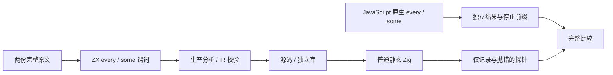
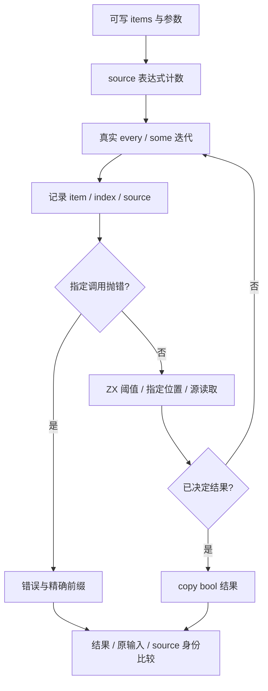

# 谓词参数与停止位置

## IDEA

- **Intent：** 完整适配 some 后续命中与 every 三参数计数原文，验证真实谓词参数、决定结果的位置及错误的停止边界。
- **Data：** Test262 固定 7ab7fafa0003f73fc85c1b95d88094d33f7eb8bd；zxc 固定 625ef2e82e42c498a398f63e10c9a7cbb6b6bd23。两方法的 ii12 尚未登记。现有 some arguments 使用恒 false 的源值比较，缺少后续命中；every 原文额外断言 called=3，不能用纯 bool 结果替代。
- **Edges：** 仅改测试包及本目录，不改生产实现。静态探针只记录参数并按调用位置抛错，阈值、索引和值的计算留在 ZX。不把 arguments[2]、generic call、原型改写、稀疏或对象身份原文改成普通列表登记。
- **Answer：** every/some × source_value/position 四类具名目录；官方原文与独立 JavaScript oracle，两种模式、源码和独立库路线实际执行；精确证据门禁后英文 Conventional Commit 并 push。

## 执行步骤

1. 保存两份完整原文、SHA 和官方 harness 观察，普通/严格模式实际执行。
2. source_value 保留 item>threshold 在前、source[index]==item 在后；some 原输入 [9,12] 后项命中，every 原输入 [11,12,13] 完整计数三次。
3. some position 在指定索引和值同时匹配时命中；every position 在指定位置和值不匹配时停止，其余位置继续。覆盖首、中、末和越界目标及匹配/失配值。
4. 使用独立 oracle 识别正常调用数，选择无失败、首调用、前缀中点、决定调用和下一调用的错误位置，去重相同位置。决定调用上的错误传播，停止后的错误不得被触发。
5. 探针先记录参数再抛错，之后始终返回 true；实际谓词由 ZX 的显式短路连接计算，不把逻辑移入宿主。
6. 比较完整原输入、参数字段、哨兵、source 指针/长度/内容、调用数及精确访问前缀；source 表达式始终只执行一次。
7. 新工作树生成当前 83 个模块，复用真实 native 编译库消费者与驱动；静态检查、执行名称、签名和跨模式一致性通过后提交 push。

## 架构图

## 数据流图

## 自我批判

不能用只有结果的 every 行丢掉 called 断言，也不能用原生探针计算正确谓词来绕开 ZX 的参数与短路实现。输入捕获和观察对象可能带来测试分配，本批不以 arena 总容量为零来冒充结果容器零分配或物理零复制证明。短路后的失败位置是有意义的忽略控制，不能把所有不可达失败位置膨胀为重复用例。总体目标继续保留。
