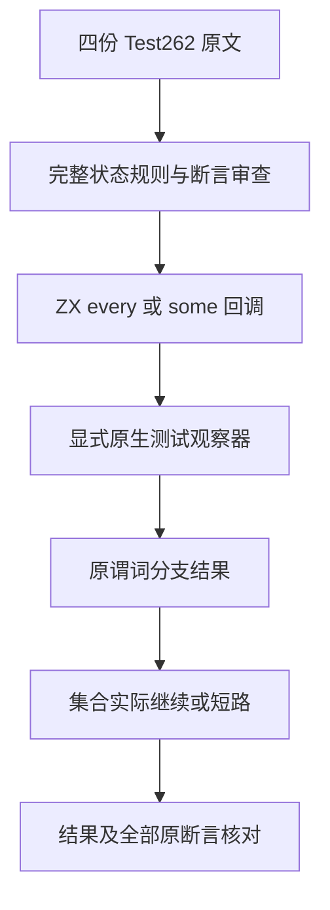
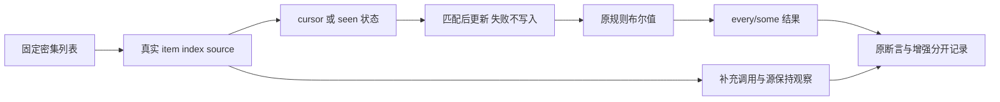

# 谓词顺序与单次访问原文审查

## Intent：最终目标

真实适配尚未登记的 every/some 顺序与单次访问原文，保留谓词内部状态规则和全部原断言，不把恒定谓词或事后排序检查当作原逻辑。

## Data：可用证据

固定 Test262 revision 为 7ab7fafa0003f73fc85c1b95d88094d33f7eb8bd。候选为 every/some 的 7-c-ii-4 与 7-c-ii-5，共四份原文、七条原断言，路径与 SHA 保存于候选原文身份.json。主 agent 已完整复读，交付前需再次与当前全部 reviews 排重。some 的 ii-12 已登记 adapted，不重复添加。

两份 ii-4 使用 [0,1,2,3,4,5]、lastIdx=0，先增加 called；索引匹配才增加 lastIdx。every 不匹配返回 false、匹配返回 true；some 相反。两份均检查最终结果及 called=6。

两份 ii-5 使用 [11,12,13,14] 和 kIndex=[]。当前未访问且前序已访问时才标记当前位置，重复或乱序失败分支不写入。every 检查结果 true、called=4；some 只检查结果 false，原文没有 called 变量，调用数只能列为补充观察。两份均显式传入未读取的 undefined 第二实参。

成熟 filter_trace/host.zig 已有 cursor、ordered、violations 观察规则，predicate_arguments/check.zig 已核对真实回调值、调用数、item/index/source 轨迹、源指针与输入哨兵，可作为局部实现风格和验证边界参考。

## Edges：边界与限制

四份原文已使用固定上游 sta.js/assert.js harness，在隔离 VM 的 sloppy/strict 两模式各真实执行一次，共八次原文执行，全部退出 0；原文每模式七条断言。候选审查起点尚未执行 zxc；其后草稿与正式执行见下文和最终执行记录。只有完整保留源谓词的真实状态规则、由 every/some 自己决定短路，并通过原断言才能登记。原生 observer 是测试观察器，不是语言运行库或隐式 ZX 全局变量。其状态只在测试中 reset，输入不变。

不得删除 ii-5 的显式无上下文实参；若用 void 原生值表示，需先验证当前显式实参求值契约，并明确不是 JS undefined/thisArg 通用支持。不能从 every 相邻原文推断 some 的断言或状态。错误注入、更多长度、轨迹与输入保持属于增强，分别标注。

reduce/2-2 的数值 seed 与 bool 回调结果不符合当前固定累加器类型，filter/9-c-i-2 含隐式 undefined 返回，均不删除前提来凑适配。

## Answer：交付与成功标准

完整保存四份原文身份及七条原断言映射，在独立固定源码上执行实际上游 harness 和 zxc 测试；运行成功后更新 reviews、catalog 和注册，再完成审计、分模式真实门禁与英文 Conventional Commits 提交推送。任何实现缺陷确认后报告授权实现会话。

## 架构图

## 数据流图

## 自我批判

现有观察器语义相近并不代表可以不读原文直接复用。必须逐分支核对更新时机、错误返回与短路结果，特别是 some ii-5 没有原 called 变量。审查发现的候选也不等于已经执行的适配；登记状态保持候选，避免用目录与数量替代真实对齐。

## 当前执行状态

2026-10-10：工作区已实现四份原文加两条 cursor 对照，共六个逻辑用例。独立 JS oracle、目录排重审计、TypeScript 检查及本次 ZX 格式检查通过；reviews 的 adapted 是未发布草稿，不能作为适配完成证据。

固定 bbd CLI 对无参 void 第二实参的预验证生成退出 0；其普通入口实际 Debug 运行一条 every visited 用例退出 0，检查完整 source/context/visit 顺序、原断言与输入保持，源码哈希未变。这只证明该组合在旧根源路线可运行，不代替当前完整专项或库路线。原始参数、程序和执行日志已无损归档。

首轮输入冻结于 predicate-order-conformance worktree，基线 07d050b18 加 20 个测试文件，共 6784 个源码输入；运行目录为 `/Users/xiewendao/.codex/conformance/predicate-order-07d050b18/r1`。资源等待进程在旧库装载 parser 结束后启动了首轮 Debug；首轮已于 23:10:50 UTC 真实退出 0，44/44 构建步骤完成，八份运行记录核实 12 次命名用例执行，输入摘要未变。

只读复核确认原逻辑和七条断言准确，但指出输入保持增强缺少列表字段指针与长度快照。已在主工作区补强，并以 predicate-order-identity-conformance 新 worktree 和 r2 新运行目录重新冻结；与 r1 仅 check.zig 不同。r1 输入保持原样，最初尝试取消排队时未定位到包装进程，随后其资源条件满足而启动构建；没有终止或修改运行中的构建。

正式 r2 已在首轮真实退出 0 后于 23:10:54 UTC 启动 Debug，随后仅在 Debug 真实成功时执行 ReleaseSafe。每模式使用独立新缓存，八条运行路线合计 12 次命名用例执行；若首轮失败则先保留并分析错误，不盲目启动下一轮。首轮不会作为最终补强检查通过的证据。

用户再次明确提交信息必须使用英文且规范；后续提交标题和正文继续使用英文 Conventional Commits，准确区分测试代码、断言修正与执行证据的范围。

正式 r2 的 Debug 于 2026-10-09 23:28:45 UTC 真实退出 0，44/44 步骤成功，changed_inputs 为空。八份 execution.json 均为 status=0、signal/error=null，真实具名执行合计 12 次；输入指针与长度补强已参与。ReleaseSafe 于 23:28:47 UTC 启动，23:50:08 UTC 真实退出 0；八份运行记录核实十二次具名执行，输入摘要未变。r1 与 r2 Debug 的完整执行、20 份输入、生成编译器和八条路线产物已分别归档，逐份解压 SHA 核验通过；r1 仍明确标记为缺少最终指针长度补强的草稿轮。

归档工具自查：首轮身份文件仅含 overlay 与 source_commit，首轮收集器曾错误读取其中的 cwd；已改为从该轮实际起点清单读取工作树路径，并重新收集本工具产生的未完成归档。测试输入、终态和运行产物未修改，最终两轮 Debug 清单各 209 份均通过解压内容核验。该归档脚本问题不属于编译器缺陷。

正式两模式与发布目录审计均已完成。四条 adapted 对应七条原断言；六个逻辑用例在两路线、两模式合计二十四次正式执行。首轮草稿及旧单例预验证另计，最终范围、数据与限制见执行记录。
