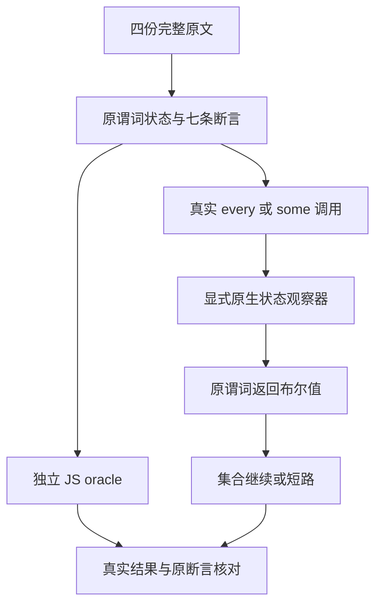
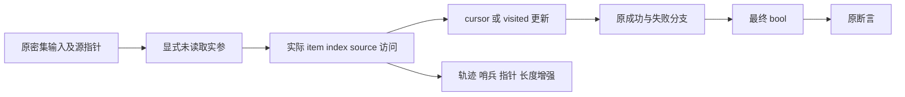

# 谓词顺序与单次访问原文审查执行记录

## Intent：最终目标

保留四份 every/some 原文的完整有状态谓词、输入和全部原断言，验证真实集合调用决定继续或短路，不能用恒定谓词或调用结束后的排序检查替代原逻辑。

## Data：可用证据

固定上游 revision 为 7ab7fafa0003f73fc85c1b95d88094d33f7eb8bd。四份原文已逐份完整复读、核验 SHA，并通过上游 sta.js/assert.js 在隔离 VM 的 sloppy/strict 模式执行，共八次原文执行、每模式七条原断言。原文、harness 和许可证均无损归档。

| 原文           | 保留的谓词规则                                     | 原断言映射                        |
| -------------- | -------------------------------------------------- | --------------------------------- |
| every/7-c-ii-4 | 先计 called；索引匹配才增加 cursor，失败返回 false | value=true，calls=6               |
| some/7-c-ii-4  | 相同更新顺序，匹配返回 false、失败返回 true        | value=false，calls=6              |
| every/7-c-ii-5 | 当前未访问且前序已访问才标记，失败不写入           | value=true，calls=4               |
| some/7-c-ii-5  | 相同单次访问状态规则，布尔结果相反                 | value=false；原文没有 called 断言 |

ii-4 保留 [0,1,2,3,4,5]；ii-5 保留 [11,12,13,14]。两份 ii-5 还保留显式、未读取的第二实参，以一次 void 原生调用表达本例的无上下文值，并额外检查 source/context/visit 的求值顺序；这不是 JS undefined 或 thisArg 通用支持。

新增两个 cursor 初值为一的对照，要求首次索引失配即短路，calls=1 且 cursor 不变。共六个逻辑用例，只有四个上游适配；轨迹、最终探针状态、输入哨兵、列表指针和长度保持均单列为增强。

正式源码为 07d050b18bb939a3aa85383ed96da3039a2861ea 加二十个测试覆盖文件。四个 suite 分别通过 source/library 路线真实编译、执行；library 路线在消费前释放 provider/library 和编码缓冲，并污染旧字节。独立 JS oracle 使用原生 every/some 与稀疏 visited 状态；Zig observer 使用独立布尔表，不由被测实现提供期望。

| 正式模式    | UTC 开始            | UTC 结束 | 构建终态      | 实际路线记录 | 具名执行 |
| ----------- | ------------------- | -------- | ------------- | ------------ | -------- |
| Debug       | 2026-10-09 23:10:54 | 23:28:45 | 0，44/44 步骤 | 8            | 12       |
| ReleaseSafe | 2026-10-09 23:28:47 | 23:50:08 | 0，44/44 步骤 | 8            | 12       |

十六份 execution.json 均为 status=0、signal/error=null，逐名匹配六个逻辑用例在两路线与两模式的二十四次正式执行；每模式十二次。源码、SDK、工具和 Node 依赖在阶段前后不变。三轮归档各含 209 份记录，93 份生成编译器文件跨首轮草稿与正式两模式 SHA 完全一致。

首轮 r1 Debug 另有十二次执行，缺少最终列表字段指针/长度快照；它保持原样，只作为草稿证据。正式 r2 仅补强 check.zig，重新冻结并执行两模式。更早的旧 bbd 单例实参预验证也单独保存，均不混入二十四次正式数量。

最终发布目录审计实际退出 0：53,597 份上游原文中 adapted=856、equivalent=103、excluded=2089、未登记=50,549；catalog=140,779，其中本部分新增六行，runtime=96,722。审计只证明登记完整性，不能代表全部 catalog 已执行。

## Edges：边界与限制

- 只适配这四份密集输入及完整状态规则，不承诺稀疏列表、动态 prototype、generic receiver、可变源列表或通用 JS closure/thisArg。
- some ii-5 的调用数是增强，不伪造为原断言；七条原断言逐条保留。
- 函数编排与回调通过现有静态编译机制执行，observer 只属于显式原生测试观察器，不新增语言运行库或隐式 ZX 全局变量。
- 五份正式 ZX 文件均不超过 120 行；源码及生成来源同时交付，没有只改生成产物。
- 运行源码固定为 07d050b18，不声称覆盖后续所有权修复、所有特性或完整根回归。
- 候选原文身份文件保留审查起点的状态，最终发布状态以四条 reviews 和本执行记录为准。

## Answer：交付与成功标准

四份原文、七条原断言、六个逻辑用例、二十四次正式执行和输入保持检查完成；登记排重、生成检查、格式检查与无损归档核验后，二十文件实现及本记录独立提交推送。提交标题和正文使用英文 Conventional Commits，推送终态写入外部 r2/publication/push-receipt.json。

## 架构图

## 数据流图

## 自我批判

首轮通过没有掩盖输入保持增强的缺口，正式重跑补上列表字段指针与长度。归档工具曾错误假设首轮身份文件含 cwd，已从真实起点清单读取并重新核验，未改变测试输入或终态。旧预验证清单原来只记录 SHA，统一核验器首次读取时发现缺少长度元数据；先验证原 SHA 和字节一致，再补充十五条清单的长度，归档载荷保持原样。显式 void 只代表本例未使用的无上下文实参，不能借此扩大语言兼容范围；catalog 与路线重复也不用于夸大新增原文或真实执行数量。
