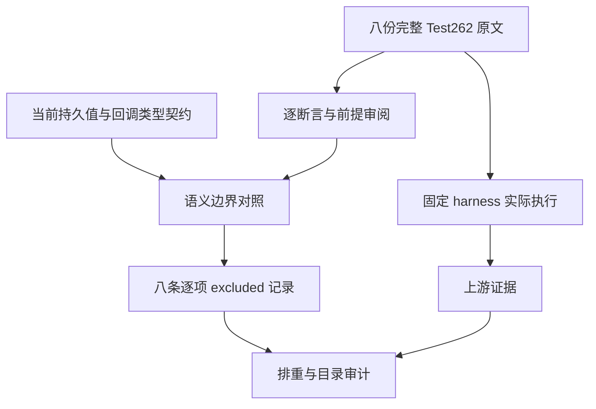

# 集合回调语义边界原文审查

## Intent：最终目标

逐份记录 Test262 与 zxc 既定语言契约之间的边界，避免删除原测试前提后误报 adapted。继续保留完整对齐目标，但不把范围排除或上游 JS 执行计作 zxc 测试覆盖。

## Data：可用证据

固定 Test262 revision 为 7ab7fafa0003f73fc85c1b95d88094d33f7eb8bd。八份原文经完整阅读、SHA 与索引核对、全部 reviews 排重；原文身份与每条边界保存在原文身份与边界.json。另一个谓词顺序草稿的四份原文不重复计入本批。

使用实际固定 sta.js/assert.js harness，在隔离 VM 中执行每份完整原文，sloppy/strict 各一次：16 次真实执行全部通过，12 条独立原断言分别在两模式验证。未替换输入、回调或任何原断言；此结果属于上游 JS，不是 zxc 运行结果。

| 原文后缀                    | 原断言                 | 必须保留的前提                 | 当前边界                   |
| --------------------------- | ---------------------- | ------------------------------ | -------------------------- |
| every/15.4.4.16-7-2.js      | result=false           | 回调写第五项为6，后续读新值    | 输入与列表为持久不可变值   |
| some/15.4.4.17-7-2.js       | result=true            | 同一第五项变更后才命中         | 不覆盖同一接收者           |
| map/15.4.4.19-8-2.js        | length=5；第五项0      | 回调写第五项-1，再按当前值映射 | 不提供同址源修改           |
| filter/15.4.4.20-9-2.js     | length=3；首项1；末项4 | 回调写索引2/4为-1，后续读取    | 不可删写入或预改输入       |
| reduce/15.4.4.21-9-2.js     | result=3               | 无初值，回调写后两项-2/-1      | 支持无初值不代表支持源修改 |
| filter/15.4.4.20-9-c-i-2.js | length=1；首项11       | 非零索引分支隐式 undefined     | bool 回调不保留该返回路径  |
| reduce/15.4.4.21-2-2.js     | result=true            | 数值初值1，回调返回bool        | 累加器由初值类型固定       |
| some/15.4.4.17-7-c-iii-8.js | result=true            | 回调返回数字5，经 JS 真值转换  | every/some 明确只接受bool  |

依据当前 packages/core/IR契约.md 的持久值、输入只读及 every/some bool 规则；filter 与 reduce 的当前类型规则另核对 packages/compiler/src/zx/analysis/analyzer/collections/hints.zx：谓词 body 使用 bool，reduce body/result 使用初值的 accumulator 类型。相关原文件及哈希随证据保存，不引用已过时的无捕获限制作为本批排除理由。

## Edges：边界与限制

这八份均登记 excluded、cases=[]，新增 zxc 用例为零，新增 adapted 为零。排除理由逐份保留真实输入、回调变更与原断言，不将“当前尚未实现”笼统用作排除依据，也不把它们发送为实现缺陷。

filter 的隐式 undefined 路径在原 [11] 输入下未到达，但原谓词仍包含该路径；不能通过补 false 删除前提再宣称完整适配。some 数字回调也不能替换成常量 true，reduce 的数值 seed 不能替换成 bool seed。源修改类不能预先改变输入或由原生观察器伪造元素。

只覆盖本批八份完整阅读的原文，不代表五个集合目录其余原文已经完成 review。独立工作树的目录审计只增加八条范围记录，避免把主工作区其他未完成 adapted 草稿纳入本部分的发布统计。

## Answer：交付与成功标准

正式源码范围只有 upstream/reviews/built_ins/array/callback_semantic_boundaries.jsonl；其余为本目录中文 IDEA 记录、上游运行与契约身份证据。原文哈希、完整实际执行、无重复登记、固定发布基线的目录审计及精确提交范围均核验后，用英文 Conventional Commits 独立提交与 push。

独立固定 e4d21707d 工作树仅覆盖新增 review 文件，实际目录审计退出 0：adapted 852、excluded 2089、equivalent 103、unreviewed 50553；catalog 仍为 140773。与已发布基线相比只有八条 excluded 增量，适配和用例数量均未增加。目录数量不代表执行覆盖。

## 架构图

## 数据流图

## 自我批判

可运行的原始 JS 与可忠实适配的 zxc 用例是两个不同结论。不能为了提高 adapted 数量弱化原前提，也不能为了降低剩余数量批量排除未读原文。这里仅逐份登记已经完整复读且与当前明确契约冲突的八例；这些范围记录不会提高 zxc 执行覆盖数字。
