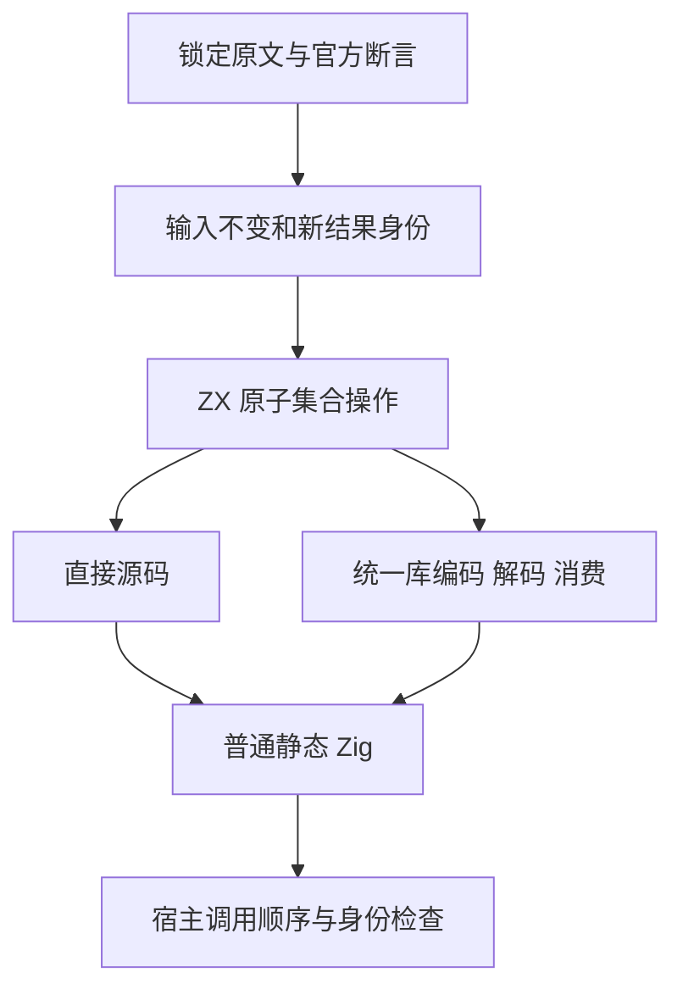
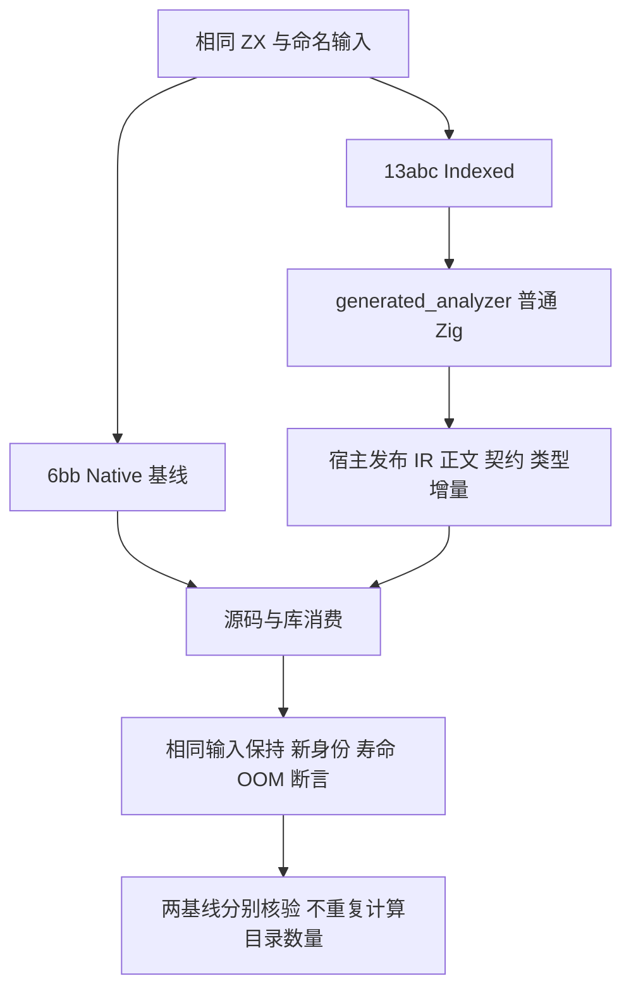

# 集合复制更新与原输入身份执行计划

本文采用 IDEA 框架。上一轮为 progress：6bb97d60c 已完成独立核验、提交与远端确认。

## Intent：最终目标

适配 Test262 change-array-by-copy 四份完整 immutable 原文，验证不可变输入和新结果身份，并为 zxc reverse、sort、splice、with 补齐重复调用与分配错误边界。继续完整 Test262 与所有特性目标。

## Data：可用证据

四份原文 SHA 与锁定索引一致，当前 review 均缺失。原文共十条顶层断言，严格与非严格模式应实际执行二十条官方断言；最终以执行记录为准。

IR 契约要求持久值与输入只读，reverse/sort 复制外层存储、splice 新存储；with 的接收者仍被调用者持有，不允许消费。当前基础为 6bb97d60c，包含新的统一 RX/ZX analyzer 生成链，需要重新生成 85 个模块。

## Edges：边界与限制

只修改 test 包与本记录目录。原文 JS 方法映射到 ZX 同语义操作，明确登记 adapted。JS 默认 sort 与 ZX 数值排序存在差异；原文使用 0、1、2，不受该差异影响，额外数字排序用例仅证明 ZX 契约。无空数组对象身份到空切片指针的错误映射，无 getter、洞、原型或动态对象适配声明。

首次执行必须真实完成并丢弃结果，随后立即检查原输入；后续执行分别检查新结果身份。splice 的第三次删除一个元素、with 的第三次替换为原值不可省略。额外检查结果内容、结果互不别名、旧结果跨调用寿命、输入哨兵及请求 arena 底层失败点；不把预期 OOM 当作实现缺陷。

## Answer：交付格式与成功标准

交付四个原子 ZX fixture、分层目录及命名用例、生成器与宿主检查、两条源码/库路径和 Debug/ReleaseSafe 实际执行、完整原文与官方 harness 身份、独立证据核验和准确提交清单。正常 hooks 后英文 Conventional Commits 提交并推送。仅确认实现缺陷时通知指定实现会话。

## 自我批判安排

区分原文十条断言、两模式二十次官方断言、额外生成用例与实际命名执行。核对结果丢弃是否真实执行、零长身份是否被错误要求、numeric sort 是否冒充 JavaScript 字典序，以及运行编译器是否确实来自当前源图。

## 执行计划调整：验收新 Indexed 入口

- **Intent：** 在同一矩阵下比较旧语义入口与实现会话新增的自举入口，避免只交付已过时基线。
- **Data：** 6bb 基线两模式、两路径已独立核验 1,008 次命名执行；13abc03129658c8f3284eaa95d376c8914498fda 真正接入 generated_analyzer，并改变 standard 模块共享关系。
- **Edges：** 旧工作树与基线证据冻结保留；新的隔离工作树重新生成全部 85 份。同步修正生成器三参数内部函数为 args 对象，目录检查必须证明所有 ZX 与 JSONL 字节不变。基线通过不能代替新入口通过，局部矩阵也不代替完整根回归。
- **Answer：** 在新入口再次完成 1,008 次命名执行、16 个签名测试程序；与基线合计 2,016 次、32 个二进制，预检 252 次仍单列。交付同一批 252 条目录用例及四份完整原文适配。

